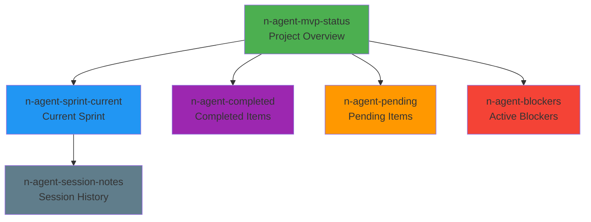

# MCP Memory Server - Project Tracking Structure

> This document defines the entity structure for persisting project tracking data between Copilot sessions using MCP Memory Server.

## 📦 Entity Definitions

### 1. Project Status Entity

**Entity Name**: `n-agent-mvp-status`  
**Entity Type**: `project-status`

```json
{
  "name": "n-agent-mvp-status",
  "entityType": "project-status",
  "observations": [
    "Current Sprint: 0 - Gap Analysis",
    "Overall Progress: 35%",
    "Last Updated: 2026-01-17",
    "Next Milestone: M1 - Agents Ready (Week 3)"
  ]
}
```

### 2. Sprint Progress Entity

**Entity Name**: `n-agent-sprint-current`  
**Entity Type**: `sprint-progress`

```json
{
  "name": "n-agent-sprint-current",
  "entityType": "sprint-progress",
  "observations": [
    "Sprint: 0 - Gap Analysis & Planning",
    "Completion: 60%",
    "Tasks Done: audit-agent-code, audit-frontend, setup-dev-environment",
    "Tasks In Progress: validate-integrations, define-backlog",
    "Blockers: None"
  ]
}
```

### 3. Completed Items Entity

**Entity Name**: `n-agent-completed`  
**Entity Type**: `completed-items`

```json
{
  "name": "n-agent-completed",
  "entityType": "completed-items",
  "observations": [
    "INFRA: AgentCore Runtime (nagent-GcrnJb6DU5)",
    "INFRA: AgentCore Memory (nAgentMemory-jXyHuA6yrO)",
    "INFRA: DynamoDB tables created",
    "INFRA: Cognito + OAuth configured",
    "INFRA: API Gateway + JWT",
    "INFRA: Lambda BFF deployed",
    "INFRA: CI/CD pipeline",
    "DOCS: MVP_SCOPE.md created",
    "DOCS: V1_SCOPE.md created",
    "DOCS: MVP_ROADMAP.md created",
    "AGENT: Router basic classification",
    "AGENT: Memory integration"
  ]
}
```

### 4. Pending Items Entity

**Entity Name**: `n-agent-pending`  
**Entity Type**: `pending-items`

```json
{
  "name": "n-agent-pending",
  "entityType": "pending-items",
  "observations": [
    "AGENT: Profile Agent write tools",
    "AGENT: Search Agent (Gemini)",
    "AGENT: Planner Agent",
    "INTEGRATION: Airbnb scraping",
    "INTEGRATION: Gemini API setup",
    "FRONTEND: Auth pages",
    "FRONTEND: Chat UI",
    "FRONTEND: Dashboard"
  ]
}
```

### 5. Blockers Entity

**Entity Name**: `n-agent-blockers`  
**Entity Type**: `blockers`

```json
{
  "name": "n-agent-blockers",
  "entityType": "blockers",
  "observations": [
    "No active blockers as of 2026-01-17"
  ]
}
```

### 6. Session Notes Entity

**Entity Name**: `n-agent-session-notes`  
**Entity Type**: `session-notes`

```json
{
  "name": "n-agent-session-notes",
  "entityType": "session-notes",
  "observations": [
    "2026-01-17: Created MVP/V1 scope documents with Mermaid diagrams",
    "2026-01-17: Setup progress tracking (MD + Memory structure)"
  ]
}
```

---

## 🔄 Update Commands

### Check Current Status
```
What is the current status of the n-agent MVP project?
```

### Update Sprint Progress
```
Update the sprint progress: Sprint 1 started, completion 20%, working on Search Agent
```

### Add Completed Item
```
Mark completed: Search Agent implemented with Gemini integration
```

### Add Blocker
```
Add blocker: Vertex AI quota exceeded - need to request increase
```

### Remove Blocker
```
Remove blocker: Vertex AI quota exceeded
```

### Add Session Note
```
Add session note: Completed Airbnb scraping tool implementation
```

---

## 📊 Entity Relations



---

## ⚡ Quick Reference

| Action | Memory Command Pattern |
|--------|----------------------|
| Get status | Read `n-agent-mvp-status` |
| Get sprint | Read `n-agent-sprint-current` |
| List done | Read `n-agent-completed` |
| List pending | Read `n-agent-pending` |
| Check blockers | Read `n-agent-blockers` |
| History | Read `n-agent-session-notes` |

---

## 🎯 Usage in Copilot Sessions

At the **start** of each session:
1. Read `n-agent-mvp-status` to understand project state
2. Read `n-agent-sprint-current` for current work
3. Read `n-agent-blockers` for any impediments

At the **end** of each session:
1. Update `n-agent-sprint-current` with progress
2. Move items from `n-agent-pending` to `n-agent-completed`
3. Add session summary to `n-agent-session-notes`
4. Update `n-agent-mvp-status` if milestone changed

---

## 📝 Notes

- MCP Memory Server persists data across Copilot sessions
- Entities are lightweight - use observations for quick status
- Keep observations concise (one item per line)
- Prefix observations with category (INFRA:, AGENT:, DOCS:, etc.)
