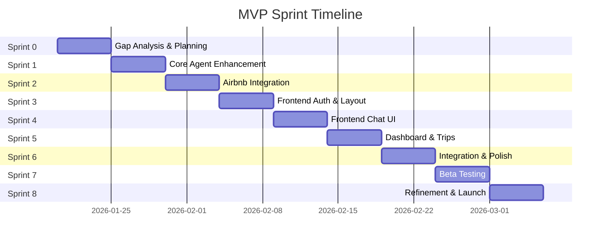
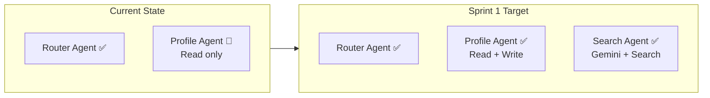
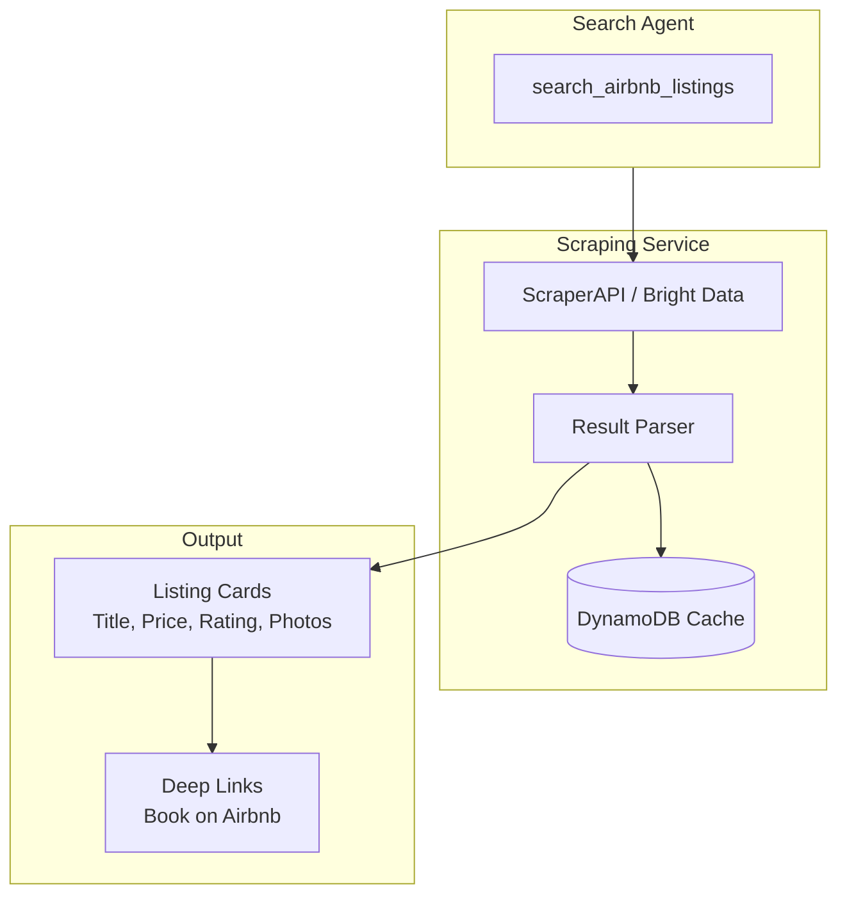
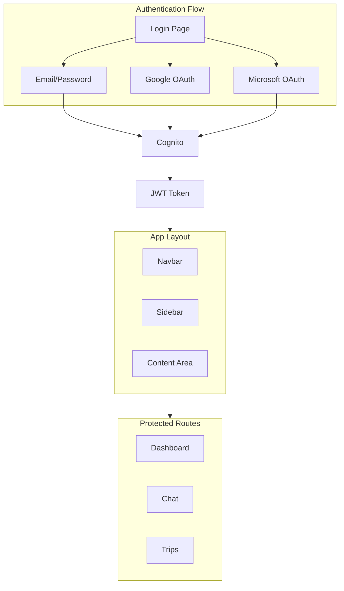
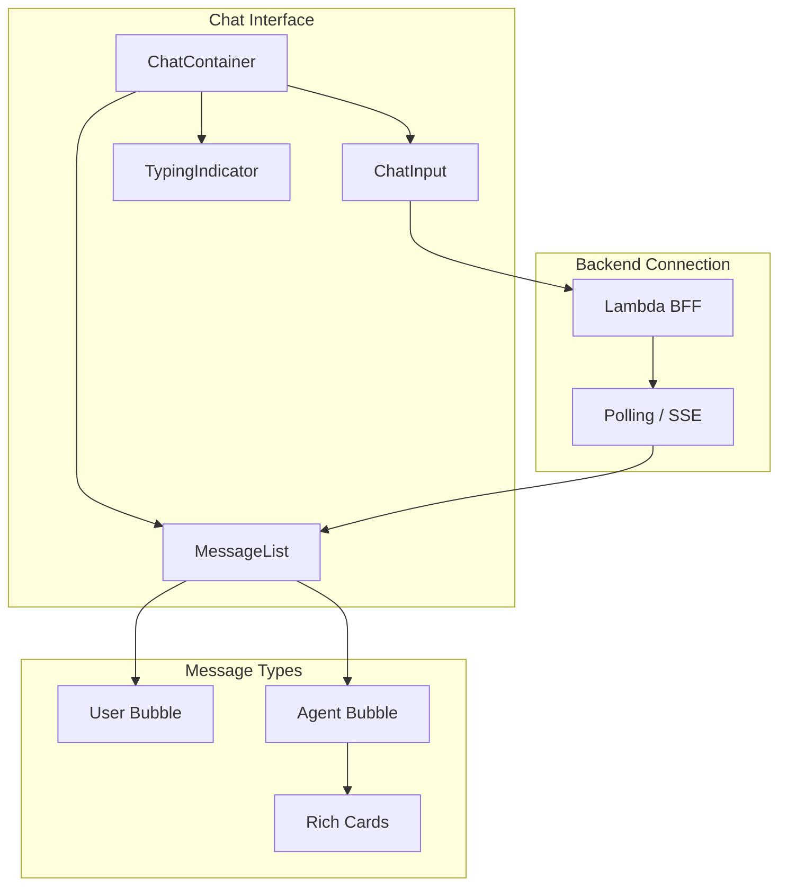
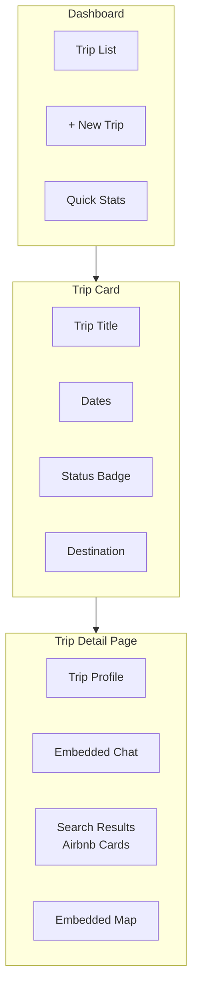
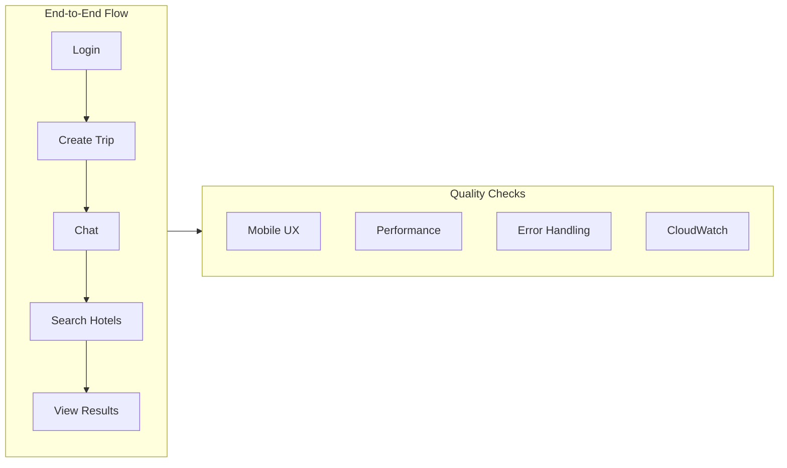
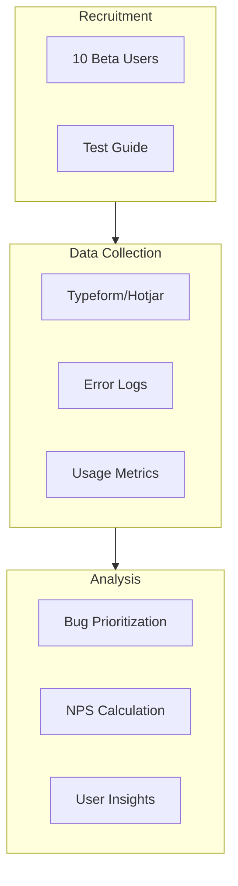
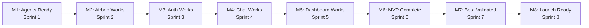

# MVP Implementation Roadmap

## 🎯 Objective

This document details the MVP implementation timeline, with weekly sprints, specific tasks, and clear acceptance criteria.

**Total Duration**: 6-8 weeks  
**Start**: After completing the gap analysis (current state vs MVP)

---

## 📊 Current State (January 2026)

### ✅ Already Implemented

| Component | Status | Details |
|-----------|--------|---------|
| AgentCore Runtime | ✅ Ready | `nagent-GcrnJb6DU5` (READY) |
| AgentCore Memory | ✅ Ready | `nAgentMemory-jXyHuA6yrO` (STM_ONLY, 30d) |
| DynamoDB Tables | ✅ Ready | `n-agent-core-prod-data`, `n-agent-profiles` |
| Cognito User Pool | ✅ Ready | `n-agent-core-users-prod` + OAuth Google/Microsoft |
| API Gateway | ✅ Ready | `n-agent-core-api-prod` with JWT Authorizer |
| Lambda BFF | ✅ Ready | `n-agent-core-bff-prod` (Python 3.12) |
| CI/CD | ✅ Ready | GitHub Actions → Terraform → Deploy |
| Router Agent | ✅ Basic | Query classification implemented |

### 🔄 Partially Implemented

| Component | Status | What's Missing |
|-----------|--------|----------------|
| Web App | 🔄 Scaffold | Vite structure created, functional UI missing |
| Profile Agent | 🔄 Partial | Read tools, write tools missing |
| Tests | 🔄 Partial | 29 unit tests, e2e missing |

### ❌ Not Implemented

| Component | MVP Priority |
|-----------|--------------|
| Search Agent (Gemini + Search) | P0 |
| Airbnb Integration | P0 |
| Functional Chat UI | P0 |
| Trip Dashboard | P0 |
| Profile Write Tools | P1 |
| Planner Agent | P1 |

---

## 🗓️ Detailed Timeline

### Sprint Overview

---

### Sprint 0: Gap Analysis & Planning (1 week)

**Objective**: Identify exactly what's missing and prioritize.

| Day | Task | Acceptance Criteria |
|-----|------|---------------------|
| 1 | Audit existing agent code | Document with feature inventory |
| 2 | Audit current frontend | List of existing vs needed components |
| 3 | Validate current integrations | Test Gemini, Airbnb connectivity |
| 4 | Define specific tasks | Refined backlog with story points |
| 5 | Setup local dev environment | All devs with working environment |

**Deliverable**: Prioritized and estimated backlog.

---

### Sprint 1: Core Agent Enhancement (1 week)

**Objective**: Complete core agents needed for MVP.

#### Tasks

| ID | Task | Priority | Est. Hours |
|----|------|----------|------------|
| 1.1 | Implement complete Profile Agent (read + write) | P0 | 8h |
| 1.2 | Create profile tools: `update_trip_profile`, `update_person_profile` | P0 | 6h |
| 1.3 | Implement Search Agent with Gemini + Search | P0 | 8h |
| 1.4 | Configure Vertex AI credentials in Lambda | P0 | 2h |
| 1.5 | Unit tests for new agents | P0 | 4h |
| 1.6 | Document agent APIs | P1 | 2h |

#### Acceptance Criteria

- [ ] Profile Agent persists user preferences in DynamoDB
- [ ] Search Agent returns Google results via Gemini
- [ ] All unit tests passing
- [ ] Memory maintains context between sessions

**Deliverable**: Functional and tested core agents.

---

### Sprint 2: Airbnb Integration (1 week)

**Objective**: Integrate Airbnb accommodation search.

#### Tasks

| ID | Task | Priority | Est. Hours |
|----|------|----------|------------|
| 2.1 | Configure ScraperAPI or Bright Data | P0 | 4h |
| 2.2 | Implement `search_airbnb_listings` tool | P0 | 8h |
| 2.3 | Create Airbnb results parser | P0 | 4h |
| 2.4 | Generate booking deep links | P0 | 2h |
| 2.5 | Implement results cache (DynamoDB) | P1 | 4h |
| 2.6 | Integration tests | P0 | 4h |
| 2.7 | Rate limiting and error handling | P0 | 4h |

#### Acceptance Criteria

- [ ] Agent can search accommodations by city and dates
- [ ] Results include: title, price, rating, photos, link
- [ ] Cache prevents duplicate requests
- [ ] Errors handled gracefully

**Deliverable**: Functional `search_airbnb_listings` tool.

---

### Sprint 3: Frontend - Auth & Layout (1 week)

**Objective**: Implement authentication and base frontend structure.

#### Tasks

| ID | Task | Priority | Est. Hours |
|----|------|----------|------------|
| 3.1 | Configure AWS Amplify for Cognito | P0 | 4h |
| 3.2 | Implement LoginPage (email + OAuth) | P0 | 6h |
| 3.3 | Implement ProtectedRoute component | P0 | 2h |
| 3.4 | Create base Layout (Navbar, Sidebar, Content) | P0 | 4h |
| 3.5 | Implement Material UI M3 theme | P1 | 4h |
| 3.6 | Create Home/Dashboard skeleton | P0 | 4h |
| 3.7 | Configure React Router | P0 | 2h |
| 3.8 | Setup React Query for API calls | P0 | 2h |

#### Acceptance Criteria

- [ ] User can login with email/password
- [ ] User can login with Google
- [ ] Protected routes redirect to login
- [ ] Responsive layout (desktop/mobile)

**Deliverable**: App with functional auth and base layout.

---

### Sprint 4: Frontend - Chat UI (1 week)

**Objective**: Implement functional chat interface.

#### Tasks

| ID | Task | Priority | Est. Hours |
|----|------|----------|------------|
| 4.1 | Create ChatContainer component | P0 | 4h |
| 4.2 | Implement MessageList with scroll | P0 | 4h |
| 4.3 | Create MessageBubble (user/agent styles) | P0 | 4h |
| 4.4 | Implement ChatInput with send | P0 | 4h |
| 4.5 | Create TypingIndicator ("Agent thinking...") | P0 | 2h |
| 4.6 | Connect chat to Lambda BFF | P0 | 4h |
| 4.7 | Implement polling/SSE for responses | P0 | 4h |
| 4.8 | Render rich responses (Markdown, links) | P1 | 4h |

#### Acceptance Criteria

- [ ] User sends message and receives agent response
- [ ] Message history persists during session
- [ ] Visual indicator while agent processes
- [ ] Markdown renders correctly

**Deliverable**: Functional chat integrated with AgentCore.

---

### Sprint 5: Frontend - Dashboard & Trips (1 week)

**Objective**: Implement trip visualization and dashboard.

#### Tasks

| ID | Task | Priority | Est. Hours |
|----|------|----------|------------|
| 5.1 | Create TripCard component | P0 | 4h |
| 5.2 | Implement Dashboard with trip list | P0 | 4h |
| 5.3 | Create basic new trip form | P0 | 4h |
| 5.4 | Implement TripDetailPage | P1 | 4h |
| 5.5 | Create trip profile component | P1 | 4h |
| 5.6 | Integrate Google Maps embed (basic) | P1 | 4h |
| 5.7 | Implement RichCard for results (Airbnb, etc.) | P0 | 4h |

#### Acceptance Criteria

- [ ] Dashboard shows user's trips
- [ ] User can create new trip
- [ ] Trip shows basic info (destination, dates)
- [ ] Airbnb cards display correctly

**Deliverable**: Dashboard and basic trip management.

---

### Sprint 6: Integration & Polish (1 week)

**Objective**: End-to-end integration, testing, and polish.

#### Tasks

| ID | Task | Priority | Est. Hours |
|----|------|----------|------------|
| 6.1 | E2E tests: complete trip flow | P0 | 8h |
| 6.2 | Test Memory persistence cross-session | P0 | 4h |
| 6.3 | Review mobile UX | P0 | 4h |
| 6.4 | Configure CloudFront for deploy | P0 | 4h |
| 6.5 | Setup basic monitoring (CloudWatch) | P1 | 4h |
| 6.6 | Create user documentation | P1 | 4h |
| 6.7 | Bug fixes and refinements | P0 | 8h |

#### Acceptance Criteria

- [ ] User can complete flow: login → create trip → chat → see suggestions
- [ ] App works on mobile
- [ ] No critical errors in production
- [ ] Basic metrics in CloudWatch

**Deliverable**: Functional MVP in production.

---

### Sprint 7: Beta Testing (1 week)

**Objective**: Validate MVP with real users.

#### Tasks

| ID | Task | Priority | Est. Hours |
|----|------|----------|------------|
| 7.1 | Recruit 10 beta testers | P0 | 4h |
| 7.2 | Create test guide for users | P0 | 2h |
| 7.3 | Configure feedback collection (Typeform/Hotjar) | P0 | 2h |
| 7.4 | Monitor logs and errors during tests | P0 | 8h |
| 7.5 | Collect and analyze feedback | P0 | 4h |
| 7.6 | Prioritize fixes and improvements | P0 | 2h |

#### Acceptance Criteria

- [ ] 10 users tested the product
- [ ] Feedback documented and categorized
- [ ] Critical bugs identified and fixed
- [ ] NPS calculated

**Deliverable**: Beta testing report with insights.

---

### Sprint 8: Refinement & Launch (1 week)

**Objective**: Fix beta issues and prepare for launch.

#### Tasks

| ID | Task | Priority | Est. Hours |
|----|------|----------|------------|
| 8.1 | Implement top 3 improvements from feedback | P0 | 12h |
| 8.2 | Fix remaining bugs | P0 | 8h |
| 8.3 | Optimize performance if needed | P1 | 4h |
| 8.4 | Prepare landing page | P1 | 4h |
| 8.5 | Document lessons learned | P2 | 2h |
| 8.6 | Plan V1 backlog | P1 | 4h |

#### Acceptance Criteria

- [ ] All critical bugs fixed
- [ ] Acceptable performance (< 5s response time)
- [ ] Documentation updated
- [ ] MVP ready for public use

**Deliverable**: MVP 1.0 launched.

---

## 📈 Validation Milestones

| Milestone | Sprint | Criteria |
|-----------|--------|----------|
| **M1: Agents Ready** | Sprint 1 | Profile and Search agents functional |
| **M2: Airbnb Works** | Sprint 2 | Accommodation search returns results |
| **M3: Auth Works** | Sprint 3 | Functional login via web |
| **M4: Chat Works** | Sprint 4 | E2E conversation with agent |
| **M5: Dashboard Works** | Sprint 5 | User sees their trips |
| **M6: MVP Complete** | Sprint 6 | Complete flow working |
| **M7: Beta Validated** | Sprint 7 | Positive user feedback |
| **M8: Launch Ready** | Sprint 8 | Ready for public use |

---

## 🧪 Definition of Done (DoD)

Each task is only considered "Done" when:

- [ ] Code implemented and working
- [ ] Unit tests written (coverage > 80%)
- [ ] Code review approved
- [ ] Documentation updated (if applicable)
- [ ] Deployed to staging environment
- [ ] Manually tested by another dev
- [ ] No lint errors

---

## 🚨 Risks and Mitigations

| Risk | Probability | Impact | Mitigation |
|------|-------------|--------|------------|
| Airbnb blocks scraping | Medium | High | Have fallback with Booking affiliate |
| Gemini API unstable | Low | High | Fallback to Claude via Bedrock |
| OAuth config complex | Low | Medium | Use well-documented Amplify SDK |
| Confusing UX | Medium | Medium | Early user testing (Sprint 5) |
| Slow performance | Low | Medium | Implement aggressive caching |

---

## 📝 Notes

1. **Sprints are flexible**: If a sprint finishes early, pull tasks from the next
2. **MVP > Perfection**: Prefer basic working functionality over complete features
3. **Fast feedback**: Show progress to stakeholders every sprint
4. **Document decisions**: Keep ADR (Architecture Decision Records) updated

---

**Last Updated**: January 2026
