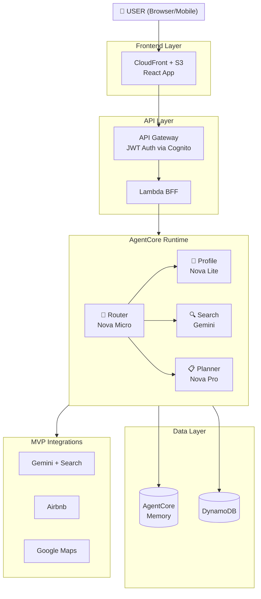
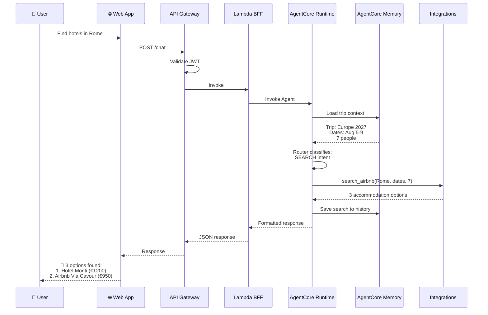
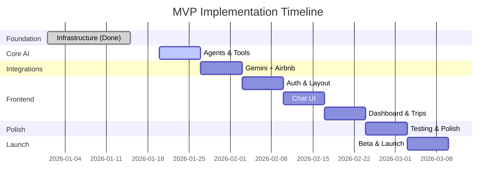

# MVP Scope - n-agent Personal Travel Assistant

## 🎯 MVP Objective

Deliver a minimum functional version that demonstrates the platform's core value: **an intelligent travel assistant accessible via web chat**, with the ability to search real accommodation information (Airbnb) and perform contextualized searches (Gemini + Search).

**Focus**: Validate the value proposition with real users before investing in complex integrations.

---

## 📋 MVP Scope

### ✅ What IS in the MVP

#### 1. User Portal (Web App)

| Feature | Description | Priority |
|---------|-------------|----------|
| **Authentication** | Login via email/password + OAuth (Google/Microsoft) | P0 |
| **Dashboard** | User's trip list, status, quick access | P0 |
| **Integrated Chat** | Chat interface to converse with the agent | P0 |
| **Rich Response Display** | Cards, tables, links, embedded maps | P0 |
| **Trip Creation** | Basic flow to create a new trip | P0 |
| **Trip Profile** | Visualization of collected trip data | P1 |
| **Responsiveness** | Works well on desktop and mobile (basic PWA) | P1 |

#### 2. Core Agent

| Feature | Description | Priority |
|---------|-------------|----------|
| **Router Agent** | Classifies intents and routes to appropriate model (Nova Micro) | P0 |
| **Profile Agent** | Extracts and persists user/trip preferences (Nova Lite) | P0 |
| **Search Agent** | Searches real-time information (Gemini + Search) | P0 |
| **AgentCore Memory** | Session and context memory (short-term + long-term) | P0 |
| **Basic Tools** | get/update trip_profile, person_profile | P0 |

#### 3. MVP Integrations

| Integration | Functionality | Priority |
|-------------|---------------|----------|
| **Google Gemini + Search** | Search for updated information (restaurants, attractions, tips) | P0 |
| **Airbnb** | Accommodation search via ethical scraping or affiliate | P0 |
| **Google Maps** | Location display on map (basic embed) | P1 |

#### 4. Infrastructure

| Component | Description | Status |
|-----------|-------------|--------|
| **AgentCore Runtime** | Serverless agent deployment | ✅ Ready |
| **AgentCore Memory** | Context management | ✅ Ready |
| **DynamoDB** | Users, trips, profiles tables | ✅ Ready |
| **Cognito** | Authentication and OAuth | ✅ Ready |
| **API Gateway** | Protected endpoints | ✅ Ready |
| **Lambda BFF** | Backend for Frontend | ✅ Ready |
| **S3 + CloudFront** | Static site hosting | 📋 Pending |

#### 5. Trip Phases (MVP)

The MVP will support only the **first 2 phases** of the trip lifecycle:

| Phase | Name | MVP Scope |
|-------|------|-----------|
| 1️⃣ | **Knowledge** | ✅ Collect information about trip, participants, objectives, budget, dates |
| 2️⃣ | **Planning** | ✅ Suggest attractions, search accommodation (Airbnb), create basic itinerary |
| 3️⃣ | Contracting | ❌ V1 |
| 4️⃣ | Concierge | ❌ V1 |
| 5️⃣ | Memories | ❌ V1 |

---

### ❌ What is NOT in the MVP (Deferred to V1)

#### Deferred Integrations

| Integration | Reason for Deferral |
|-------------|---------------------|
| **WhatsApp** | Requires Meta Business approval, high bureaucracy |
| **Booking.com** | Requires affiliate program, complex setup |
| **Skyscanner/Kayak** | Focus on accommodation first |
| **AviationStack** | Only needed for Concierge (Phase 4) |
| **OpenWeather** | Nice-to-have, Gemini already provides weather info |
| **DeepL/Translate** | Nice-to-have |
| **Exchange Rates** | Nice-to-have, Gemini provides quotes |

#### Deferred Features

| Feature | Original Phase | Reason |
|---------|----------------|--------|
| Flight monitoring | Phase 5 (Concierge) | Complexity + API cost |
| Proactive alerts | Phase 5 (Concierge) | Requires EventBridge Scheduler setup |
| Memory albums | Phase 6 (Memories) | Post-MVP |
| Google Photos integration | Phase 6 (Memories) | Post-MVP |
| Album printing | Phase 6 (Memories) | Post-MVP |
| Itinerary versioning | Phase 3 (Core AI) | Nice-to-have |
| PDF generation | Phase 3 (Core AI) | HTML is sufficient for MVP |
| Vision Agent (OCR) | Phase 3 (Core AI) | Nice-to-have |
| Document Agent | Phase 3 (Core AI) | Simple HTML templates for MVP |
| Full Admin Panel | Phase 4 (Frontend) | Basic admin via AWS Console |
| Multi-trip management | Phase 4 (Frontend) | One trip at a time for MVP |

---

## 🏗️ Simplified MVP Architecture

---

## 🔄 MVP Message Flow

---

## 📅 MVP Timeline

### Timeline: 6-8 weeks

| Week | Phase | Deliverables |
|------|-------|--------------|
| 1-2 | Foundation | ✅ Already done: AgentCore Runtime, Memory, DynamoDB, Cognito |
| 3 | Core AI | Router Agent, Profile Agent, basic tools |
| 4 | Integrations | Gemini + Search, Airbnb scraping/affiliate |
| 5-6 | Frontend | Chat UI, Dashboard, response visualization |
| 7 | Polish | Tests, UX adjustments, responsiveness |
| 8 | Deploy | Production, monitoring, documentation |

### Validation Milestones

| Milestone | Success Criteria |
|-----------|------------------|
| **M1: Chat Works** | User can chat with agent via web |
| **M2: Profile Persists** | Agent remembers information between sessions |
| **M3: Search Works** | Agent searches real information via Gemini |
| **M4: Airbnb Works** | Agent suggests Airbnb accommodations with links |
| **M5: MVP Complete** | User can plan a trip from start to itinerary |

---

## 💰 Estimated MVP Cost

| Component | Monthly Cost (estimated) |
|-----------|--------------------------|
| AgentCore Runtime | $0.60 |
| DynamoDB (on-demand) | $0.50 |
| Cognito (< 50K MAU) | $0.00 |
| API Gateway | $0.10 |
| Lambda BFF | $0.10 |
| CloudFront + S3 | $1.00 |
| Gemini API (~500 queries) | $17.50 |
| Airbnb Scraping (optional) | $0-50 |
| **Total MVP** | **$20-70/month** |

---

## 🎯 MVP Success Criteria

### Technical

- [ ] Chat response time < 5 seconds
- [ ] Uptime > 99%
- [ ] Zero critical errors in production
- [ ] Automated tests passing

### Product

- [ ] 10 beta users test the product
- [ ] NPS > 30 in tests
- [ ] User can create and plan a trip without external help
- [ ] Agent provides useful accommodation suggestions

### Learning

- [ ] Identify top 3 user pain points
- [ ] Validate if accommodation search is the most valued feature
- [ ] Collect feedback on which integrations are most desired

---

## 📝 Implementation Notes

### Accepted Simplifications for MVP

1. **No itinerary versioning** - Only one active version
2. **No PDF** - Responsive HTML is sufficient
3. **No OCR** - User types information manually
4. **No proactive alerts** - Only responses to questions
5. **Admin via AWS Console** - No custom admin panel
6. **One trip at a time** - Simplifies UX and logic

### Technical Decisions

1. **Airbnb Integration**: Start with ethical scraping (Bright Data/ScraperAPI), migrate to affiliate when approved
2. **Gemini**: Use Vertex AI with Search Grounding for all searches
3. **Maps**: Simple Google Maps embed, no complex Places API
4. **Frontend**: React + Vite + Material UI M3, no SSR

---

## 🔗 Related Documents

- [V1_SCOPE.md](./V1_SCOPE.md) - V1 scope (post-MVP)
- [proposta_inicial.md](./proposta_inicial.md) - Complete product vision
- [proposta_técnica.md](./proposta_técnica.md) - Detailed technical architecture
- [fases_implementacao/](./fases_implementacao/) - Phase details

---

**Last Updated**: January 2026
