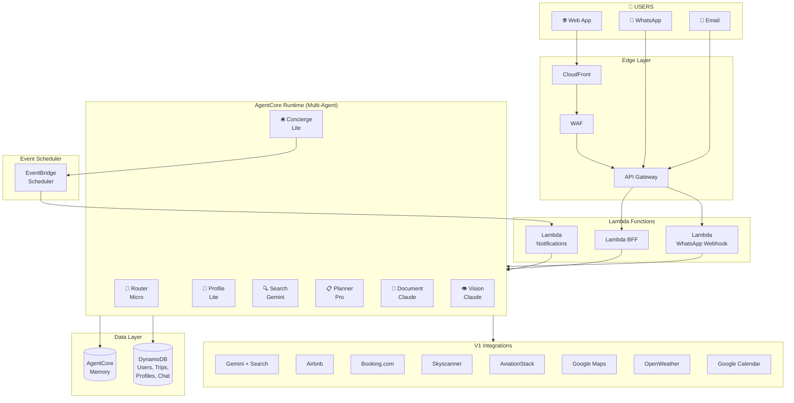
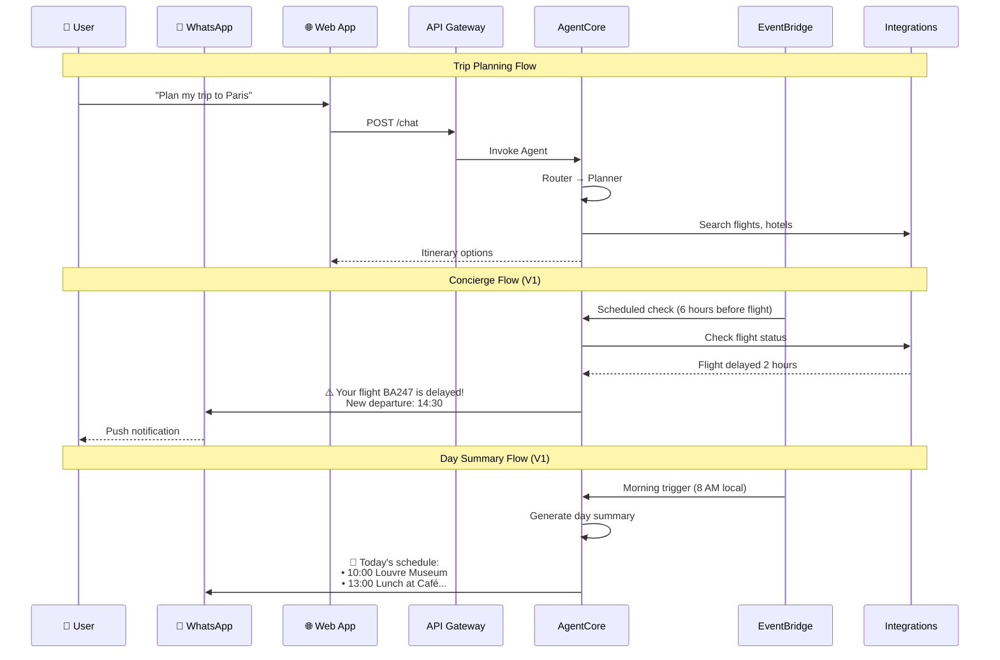
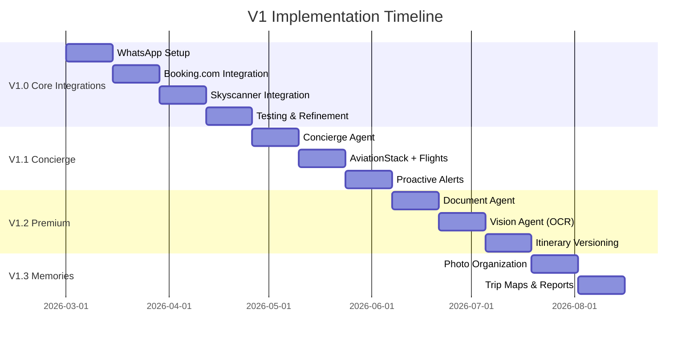

# V1 Scope - n-agent Personal Travel Assistant

## 🎯 V1 Objective

After validating the MVP, V1 expands the platform with **all originally planned features**: complete integrations (WhatsApp, flights, hotels), advanced trip phases (concierge, memories), and the full premium experience.

**Prerequisite**: MVP validated with beta users and feedback incorporated.

---

## 📋 Complete V1 Scope

### 🔄 Maintained from MVP (Base)

Everything delivered in the MVP continues working and will be enhanced:

- ✅ Web Portal with Chat
- ✅ OAuth Authentication
- ✅ Router + Profile + Search Agents
- ✅ AgentCore Memory
- ✅ Gemini + Search Integration
- ✅ Airbnb Integration
- ✅ Phases 1-2 (Knowledge + Planning)

---

### 🆕 New V1 Features

#### 1. Complete Integrations

| Integration | Functionality | Phase |
|-------------|---------------|-------|
| **WhatsApp Business** | Alternative chat interface, notifications | V1.0 |
| **Booking.com** | Hotel search via Affiliate API | V1.0 |
| **Skyscanner/Kayak** | Flight search | V1.0 |
| **AviationStack** | Real-time flight status monitoring | V1.1 |
| **OpenWeather** | Weather alerts, contextual suggestions | V1.1 |
| **Google Calendar** | Itinerary sync | V1.2 |
| **Google Keep/Todo** | Shared task lists | V1.2 |
| **DeepL/Translate** | Menu and sign translation | V1.2 |
| **Exchange Rates** | Real-time currency quotes | V1.1 |
| **Sherpa** | Travel rules by country (visas, vaccines) | V1.1 |

#### 2. New Agents

| Agent | Model | Responsibility |
|-------|-------|----------------|
| **Concierge Agent** | Nova Lite | Active trip monitoring, alerts |
| **Document Agent** | Claude 3.5 Sonnet | Rich document generation (PDF, itineraries) |
| **Vision Agent** | Claude 3.5 Sonnet | OCR for passports, tickets, menus |

#### 3. Complete Trip Phases

| Phase | Name | V1 Features |
|-------|------|-------------|
| 1️⃣ | **Knowledge** | ✅ MVP + document extraction via OCR |
| 2️⃣ | **Planning** | ✅ MVP + versioning, itinerary comparison |
| 3️⃣ | **Contracting** | Booking organization, vouchers, payments |
| 4️⃣ | **Concierge** | Proactive alerts, flight status, real-time support |
| 5️⃣ | **Memories** | Albums, maps, financial report, printing |

#### 4. Premium Features

| Feature | Description | Plan |
|---------|-------------|------|
| **Itinerary Versioning** | "Economy Version" vs "Comfort Version" | Planner+ |
| **PDF Generation** | Itineraries for printing/offline | Planner+ |
| **Voucher Management** | All PDFs and QR codes organized | Planner+ |
| **Flight Monitoring** | Delay alerts, gate changes | Concierge |
| **Day Summaries** | Morning summary sent daily | Concierge |
| **Offline Mode** | Information package for no-internet | Concierge |
| **Photo Albums** | Automatic organization by location/date | Memories |
| **Trip Map** | Interactive map of traveled route | Memories |
| **Print Album** | Print service integration | Memories |

#### 5. Admin Portal

| Feature | Description |
|---------|-------------|
| **Prompt Management** | Edit agent prompts with versioning |
| **Integration Config** | API keys, limits, cache configuration |
| **User Management** | User and permission management |
| **Monitoring Dashboard** | Usage, cost, and error metrics |
| **Audit Logs** | Change history |

---

## 🏗️ V1 Architecture

---

## 🔄 V1 Multi-Channel Flow

---

## 📅 V1 Timeline

### Timeline: 20-24 weeks (post-MVP)

#### Phase V1.0: Core Integrations (Weeks 1-8)

| Week | Deliverables |
|------|--------------|
| 1-2 | WhatsApp Business setup, webhook handler |
| 3-4 | Booking.com Affiliate integration |
| 5-6 | Skyscanner/Kayak flights integration |
| 7-8 | Testing, refinements, documentation |

#### Phase V1.1: Concierge (Weeks 9-14)

| Week | Deliverables |
|------|--------------|
| 9-10 | Concierge Agent, EventBridge Scheduler |
| 11-12 | AviationStack, flight monitoring |
| 13-14 | Proactive alerts, day summaries |

#### Phase V1.2: Premium Features (Weeks 15-20)

| Week | Deliverables |
|------|--------------|
| 15-16 | Document Agent, PDF generation |
| 17-18 | Vision Agent, document OCR |
| 19-20 | Itinerary versioning, comparison |

#### Phase V1.3: Memories (Weeks 21-24)

| Week | Deliverables |
|------|--------------|
| 21-22 | Photo organization, digital albums |
| 23-24 | Trip maps, financial report, print integration |

---

## 💰 Estimated V1 Cost

### Infrastructure (per month)

| Component | MVP Cost | V1 Cost |
|-----------|----------|---------|
| AgentCore Runtime | $0.60 | $5-15 |
| DynamoDB | $0.50 | $5-10 |
| Cognito | $0.00 | $0.00 |
| API Gateway | $0.10 | $1-3 |
| Lambda (multiple) | $0.10 | $2-5 |
| CloudFront + S3 | $1.00 | $5-10 |
| EventBridge | $0.00 | $1-2 |
| **Subtotal Infra** | **~$2.30** | **~$20-45** |

### External APIs (per 1000 users/month)

| API | Estimated Cost |
|-----|----------------|
| Gemini + Search | $50-80 |
| Airbnb Scraping | $50-100 |
| AviationStack | $49 |
| OpenWeather | $0 (free tier) |
| WhatsApp | $30-50 |
| Google Maps | $0 ($200 credit) |
| **Subtotal APIs** | **~$180-280** |

### Total V1 (1000 users)

| Scenario | Monthly Cost |
|----------|--------------|
| Low usage | ~$100 |
| Medium usage | ~$200 |
| High usage | ~$350 |

---

## 📊 V1 Success Metrics

### Technical

- [ ] Response time < 3 seconds (95th percentile)
- [ ] Uptime > 99.5%
- [ ] Test coverage > 80%
- [ ] Zero critical vulnerabilities

### Product

- [ ] 1000 registered users
- [ ] 100 planned trips
- [ ] Free → paid conversion > 8%
- [ ] NPS > 40
- [ ] Retention (2nd trip) > 30%

### Business

- [ ] Revenue > $5000/month
- [ ] CAC < $20
- [ ] LTV > $100

---

## 🔄 MVP → V1 Migration

### Compatibility

- ✅ User data maintained
- ✅ Existing trips preserved
- ✅ Memory sessions continue working
- ✅ Existing APIs maintain compatibility

### New Capabilities

- 🆕 New endpoints for WhatsApp
- 🆕 Webhooks for notifications
- 🆕 Document APIs
- 🆕 Admin APIs

---

## 📝 Features by Plan (V1)

### Free

- 1 trip/year
- Up to 4 participants
- Phases 1-2 (Knowledge + Basic Planning)
- Web chat only
- No rich documents

### Planner ($49/trip)

- Unlimited trips (1 active)
- Unlimited participants
- Phases 1-3 (+ Contracting)
- PDF generation
- Voucher management
- Itinerary versioning

### Concierge ($149/trip)

- 3 simultaneous active trips
- All 5 phases
- WhatsApp integration
- Proactive alerts
- Flight monitoring
- Day summaries
- Priority support

### Family ($399/year)

- 5 trips/year
- Everything from Concierge
- Memory albums
- Partner discounts
- Interactive trip map

---

## 🔗 Related Documents

- [MVP_SCOPE.md](./MVP_SCOPE.md) - MVP scope (prerequisite)
- [proposta_inicial.md](./proposta_inicial.md) - Complete product vision
- [proposta_técnica.md](./proposta_técnica.md) - Detailed technical architecture
- [fases_implementacao/](./fases_implementacao/) - Phase details

---

## 📚 Reference: Original Implementation Phases

The phases documented in `fases_implementacao/` map to V1 as follows:

| Document | Content | MVP | V1 |
|----------|---------|-----|-----|
| 00_arquitetura.md | General architecture | ✅ | ✅ |
| 01_fase0_preparacao.md | Environment setup | ✅ | ✅ |
| 02_fase1_fundacao.md | AgentCore, DynamoDB, Auth | ✅ | ✅ |
| 03_fase2_integracoes.md | WhatsApp, external APIs | ❌ | ✅ |
| 04_fase3_core_ai.md | Trip flows, multi-agent | Partial | ✅ |
| 05_fase4_frontend.md | Web App, Admin Panel | Partial | ✅ |
| 06_fase5_concierge.md | Alerts, monitoring | ❌ | ✅ |
| 07_fase6_memorias.md | Albums, reports | ❌ | ✅ |

---

**Last Updated**: January 2026
