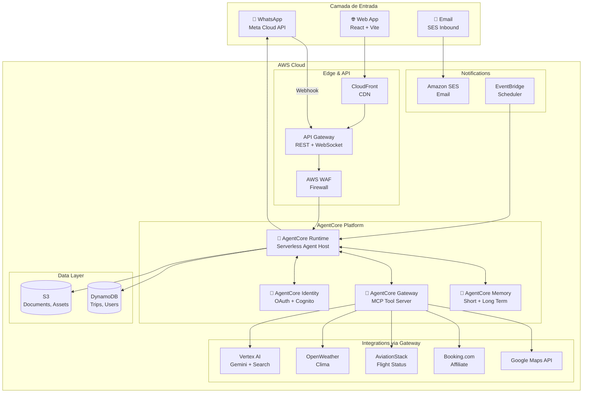
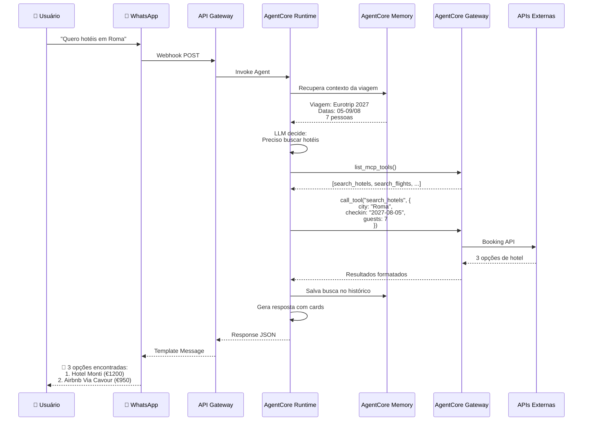
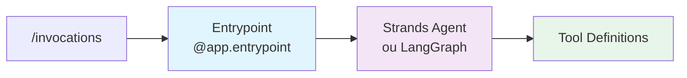
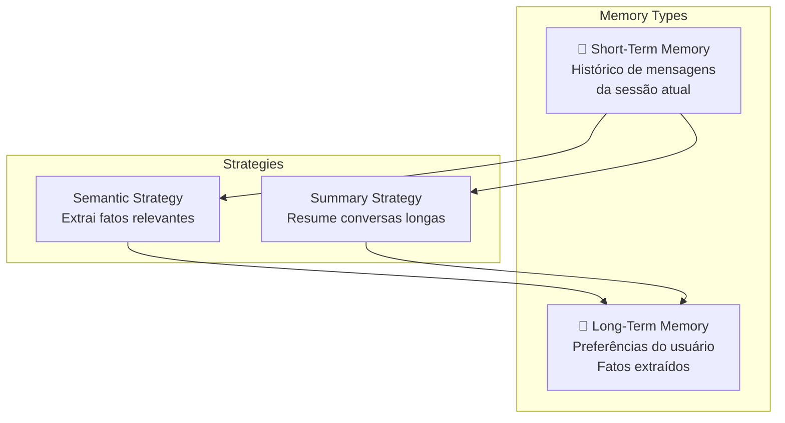
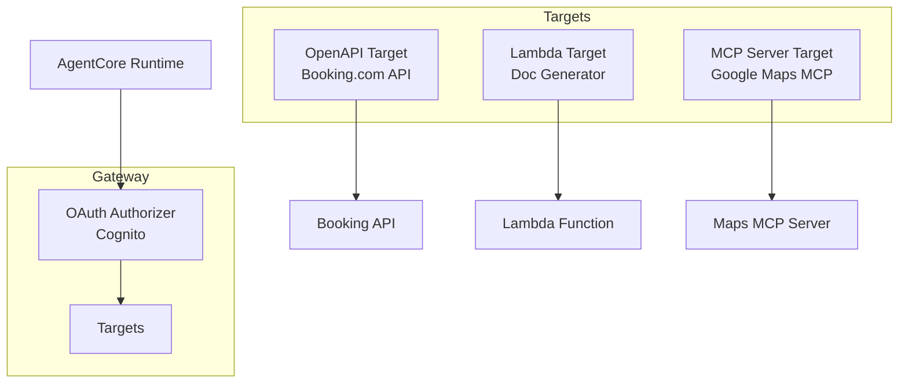
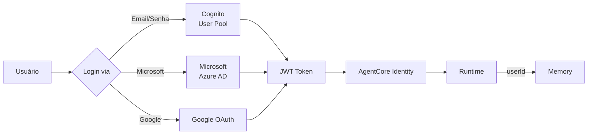
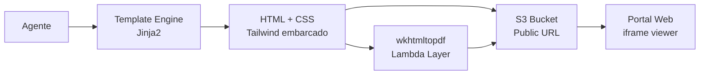
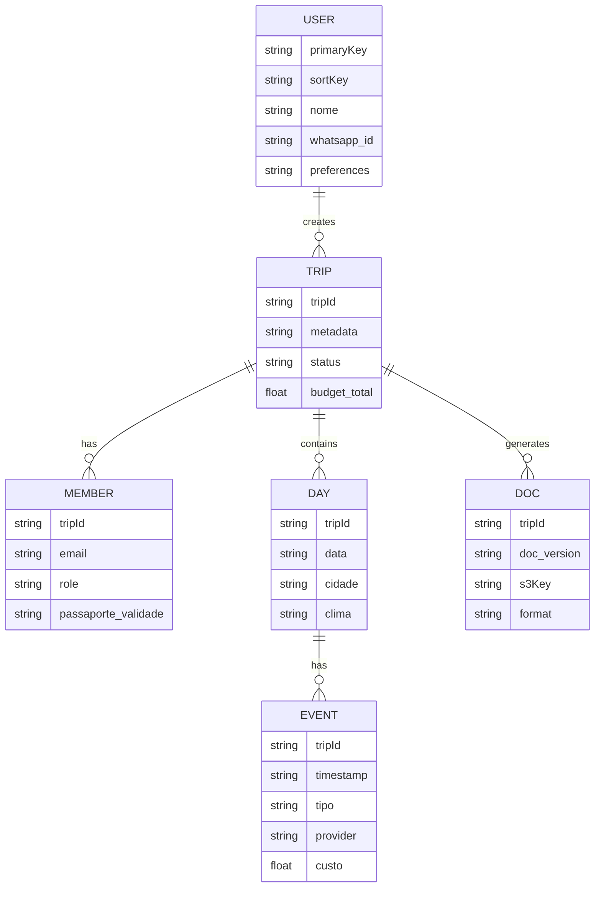
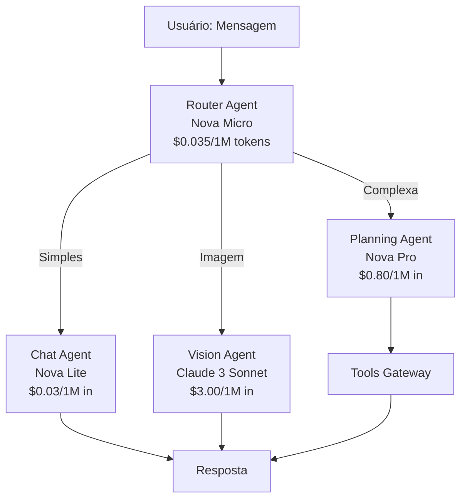

# Arquitetura n-agent com AWS Bedrock AgentCore

## Visão Geral

A plataforma n-agent é um assistente pessoal de viagens que utiliza **AWS Bedrock AgentCore** como centro da solução. AgentCore é uma plataforma serverless completa para construção, deploy e operação de agentes de IA em escala.

## Por que AgentCore?

| Aspecto | Abordagem Anterior (Docker) | AgentCore |
|---------|---------------------------|-----------|
| Deploy | Container + App Runner | Serverless (zip direto) |
| Cold Start | ~5-10s | ~1-2s |
| Memória | Custom (DynamoDB) | AgentCore Memory nativo |
| Ferramentas | Lambda functions | AgentCore Gateway (MCP) |
| Identidade | Custom Cognito | AgentCore Identity integrado |
| Observability | Custom X-Ray | Built-in OpenTelemetry |
| Custo | Sempre ligado | Pay-per-use |

## Diagrama de Arquitetura Geral



## Fluxo de Mensagem do Usuário



## Componentes AgentCore Utilizados

### 1. AgentCore Runtime

O **coração** da solução. Hospeda o agente Python de forma serverless.



**Características:**
- Deploy via ZIP (código Python + dependências)
- Cold start otimizado (~1-2s)
- Isolamento de sessão por usuário
- Escala automática (0 a N instâncias)

### 2. AgentCore Memory

Gerencia o contexto das conversas e preferências do usuário.



**Uso no n-agent:**
- **Short-term**: Histórico da conversa atual
- **Long-term**: 
  - Preferências do viajante (restrições alimentares, medo de altura)
  - Dados da viagem (destinos, datas, orçamento)
  - Decisões já tomadas (hotéis escolhidos, voos reservados)

### 3. AgentCore Gateway

Transforma APIs REST em ferramentas MCP que o agente pode usar.



**Targets Planejados:**
| Target | Tipo | Função |
|--------|------|--------|
| booking-search | OpenAPI | Busca de hotéis |
| flight-status | OpenAPI | Status de voos |
| maps-places | MCP Server | Busca de locais |
| weather | OpenAPI | Previsão do tempo |
| doc-generator | Lambda | Gera PDFs/HTMLs |
| trip-data | Lambda | CRUD viagens |

### 4. AgentCore Identity + OAuth Microsoft

Integra autenticação do usuário com múltiplos provedores.



**Configuração OAuth Microsoft:**

1. **Registrar aplicação no Azure AD:**
   - Portal: https://portal.azure.com → Azure Active Directory → App registrations
   - Redirect URI: `https://your-domain.auth.us-east-1.amazoncognito.com/oauth2/idpresponse`
   - Permissions: `openid`, `profile`, `email`

2. **Configurar Cognito User Pool:**

```bash
# Adicionar Microsoft como Identity Provider
aws cognito-idp create-identity-provider \
  --user-pool-id us-east-1_xxxxx \
  --provider-name Microsoft \
  --provider-type OIDC \
  --provider-details \
    MetadataURL="https://login.microsoftonline.com/common/v2.0/.well-known/openid-configuration",\
    client_id="{azure-client-id}",\
    client_secret="{azure-client-secret}",\
    authorize_scopes="openid profile email" \
  --attribute-mapping \
    email=email,\
    username=sub,\
    name=name
```

3. **Configurar AgentCore Identity:**

```json
{
  "name": "Microsoft",
  "credentialProviderVendor": "OAuth2",
  "oauth2ProviderConfigInput": {
    "includedOauth2ProviderConfig": {
      "clientId": "{azure-client-id}",
      "clientSecret": "{azure-client-secret}",
      "authorizeEndpoint": "https://login.microsoftonline.com/common/oauth2/v2.0/authorize",
      "tokenEndpoint": "https://login.microsoftonline.com/common/oauth2/v2.0/token",
      "issuer": "https://login.microsoftonline.com/common/v2.0"
    }
  }
}
```

**Fluxo de Login:**
1. Usuário clica "Login com Microsoft"
2. Redirecionado para Microsoft Login
3. Após autenticação, Microsoft retorna authorization code
4. Cognito troca code por tokens (ID token, access token)
5. Cognito mapeia atributos Microsoft → Cognito attributes
6. AgentCore Identity valida JWT e concede acesso ao Runtime

**Custo:** Cognito cobra apenas por usuários **ativos** (MAU - Monthly Active Users):
- Primeiros 50.000 MAU: **grátis**
- 50.001 - 100.000: $0.0055/MAU
- Com 1000 usuários ativos: **$0**

## Armazenamento de Documentos Ricos e Versionamento

### Classificação de Documentos

O sistema gerencia **dois tipos distintos** de documentos:

#### 1. Documentos Fornecidos pelo Usuário (Uploads)

**Propósito**: Entrada de dados para o agente processar e gerenciar

| Tipo | Formatos Aceitos | Processamento | Armazenamento |
|------|------------------|---------------|---------------|
| Ingressos/Tickets | PDF, JPG, PNG | OCR + extração dados | S3 + metadados DynamoDB |
| Vouchers de Hotel | PDF, Email (EML) | Parse de reserva | S3 + link no evento |
| Documentos Pessoais | PDF, JPG (passaporte, visto) | OCR + validação validade | S3 (criptografado) |
| Fotos de Viagem | JPG, PNG, HEIC | Vision API (local/data) | S3 + metadados |
| Comprovantes | PDF (passagem, seguro) | Parse + vincular à viagem | S3 + DynamoDB |

**Modelo DynamoDB (Upload):**
```python
USER_DOCUMENT = {
    "PK": "TRIP#550e8400",
    "SK": "UPLOAD#1722885600#ticket-coliseu",
    "type": "ticket",  # ticket | voucher | passport | receipt | photo
    "uploaded_by": "user#joão@email.com",
    "uploaded_at": "2027-07-20T10:00:00Z",
    "file_name": "ticket-coliseu.pdf",
    "s3_key": "uploads/550e8400/ticket-coliseu.pdf",
    "content_type": "application/pdf",
    "size_bytes": 245678,
    "extracted_data": {  # Processado por OCR/Vision
        "venue": "Colosseum",
        "date": "2027-08-06",
        "time": "15:00",
        "ticket_number": "COL-2027-12345",
        "price": 16.00,
        "qr_code": "base64..."
    },
    "linked_event_id": "evt-123",  # Vincula ao evento da viagem
    "processing_status": "completed"  # pending | completed | failed
}
```

#### 2. Documentos Gerados pelo Agente (Rich Documents)

**Propósito**: Saída rica para visualização no portal web, superando limitações do WhatsApp

**Formato Primário: HTML Responsivo Componentizado**

Documentos são gerados como **HTML standalone** com:
- ✅ Texto formatado (headings, bold, italic)
- ✅ Imagens inline (base64 ou CDN)
- ✅ Tabelas e gráficos (Chart.js embarcado)
- ✅ Listas interativas (checkboxes para tarefas)
- ✅ Mapas (Google Maps embed)
- ✅ Timeline visual
- ✅ Print-friendly (CSS @media print)

**Arquitetura de Geração:**



**Tipos de Documentos Gerados:**

| Tipo | Conteúdo | Formato | Interativo? |
|------|----------|---------|-------------|
| **Itinerário Completo** | Timeline visual, mapas, hotéis, voos | HTML + PDF | ✅ Zoom mapas |
| **Análise de Destino** | Fotos, clima, atrações, custos, gráficos | HTML | ✅ Tabs, accordion |
| **Checklist Pré-Viagem** | Lista tarefas, deadlines, status | HTML + JSON | ✅ Checkboxes |
| **Roteiro Diário** | Hora-a-hora com sugestões, mapas | HTML + PDF | ✅ Expandir detalhes |
| **Comparativo de Opções** | Tabela hotéis/voos, prós/contras | HTML | ✅ Ordenar colunas |
| **Orçamento Detalhado** | Gráfico pizza, tabela custos | HTML + PDF | ✅ Hover tooltips |
| **Guia do Viajante** | Frases úteis, dicas locais, emergências | HTML + PDF | ❌ Estático |
| **Relatório Pós-Viagem** | Fotos organizadas, gastos reais, memórias | HTML | ✅ Galeria fotos |

**Template HTML Base:**

```html
<!DOCTYPE html>
<html lang="pt-BR">
<head>
    <meta charset="UTF-8">
    <meta name="viewport" content="width=device-width, initial-scale=1.0">
    <title>{{ document_title }}</title>
    
    <!-- Tailwind CSS inline -->
    <script src="https://cdn.tailwindcss.com"></script>
    
    <!-- Chart.js para gráficos -->
    <script src="https://cdn.jsdelivr.net/npm/chart.js"></script>
    
    <style>
        @media print {
            .no-print { display: none; }
            .page-break { page-break-before: always; }
        }
        
        /* Tema n-agent */
        :root {
            --primary: #1976d2;
            --secondary: #424242;
        }
    </style>
</head>
<body class="bg-gray-50 p-6">
    <!-- Header -->
    <header class="bg-white shadow-sm rounded-lg p-4 mb-6">
        <div class="flex items-center justify-between">
            <div>
                <h1 class="text-2xl font-bold text-gray-900">{{ title }}</h1>
                <p class="text-gray-600">{{ subtitle }}</p>
            </div>
            <div class="text-right no-print">
                <button onclick="window.print()" class="btn-primary">
                    📄 Baixar PDF
                </button>
            </div>
        </div>
    </header>
    
    <!-- Content -->
    <main class="space-y-6">
        {{ content | safe }}
    </main>
    
    <!-- Footer -->
    <footer class="mt-8 text-center text-gray-500 text-sm">
        Gerado por n-agent em {{ generated_at }} | Versão {{ version }}
    </footer>
    
    <script>
        // Interatividade (checkboxes, accordion, etc)
        {{ interactive_scripts | safe }}
    </script>
</body>
</html>
```

**Exemplo: Itinerário Detalhado**

```python
# Lambda doc-generator/src/templates/itinerary.py

def generate_itinerary(trip_data: dict) -> str:
    """Gera HTML do itinerário completo."""
    
    template = """
    <!-- Timeline Visual -->
    <div class="timeline">
        
        <div class="day-card bg-white rounded-lg shadow p-6 mb-4">
            <h2 class="text-xl font-bold">{{ day.date | format_date }} - {{ day.city }}</h2>
            <p class="text-gray-600 mb-4">{{ day.weather_summary }}</p>
            
            <!-- Eventos do dia -->
            <div class="events space-y-3">
                
                <div class="event flex items-start">
                    <div class="time text-primary font-bold mr-4">{{ event.time }}</div>
                    <div class="flex-1">
                        <h3 class="font-semibold">{{ event.title }}</h3>
                        <p class="text-gray-600 text-sm">{{ event.description }}</p>
                        
                        
                        <a href="{{ event.maps_url }}" target="_blank" 
                           class="text-blue-600 text-sm flex items-center mt-1">
                            📍 {{ event.location }} (Ver no mapa)
                        </a>
                        
                        
                        
                        <span class="text-green-600 text-sm">💰 {{ event.cost | currency }}</span>
                        
                    </div>
                </div>
                
            </div>
            
            <!-- Mapa do dia -->
            <div class="map mt-4 page-break">
                <iframe width="100%" height="300" frameborder="0" 
                    src="https://www.google.com/maps/embed/v1/directions?key=...&origin={{ day.start_location }}&destination={{ day.end_location }}&waypoints={{ day.waypoints }}">
                </iframe>
            </div>
        </div>
        
    </div>
    
    <!-- Orçamento do dia (gráfico) -->
    <div class="budget-chart bg-white rounded-lg shadow p-6">
        <h2 class="text-xl font-bold mb-4">Orçamento por Categoria</h2>
        <canvas id="budgetChart" width="400" height="200"></canvas>
        <script>
            const ctx = document.getElementById('budgetChart').getContext('2d');
            new Chart(ctx, {
                type: 'pie',
                data: {
                    labels: {{ categories | tojson }},
                    datasets: [{
                        data: {{ values | tojson }},
                        backgroundColor: ['#FF6384', '#36A2EB', '#FFCE56', '#4BC0C0']
                    }]
                }
            });
        </script>
    </div>
    """
    
    return render_template(template, **trip_data)
```

**Exemplo: Checklist Interativa**

```python
def generate_checklist(trip_id: str, tasks: list) -> str:
    """Gera HTML de checklist com checkboxes persistentes."""
    
    template = """
    <div class="checklist bg-white rounded-lg shadow p-6">
        <h2 class="text-xl font-bold mb-4">📋 Checklist Pré-Viagem</h2>
        
        <div class="tasks space-y-3">
            
            <div class="task flex items-center p-3 rounded hover:bg-gray-50">
                <input type="checkbox" 
                       id="task-{{ task.id }}" 
                       checked
                       onchange="updateTask('{{ task.id }}', this.checked)"
                       class="w-5 h-5 mr-3">
                
                <label for="task-{{ task.id }}" class="flex-1 cursor-pointer">
                    <div class="font-medium">{{ task.title }}</div>
                    <div class="text-sm text-gray-600">{{ task.description }}</div>
                    
                    <div class="text-sm text-orange-600">⏰ {{ task.due_date | format_date }}</div>
                    
                </label>
                
                <span class="priority-badge {{ task.priority }}">
                    {{ task.priority | upper }}
                </span>
            </div>
            
        </div>
        
        <div class="progress mt-6">
            <div class="bg-gray-200 rounded-full h-4">
                <div class="bg-green-500 rounded-full h-4" 
                     style="width: {{ completion_percentage }}%"></div>
            </div>
            <p class="text-center mt-2 text-gray-600">
                {{ completed_count }} de {{ total_count }} tarefas concluídas
            </p>
        </div>
    </div>
    
    <script>
        async function updateTask(taskId, completed) {
            // Chama API para persistir no DynamoDB
            await fetch(`/api/trips/{{ trip_id }}/tasks/${taskId}`, {
                method: 'PATCH',
                headers: {'Content-Type': 'application/json'},
                body: JSON.stringify({completed})
            });
        }
    </script>
    """
    
    return render_template(template, tasks=tasks, trip_id=trip_id)
```

### Visualização no Portal Web

**Componente React DocumentViewer:**

```typescript
// frontend/src/components/DocumentViewer.tsx

interface DocumentViewerProps {
  documentId: string;
  tripId: string;
}

const DocumentViewer: React.FC<DocumentViewerProps> = ({ documentId, tripId }) => {
  const [document, setDocument] = useState<Document | null>(null);
  const [loading, setLoading] = useState(true);
  
  useEffect(() => {
    // Fetch document metadata
    fetch(`/api/trips/${tripId}/documents/${documentId}`)
      .then(res => res.json())
      .then(setDocument)
      .finally(() => setLoading(false));
  }, [documentId]);
  
  if (loading) return <Skeleton variant="rectangular" height={400} />;
  
  return (
    <Paper elevation={2} sx={{ overflow: 'hidden' }}>
      {/* Header com ações */}
      <Box sx={{ p: 2, borderBottom: 1, borderColor: 'divider', display: 'flex', justifyContent: 'space-between' }}>
        <Box>
          <Typography variant="h6">{document.title}</Typography>
          <Typography variant="caption" color="text.secondary">
            Gerado em {format(document.created_at, 'dd/MM/yyyy HH:mm')} • Versão {document.version}
          </Typography>
        </Box>
        
        <Box>
          {/* Ações */}
          <Tooltip title="Baixar PDF">
            <IconButton onClick={() => window.open(document.pdf_url)}>
              <PictureAsPdfIcon />
            </IconButton>
          </Tooltip>
          
          <Tooltip title="Compartilhar">
            <IconButton onClick={() => handleShare(document.public_url)}>
              <ShareIcon />
            </IconButton>
          </Tooltip>
          
          {document.has_previous_version && (
            <Tooltip title="Ver histórico">
              <IconButton onClick={() => setShowHistory(true)}>
                <HistoryIcon />
              </IconButton>
            </Tooltip>
          )}
        </Box>
      </Box>
      
      {/* Iframe viewer */}
      <Box sx={{ height: 600, overflow: 'auto' }}>
        <iframe
          src={document.html_url}
          style={{ width: '100%', height: '100%', border: 'none' }}
          sandbox="allow-scripts allow-same-origin"
          title={document.title}
        />
      </Box>
      
      {/* Notificação de atualização */}
      {document.has_newer_version && (
        <Alert severity="info" sx={{ m: 2 }}>
          Uma versão mais recente deste documento está disponível.
          <Button size="small" onClick={() => loadVersion(document.latest_version)}>
            Ver versão {document.latest_version}
          </Button>
        </Alert>
      )}
    </Paper>
  );
};
```

**Integração com Chat:**

Quando o agente gera um documento, ele envia uma mensagem especial no WhatsApp/Chat:

```typescript
// Resposta do agente
{
  "type": "document_generated",
  "message": "📄 Criei um itinerário detalhado para sua viagem! Veja no portal:",
  "document": {
    "id": "doc-550e8400-itinerary-v1.0",
    "title": "Itinerário Completo - Eurotrip 2027",
    "type": "itinerary",
    "preview_image": "https://cdn.n-agent.com/previews/550e8400-thumb.jpg",
    "web_url": "https://app.n-agent.com/trips/550e8400/documents/itinerary-v1.0",
    "pdf_url": "https://docs.n-agent.com/550e8400/itinerary-v1.0.pdf"
  }
}
```

**Visualização no WhatsApp:**
```
🤖 n-agent:
📄 Criei um itinerário detalhado para sua viagem!

👉 Ver no portal: https://app.n-agent.com/d/550e8400-it

Ou baixe o PDF:
📥 https://docs.n-agent.com/550e8400/itinerary-v1.0.pdf

[Imagem preview do documento]
```

**Visualização no Chat Web:**
```typescript
// Renderiza card rico no chat
<DocumentCard>
  <Thumbnail src={document.preview_image} />
  <Title>{document.title}</Title>
  <Subtitle>Versão {document.version} • {document.page_count} páginas</Subtitle>
  <Actions>
    <Button onClick={() => openInModal(document.id)}>Abrir</Button>
    <Button onClick={() => download(document.pdf_url)}>Baixar PDF</Button>
  </Actions>
</DocumentCard>
```

### Armazenamento e CDN

**S3 Bucket Structure:**
```
n-agent-documents/
├── trips/
│   └── 550e8400/
│       ├── generated/               # Documentos gerados pelo agente
│       │   ├── itinerary-v1.0.html
│       │   ├── itinerary-v1.0.pdf
│       │   ├── itinerary-v1.1.html
│       │   ├── checklist-v1.0.html
│       │   └── budget-report-v1.0.html
│       └── uploads/                 # Documentos do usuário
│           ├── ticket-coliseu.pdf
│           ├── passport-joao.jpg (encrypted)
│           └── hotel-voucher.pdf
└── templates/                       # Templates HTML base
    ├── base.html
    ├── itinerary.html
    └── checklist.html
```

**CloudFront Configuration:**
- Cache: 1 hora para HTML (podem mudar)
- Cache: 1 ano para PDFs (imutáveis por versão)
- Signed URLs para documentos privados
- CORS habilitado para iframe embed

### Formato de Documentos

Documentos gerados (itinerários, checklists, vouchers) serão armazenados em **múltiplos formatos**:

| Tipo | Formato Primário | Formatos Alternativos | Armazenamento |
|------|------------------|----------------------|---------------|
| Itinerário | HTML responsivo | PDF, JSON estruturado | S3 + DynamoDB (metadados) |
| Checklist | JSON estruturado | Markdown, PDF | DynamoDB + S3 |
| Voucher | PDF | HTML, PNG (QR code) | S3 + DynamoDB (link) |
| Roteiro Diário | HTML | PDF, iCal | S3 |

### Estratégia de Versionamento

**Sistema de Versionamento Semântico Adaptado:**

```
v{major}.{minor} onde:
- major: Mudança estrutural (novo dia, remoção de evento, mudança de hotel)
- minor: Refinamento (ajuste de horário, correção, nova recomendação)
```

**Modelo de Versionamento no DynamoDB:**

```python
# Chave: PK = TRIP#{uuid}, SK = DOC#{type}#v{version}#{timestamp}
DOC_VERSION = {
    "PK": "TRIP#550e8400",
    "SK": "DOC#itinerary#v2.3#1722885600",
    "doc_type": "itinerary",
    "version": "2.3",
    "is_current": True,  # Apenas a versão mais recente
    "created_at": "2027-08-05T14:00:00Z",
    "created_by": "system",  # ou user_id
    "change_summary": "Adicionado tour Coliseu às 15h",
    "change_type": "minor",  # major | minor
    "formats": {
        "html": "s3://n-agent-docs/550e8400/itinerary-v2.3.html",
        "pdf": "s3://n-agent-docs/550e8400/itinerary-v2.3.pdf",
        "json": "inline_or_s3_key"
    },
    "diff_from_previous": {
        "version": "2.2",
        "changes": [
            {"field": "events", "action": "added", "value": {"event_id": "evt-123"}}
        ]
    }
}
```

**Comparação entre Versões:**

```python
def compare_versions(trip_id: str, v1: str, v2: str) -> dict:
    """
    Retorna diff estruturado entre duas versões.
    Exemplo: v2.1 → v2.5 mostra:
    - Eventos adicionados/removidos
    - Horários alterados
    - Custos modificados
    """
    # Query: SK BETWEEN DOC#itinerary#v2.1 AND DOC#itinerary#v2.5
    # Processa diffs incrementais
```

### Listas de Tarefas (Checklists)

**Modelo de Checklist no DynamoDB:**

```python
CHECKLIST = {
    "PK": "TRIP#550e8400",
    "SK": "CHECKLIST#pre-trip#v1.2",
    "type": "pre-trip",  # pre-trip | during-trip | post-trip
    "version": "1.2",
    "tasks": [
        {
            "id": "task-001",
            "title": "Renovar passaporte",
            "status": "completed",  # pending | in_progress | completed | skipped
            "due_date": "2027-07-15",
            "completed_at": "2027-07-10T10:30:00Z",
            "completed_by": "user#joão@email.com",
            "priority": "high",  # high | medium | low
            "category": "documents",
            "notes": "Renovado em 10/07. Validade até 2037."
        },
        {
            "id": "task-002",
            "title": "Contratar seguro viagem",
            "status": "pending",
            "due_date": "2027-07-30",
            "estimated_cost": 150.00,
            "category": "insurance",
            "dependencies": ["task-001"]  # Depende do passaporte
        }
    ],
    "history": [
        {
            "timestamp": "2027-07-10T10:30:00Z",
            "action": "task_completed",
            "task_id": "task-001",
            "user_id": "joão@email.com"
        }
    ]
}
```

**Histórico de Alterações:**
- Cada mudança de status gera entrada no array `history`
- Versões incrementais (v1.1 → v1.2) quando tarefa é adicionada/removida
- Query de histórico: `SK BETWEEN CHECKLIST#pre-trip#v1.0 AND CHECKLIST#pre-trip#v1.9`

## Modelo de Dados (DynamoDB)

Mantemos o Single Table Design proposto:



**Detalhes das Chaves (DynamoDB Single Table Design):**
| Entidade | Chave Primária | Chave de Ordenação | Exemplo |
|----------|----------------|-------------------|---------|
| USER | PK = `USER#email` | SK = `PROFILE` | `USER#joão@email.com#PROFILE` |
| TRIP | PK = `TRIP#uuid` | SK = `META#...` | `TRIP#550e8400#META#2027-08-05` |
| MEMBER | PK = `TRIP#uuid` | SK = `MEMBER#email` | `TRIP#550e8400#MEMBER#maria@email.com` |
| DAY | PK = `TRIP#uuid` | SK = `DAY#YYYY-MM-DD` | `TRIP#550e8400#DAY#2027-08-05` |
| EVENT | PK = `TRIP#uuid` | SK = `EVENT#timestamp` | `TRIP#550e8400#EVENT#1725480000` |
| DOC | PK = `TRIP#uuid` | SK = `DOC#type-version` | `TRIP#550e8400#DOC#itinerary-v1` |

## Stack Tecnológico Final

### Backend (AgentCore)
- **Runtime**: Python 3.13 + Strands Agents
- **Memory**: AgentCore Memory (Semantic + Summary)
- **Gateway**: MCP Tools via OpenAPI/Lambda
- **Identity**: Cognito integration

### Frontend
- **Web & Mobile**: React 18 + Vite + Material UI M3 + PWA
- **Estratégia Única**: PWA adaptativo para todos os dispositivos

**Por que Vite?**
- ⚡ Hot Module Replacement (HMR) instantâneo durante desenvolvimento
- 📦 Build otimizado com code-splitting automático
- 🎯 Zero-config para React + TypeScript
- 🚀 Tamanho de bundle 40-60% menor que Create React App
- 🔧 Suporte nativo a ESM (ES Modules)

**Por que PWA Único?**
| Aspecto | PWA Adaptativo | App Nativo Separado |
|---------|----------------|---------------------|
| **Desenvolvimento** | 1 codebase | 2+ codebases (web + mobile) |
| **Manutenção** | Deploy único | Deploy em múltiplas stores |
| **Atualização** | Instantânea (sem app store) | Dependente de aprovação (7-14 dias) |
| **Instalação** | Opcional, via browser | Obrigatória download |
| **Offline** | Service Worker + Cache | Nativo |
| **Push Notifications** | ✅ (via Web Push API) | ✅ |
| **Custo** | ~50% menor | Mais caro |

**Responsividade:**
```javascript
// Breakpoints Material UI M3
const theme = createTheme({
  breakpoints: {
    values: {
      mobile: 0,      // 0-599px: Layout vertical, bottom navigation
      tablet: 600,    // 600-1023px: Grid 2 colunas
      desktop: 1024,  // 1024+: Grid 3 colunas, sidebar
    },
  },
});
```

### IAs Utilizadas e Pricing (Dados AWS - 28/12/2025)

#### Arquitetura Multi-Agente

**Por que Multi-Agente ao invés de modelo único?**

✅ **Vantagens:**
- **Custo otimizado**: Usa modelo caro apenas quando necessário
- **Latência reduzida**: Modelos pequenos respondem ~80% das queries em <1s
- **Especialização**: Cada agente focado em sua tarefa
- **Escalabilidade**: Adicionar novo agente não impacta existentes

❌ **Desvantagens de usar apenas Nova Pro/Claude:**
- Custo 10-100x maior para queries simples ("Oi", "Obrigado")
- Latência desnecessária para tarefas triviais
- Desperdício de recursos em confirmações

**Sistema de Roteamento Inteligente:**



**Classificação de Queries:**

| Tipo | Exemplos | Roteamento | Modelo |
|------|----------|------------|--------|
| **Trivial** (60%) | "Oi", "Obrigado", "Ok", "Sim" | Router → Chat | Nova Lite |
| **Informativa** (25%) | "Qual meu hotel?", "Que horas é o voo?" | Router → Chat + Memory | Nova Lite |
| **Complexa** (10%) | "Planeje 3 dias em Roma" | Router → Planning | Nova Pro + Tools |
| **Visão** (3%) | "Identifique este documento" | Router → Vision | Claude 3 Sonnet |
| **Crítica** (2%) | Geração de contratos, docs legais | Router → Premium | Claude 3 Sonnet |

#### Modelos e Pricing Detalhado

| Modelo | Input ($/1M tokens) | Output ($/1M tokens) | Velocidade | Contexto | Capacidades |
|--------|---------------------|----------------------|------------|----------|-------------|
| **Nova Micro** | $0.035 | $0.14 | 🚀 Muito rápida | 128K | Texto, Router |
| **Nova Lite** | $0.06 | $0.24 | 🚀 Rápida | 300K | Texto, Chat, Prompt Cache |
| **Nova Pro** | $0.80 | $3.20 | ⚡ Normal | 300K | Texto, Imagem, Vídeo, Prompt Cache |
| **Claude 3 Haiku** | $0.25 | - | 🚀 Rápida | 200K | Texto, Imagem |
| **Claude 3 Sonnet** | $3.00 | - | ⚡ Normal | 200K | Texto, Imagem, OCR, Docs |

**Observações Importantes:**

1. **Claude 3 Sonnet** (não 4.5): Pricing API AWS Bedrock retorna apenas Claude 3 Sonnet. Claude Sonnet 4.5 pode não estar disponível via API ainda ou ter pricing diferenciado.

2. **Nova Pro**: Suporta **multimodalidade nativa** (texto, imagem, vídeo, documentos) - ideal para análise de passaportes, tickets, fotos de viagem.

3. **Prompt Caching**: Disponível em Nova Lite/Pro e Claude. Reduz custo em até 90% para contextos repetidos:
   - Cache read: $0 (grátis para Nova custom models)
   - Cache write: $0 (grátis para Nova custom models)
   - TTL: 5 minutos
   - Mínimo: 1024 tokens para Nova

#### Estratégia de Prompt Caching

```python
# System prompt fixo (cached)
SYSTEM_PROMPT = """
Você é o n-agent, assistente de viagens especializado...
[2000 tokens de instruções]
"""  # ← Marcado para cache

# Contexto da viagem (cached se > 1024 tokens)
TRIP_CONTEXT = """
Viagem: Eurotrip 2027
Destinos: Roma, Paris, Barcelona
Datas: 05-15/08/2027
7 pessoas...
[Mais detalhes]
"""  # ← Marcado para cache

# Mensagem do usuário (não cached)
user_message = "Qual o hotel em Roma?"  # ← Não cached
```

**Economia com Cache:**
- Sem cache: 2000 tokens (system) + 500 tokens (context) + 10 tokens (query) = 2510 tokens × $0.0008 = $0.002008/query
- Com cache: 0 (cache hit) + 0 (cache hit) + 10 tokens × $0.0008 = $0.000008/query
- **Economia: 99.6%** em queries repetidas dentro de 5min

#### Custos por Agente (1000 usuários/mês)

**Premissas:**
- Usuário médio: 50 mensagens/viagem
- 1 viagem a cada 6 meses = ~8 mensagens/usuário/mês
- Total: 8000 mensagens/mês
- Distribuição: 60% trivial, 25% informativa, 10% complexa, 3% visão, 2% crítica

| Agente | Msgs/mês | Tokens in | Tokens out | Custo |
|--------|----------|-----------|------------|-------|
| Router (Nova Micro) | 8000 | 80K (10 each) | 8K (1 each) | $0.004 |
| Chat (Nova Lite) | 6800 | 680K (100 each) | 340K (50 each) | $0.12 |
| Planning (Nova Pro) | 800 | 400K (500 each) | 800K (1000 each) | $2.88 |
| Vision (Claude Sonnet) | 240 | 480K (2000 each) | - | $1.44 |
| Premium (Claude Sonnet) | 160 | 320K (2000 each) | - | $0.96 |
| **Total IA/mês** | | | | **~$5.40** |

**Com Prompt Caching (70% hit rate):**
- Chat: $0.12 × 0.3 = $0.036
- Planning: $2.88 × 0.3 = $0.864
- **Total com cache: ~$3.40/mês**

### Infraestrutura
- **IaC**: Terraform ou CDK
- **CI/CD**: GitHub Actions
- **Observability**: CloudWatch + X-Ray + AgentCore Observability

### IAs Utilizadas
| Tarefa | Modelo | Motivo |
|--------|--------|--------|
| Conversa geral | AWS Nova Lite | Barato, rápido |
| Busca web | Gemini 2.0 Flash + Search | Dados atualizados |
| OCR/Visão | Claude 3.5 Sonnet | Melhor para imagens |
| Documentos | Claude 3.5 Sonnet | Textos estruturados |
| Orquestração | Strands Agents | Framework AWS |

## Custos Estimados Detalhados (MVP - 1000 usuários)

### Premissas de Volumetria

**Perfil do Usuário Médio:**
- 1 viagem planejada a cada 6 meses
- 50 mensagens durante todo o ciclo da viagem
- Média de 8 mensagens/usuário/mês
- 200 usuários ativos/mês (20% da base)
- Total: **8.000 mensagens/mês**

**Distribuição de Carga:**
- Fase Conhecimento: 30% das mensagens (exploração, dúvidas)
- Fase Planejamento: 40% das mensagens (itinerário, reservas)
- Fase Concierge: 20% das mensagens (alertas, suporte)
- Fase Memórias: 10% das mensagens (organização fotos)

### Breakdown de Custos

| Componente | Volumetria | Cálculo | Custo/mês |
|------------|------------|---------|-----------|
| **AgentCore Runtime** | 8K invocações | 8000 × $0.0050 | $40 |
| **AgentCore Memory** | | | |
| ↳ Short-term writes | 8K sessões × 10 msgs | 80K writes × $0.0001 | $8 |
| ↳ Long-term writes | 8K × 2 facts/msg | 16K facts × $0.0005 | $8 |
| ↳ Memory reads | 8K queries × 5 facts | 40K reads × $0.00005 | $2 |
| **AgentCore Gateway** | 2K tool calls | 2000 × $0.005 | $10 |
| **DynamoDB** | | | |
| ↳ Read (25M RCUs) | 8K msgs × 3 queries | 25M × $0.25/M | $6.25 |
| ↳ Write (5M WCUs) | 2K events/mês | 5M × $1.25/M | $6.25 |
| ↳ Storage (5 GB) | 200 trips × 25 MB | 5 GB × $0.25/GB | $1.25 |
| **S3 + CloudFront** | | | |
| ↳ S3 storage (50 GB) | Docs + assets | 50 GB × $0.023/GB | $1.15 |
| ↳ CloudFront (100 GB) | Frontend delivery | 100 GB × $0.085/GB | $8.50 |
| **API Gateway** | | | |
| ↳ REST API | 10K calls (webhook) | 10K × $3.50/M | $0.035 |
| ↳ WebSocket | 8K connections | 8K × $1.00/M msgs | $8 |
| **Cognito** | 200 ativos/mês | 200 MAU grátis | $0 |
| **Lambda (integrações)** | | | |
| ↳ WhatsApp handler | 8K msgs × 100ms | 8K × $0.0000002 | $0.002 |
| ↳ Google Maps | 500 queries | 500 × 200ms | $0.0001 |
| ↳ Doc generator | 200 PDFs × 2s | 200 × $0.000001 | $0.0002 |
| **EventBridge Scheduler** | 1000 schedules | 1000 × $0.00001 | $0.01 |
| **SES (Email)** | 5K emails | 5K × $0.0001 | $0.50 |
| **Modelos de IA** | (ver tabela anterior) | Com cache | $3.40 |
| **APIs Externas** | | | |
| ↳ Google Maps API | 1K queries | 1K × $0.005 | $5 |
| ↳ Booking.com | Comissão (não custo) | - | $0 |
| ↳ AviationStack | 2K queries | $49.99/mês (plano) | $50 |
| ↳ OpenWeather | 3K queries | Grátis até 60 calls/min | $0 |
| ↳ Vertex AI (Gemini) | 500 queries | 500 × $0.00025 | $0.13 |
| **Total AWS** | | | **~$103** |
| **Total APIs Externas** | | | **~$55** |
| **TOTAL GERAL** | | | **~$158/mês** |

### Escalabilidade de Custos

| Usuários | Msgs/mês | AWS | APIs | Total | $/usuário |
|----------|----------|-----|------|-------|-----------|
| 1.000 | 8K | $103 | $55 | $158 | $0.16 |
| 5.000 | 40K | $295 | $180 | $475 | $0.10 |
| 10.000 | 80K | $520 | $310 | $830 | $0.08 |
| 50.000 | 400K | $2.100 | $950 | $3.050 | $0.06 |

**Observações:**
- Economia de escala em AWS (~40% de redução por usuário em 50K usuários)
- APIs externas têm breakpoints (ex: AviationStack sobe para $149/mês em 10K queries)
- Prompt caching reduz custo de IA em ~60-70%

## Próximos Passos

1. **Fase 0**: Preparação do ambiente AWS
2. **Fase 1**: Fundação (Runtime + Memory + Auth)
3. **Fase 2**: Integrações (Gateway + APIs externas)
3. **Fase 3**: Core AI (Fluxos de viagem)
5. **Fase 4**: Frontend (Web + WhatsApp)
6. **Fase 5**: Concierge (Alertas + Notificações)

Cada fase está detalhada em seu arquivo correspondente nesta pasta.
