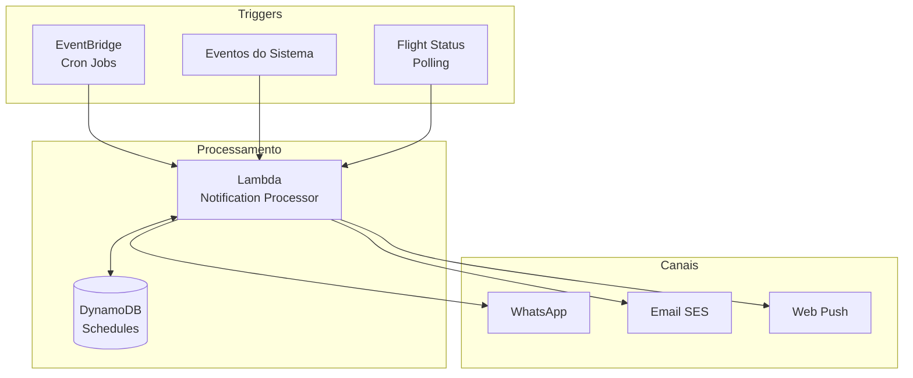

# Fase 5 - Concierge (Alertas e Notificações)

## Objetivo
Implementar o sistema de alertas proativos e notificações durante a viagem: lembretes de check-in, status de voos, informações contextuais e suporte em tempo real.

## Entradas
- Fase 4 completa (Frontend funcionando)
- WhatsApp integrado
- Dados de viagens no DynamoDB
- Integrações com APIs de voos

## Saídas
- Sistema de alertas via EventBridge Scheduler
- Notificações proativas no WhatsApp
- Monitoramento de voos em tempo real
- Alertas de documentos e pagamentos
- Sistema de lembretes inteligentes

## Duração Estimada: 2 semanas

---

## Semana 1: EventBridge Scheduler + Alertas

### Passo 5.1: Arquitetura de Notificações



### Passo 5.2: Modelo de Notificações

**lambdas/notifications/src/models.py**:

```python
from dataclasses import dataclass
from enum import Enum
from typing import List, Optional, Dict
from datetime import datetime

class NotificationType(Enum):
    # Urgentes (WhatsApp + Push)
    FLIGHT_GATE_CHANGE = "flight_gate_change"
    FLIGHT_DELAY = "flight_delay"
    BOOKING_CANCELLED = "booking_cancelled"
    EMERGENCY = "emergency"
    
    # Importantes (WhatsApp)
    CHECKIN_REMINDER = "checkin_reminder"
    DOCUMENT_EXPIRING = "document_expiring"
    PAYMENT_DUE = "payment_due"
    DAY_SUMMARY = "day_summary"
    ATTRACTION_REMINDER = "attraction_reminder"
    
    # Informativas (Email + In-App)
    ITINERARY_UPDATED = "itinerary_updated"
    NEW_RECOMMENDATION = "new_recommendation"
    WEEKLY_SUMMARY = "weekly_summary"

class NotificationPriority(Enum):
    CRITICAL = 1    # Enviar imediatamente, todos os canais
    HIGH = 2        # Enviar imediatamente, WhatsApp
    NORMAL = 3      # Enviar no próximo batch
    LOW = 4         # Apenas in-app

class NotificationChannel(Enum):
    WHATSAPP = "whatsapp"
    EMAIL = "email"
    PUSH = "push"
    IN_APP = "in_app"

@dataclass
class Notification:
    id: str
    trip_id: str
    user_id: str
    type: NotificationType
    priority: NotificationPriority
    title: str
    message: str
    channels: List[NotificationChannel]
    scheduled_for: datetime
    sent_at: Optional[datetime] = None
    metadata: Dict = None
    
    def to_whatsapp_message(self) -> str:
        """Formata a notificação para WhatsApp."""
        emoji_map = {
            NotificationType.FLIGHT_GATE_CHANGE: "🚨",
            NotificationType.FLIGHT_DELAY: "⏰",
            NotificationType.CHECKIN_REMINDER: "🏨",
            NotificationType.DAY_SUMMARY: "📋",
            NotificationType.ATTRACTION_REMINDER: "🎫",
            NotificationType.PAYMENT_DUE: "💳",
        }
        emoji = emoji_map.get(self.type, "📢")
        return f"{emoji} *{self.title}*\n\n{self.message}"

@dataclass 
class ScheduledAlert:
    """Alerta agendado no EventBridge."""
    id: str
    trip_id: str
    event_id: str
    trigger_time: datetime
    notification_type: NotificationType
    rule_name: str  # Nome da rule no EventBridge
```

### Passo 5.3: Serviço de Agendamento

**lambdas/notifications/src/scheduler.py**:

```python
import boto3
import json
from datetime import datetime, timedelta
from typing import List, Dict
import uuid

eventbridge = boto3.client('scheduler')
dynamodb = boto3.resource('dynamodb')

LAMBDA_ARN = "arn:aws:lambda:us-east-1:xxx:function:notification-processor"
ROLE_ARN = "arn:aws:iam::xxx:role/eventbridge-scheduler-role"

class NotificationScheduler:
    def __init__(self, table_name: str = "n-agent-schedules"):
        self.table = dynamodb.Table(table_name)
    
    def schedule_trip_alerts(self, trip_id: str, trip_data: Dict):
        """Agenda todos os alertas para uma viagem."""
        events = trip_data.get('events', [])
        
        for event in events:
            self._schedule_event_alerts(trip_id, event)
    
    def _schedule_event_alerts(self, trip_id: str, event: Dict):
        """Agenda alertas para um evento específico."""
        event_type = event.get('type')
        event_datetime = datetime.fromisoformat(event['datetime'])
        event_id = event.get('event_id')
        user_id = event.get('user_id')
        
        alerts_to_schedule = []
        
        if event_type == 'FLIGHT':
            # 24h antes: Lembrete de check-in
            alerts_to_schedule.append({
                'offset': timedelta(hours=-24),
                'type': 'checkin_reminder',
                'title': 'Hora do check-in! ✈️',
                'message': f"Seu voo {event.get('flight_number')} sai amanhã às {event_datetime.strftime('%H:%M')}. Faça o check-in online agora!"
            })
            
            # 3h antes: Direções para aeroporto
            alerts_to_schedule.append({
                'offset': timedelta(hours=-3),
                'type': 'airport_directions',
                'title': 'Hora de ir ao aeroporto! 🚗',
                'message': f"Seu voo sai em 3 horas. Aqui está a rota para o aeroporto."
            })
            
            # 1h antes: Lembrete de portão
            alerts_to_schedule.append({
                'offset': timedelta(hours=-1),
                'type': 'gate_reminder',
                'title': 'Confira seu portão de embarque',
                'message': f"Voo {event.get('flight_number')} - verifique o portão no painel do aeroporto."
            })
        
        elif event_type == 'HOTEL':
            # 2h antes do check-in
            alerts_to_schedule.append({
                'offset': timedelta(hours=-2),
                'type': 'checkin_reminder',
                'title': 'Check-in do hotel em breve! 🏨',
                'message': f"Check-in no {event.get('title')} a partir das {event_datetime.strftime('%H:%M')}."
            })
        
        elif event_type == 'TOUR' or event_type == 'TICKET':
            # 2h antes
            alerts_to_schedule.append({
                'offset': timedelta(hours=-2),
                'type': 'attraction_reminder',
                'title': f"{event.get('title')} em 2 horas! 🎫",
                'message': f"Não esqueça: {event.get('title')} às {event_datetime.strftime('%H:%M')}."
            })
            
            # 30min antes com voucher
            alerts_to_schedule.append({
                'offset': timedelta(minutes=-30),
                'type': 'voucher_reminder',
                'title': 'Aqui está seu ingresso! 🎟️',
                'message': f"Ingresso para {event.get('title')}. Apresente o QR code na entrada."
            })
        
        # Agendar cada alerta
        for alert in alerts_to_schedule:
            trigger_time = event_datetime + alert['offset']
            
            # Não agendar se já passou
            if trigger_time < datetime.utcnow():
                continue
            
            self._create_schedule(
                trip_id=trip_id,
                event_id=event_id,
                user_id=user_id,
                trigger_time=trigger_time,
                alert_type=alert['type'],
                title=alert['title'],
                message=alert['message'],
                event_data=event
            )
    
    def _create_schedule(
        self,
        trip_id: str,
        event_id: str,
        user_id: str,
        trigger_time: datetime,
        alert_type: str,
        title: str,
        message: str,
        event_data: Dict
    ):
        """Cria uma schedule no EventBridge."""
        schedule_id = f"alert-{uuid.uuid4().hex[:8]}"
        rule_name = f"n-agent-{trip_id}-{schedule_id}"
        
        # Criar schedule no EventBridge
        eventbridge.create_schedule(
            Name=rule_name,
            ScheduleExpression=f"at({trigger_time.strftime('%Y-%m-%dT%H:%M:%S')})",
            FlexibleTimeWindow={'Mode': 'OFF'},
            Target={
                'Arn': LAMBDA_ARN,
                'RoleArn': ROLE_ARN,
                'Input': json.dumps({
                    'schedule_id': schedule_id,
                    'trip_id': trip_id,
                    'event_id': event_id,
                    'user_id': user_id,
                    'alert_type': alert_type,
                    'title': title,
                    'message': message,
                    'event_data': event_data
                })
            },
            State='ENABLED'
        )
        
        # Salvar no DynamoDB para tracking
        self.table.put_item(Item={
            'PK': f'TRIP#{trip_id}',
            'SK': f'SCHEDULE#{schedule_id}',
            'schedule_id': schedule_id,
            'event_id': event_id,
            'user_id': user_id,
            'trigger_time': trigger_time.isoformat(),
            'alert_type': alert_type,
            'rule_name': rule_name,
            'status': 'SCHEDULED'
        })
        
        return schedule_id
    
    def cancel_trip_alerts(self, trip_id: str):
        """Cancela todos os alertas de uma viagem."""
        # Buscar schedules
        response = self.table.query(
            KeyConditionExpression='PK = :pk AND begins_with(SK, :sk)',
            ExpressionAttributeValues={
                ':pk': f'TRIP#{trip_id}',
                ':sk': 'SCHEDULE#'
            }
        )
        
        for item in response['Items']:
            try:
                eventbridge.delete_schedule(Name=item['rule_name'])
            except:
                pass
            
            # Atualizar status
            self.table.update_item(
                Key={'PK': item['PK'], 'SK': item['SK']},
                UpdateExpression='SET #status = :status',
                ExpressionAttributeNames={'#status': 'status'},
                ExpressionAttributeValues={':status': 'CANCELLED'}
            )
```

### Passo 5.4: Processador de Notificações

**lambdas/notifications/src/handler.py**:

```python
import json
import boto3
import os
from datetime import datetime

dynamodb = boto3.resource('dynamodb')
secrets = boto3.client('secretsmanager')

TABLE_NAME = os.environ.get('TABLE_NAME', 'n-agent-core')
WHATSAPP_SECRET = 'n-agent/whatsapp-credentials'

def get_whatsapp_credentials():
    secret = secrets.get_secret_value(SecretId=WHATSAPP_SECRET)
    return json.loads(secret['SecretString'])

def send_whatsapp_message(to: str, message: str, creds: dict):
    """Envia mensagem via WhatsApp."""
    import urllib.request
    
    url = f"https://graph.facebook.com/v18.0/{creds['phone_number_id']}/messages"
    
    data = json.dumps({
        "messaging_product": "whatsapp",
        "to": to,
        "type": "text",
        "text": {"body": message}
    }).encode()
    
    req = urllib.request.Request(url, data=data)
    req.add_header('Authorization', f"Bearer {creds['access_token']}")
    req.add_header('Content-Type', 'application/json')
    
    with urllib.request.urlopen(req) as response:
        return json.loads(response.read())

def send_whatsapp_template(to: str, template_name: str, params: list, creds: dict):
    """Envia mensagem com template aprovado."""
    import urllib.request
    
    url = f"https://graph.facebook.com/v18.0/{creds['phone_number_id']}/messages"
    
    data = json.dumps({
        "messaging_product": "whatsapp",
        "to": to,
        "type": "template",
        "template": {
            "name": template_name,
            "language": {"code": "pt_BR"},
            "components": [
                {
                    "type": "body",
                    "parameters": [{"type": "text", "text": p} for p in params]
                }
            ]
        }
    }).encode()
    
    req = urllib.request.Request(url, data=data)
    req.add_header('Authorization', f"Bearer {creds['access_token']}")
    req.add_header('Content-Type', 'application/json')
    
    with urllib.request.urlopen(req) as response:
        return json.loads(response.read())

def get_user_phone(user_id: str) -> str:
    """Busca telefone do usuário no DynamoDB."""
    table = dynamodb.Table(TABLE_NAME)
    response = table.get_item(
        Key={'PK': f'USER#{user_id}', 'SK': 'PROFILE'}
    )
    return response.get('Item', {}).get('whatsapp_id', user_id)

def enrich_message(alert_type: str, message: str, event_data: dict) -> str:
    """Enriquece a mensagem com dados adicionais."""
    
    if alert_type == 'voucher_reminder' and event_data.get('documents'):
        doc_url = event_data['documents'][0].get('url', '')
        message += f"\n\n🔗 Voucher: {doc_url}"
    
    if alert_type == 'airport_directions':
        # Adicionar link do Google Maps
        airport = event_data.get('departure', {}).get('airport', '')
        if airport:
            maps_url = f"https://www.google.com/maps/search/{airport}+airport"
            message += f"\n\n📍 Como chegar: {maps_url}"
    
    return message

def handler(event, context):
    """Handler principal do processador de notificações."""
    
    # Extrair dados do evento
    schedule_id = event.get('schedule_id')
    trip_id = event.get('trip_id')
    event_id = event.get('event_id')
    user_id = event.get('user_id')
    alert_type = event.get('alert_type')
    title = event.get('title')
    message = event.get('message')
    event_data = event.get('event_data', {})
    
    print(f"Processing notification: {schedule_id} for user {user_id}")
    
    try:
        # Enriquecer mensagem
        full_message = f"*{title}*\n\n{enrich_message(alert_type, message, event_data)}"
        
        # Obter telefone do usuário
        phone = get_user_phone(user_id)
        
        # Enviar via WhatsApp
        creds = get_whatsapp_credentials()
        send_whatsapp_message(phone, full_message, creds)
        
        # Atualizar status no DynamoDB
        table = dynamodb.Table('n-agent-schedules')
        table.update_item(
            Key={'PK': f'TRIP#{trip_id}', 'SK': f'SCHEDULE#{schedule_id}'},
            UpdateExpression='SET #status = :status, sent_at = :sent_at',
            ExpressionAttributeNames={'#status': 'status'},
            ExpressionAttributeValues={
                ':status': 'SENT',
                ':sent_at': datetime.utcnow().isoformat()
            }
        )
        
        return {'statusCode': 200, 'body': 'Notification sent'}
        
    except Exception as e:
        print(f"Error sending notification: {e}")
        return {'statusCode': 500, 'body': str(e)}
```

---

## Semana 2: Monitoramento de Voos + Alertas Inteligentes

### Passo 5.5: Monitor de Status de Voos

**lambdas/flight-monitor/src/handler.py**:

```python
import json
import boto3
import os
from datetime import datetime, timedelta
import urllib.request
import urllib.parse

dynamodb = boto3.resource('dynamodb')
lambda_client = boto3.client('lambda')

TABLE_NAME = os.environ.get('TABLE_NAME', 'n-agent-core')
AVIATIONSTACK_API_KEY = os.environ.get('AVIATIONSTACK_API_KEY')
NOTIFICATION_LAMBDA = os.environ.get('NOTIFICATION_LAMBDA')

def get_active_flights():
    """Busca voos das próximas 24h."""
    table = dynamodb.Table(TABLE_NAME)
    
    now = datetime.utcnow()
    tomorrow = now + timedelta(hours=24)
    
    # Buscar eventos do tipo FLIGHT nas próximas 24h
    # Isso requer um GSI por tipo de evento
    response = table.scan(
        FilterExpression='#type = :type AND #datetime BETWEEN :now AND :tomorrow',
        ExpressionAttributeNames={
            '#type': 'type',
            '#datetime': 'datetime'
        },
        ExpressionAttributeValues={
            ':type': 'FLIGHT',
            ':now': now.isoformat(),
            ':tomorrow': tomorrow.isoformat()
        }
    )
    
    return response['Items']

def check_flight_status(flight_number: str, date: str) -> dict:
    """Consulta status do voo na AviationStack."""
    base_url = "http://api.aviationstack.com/v1/flights"
    
    params = {
        'access_key': AVIATIONSTACK_API_KEY,
        'flight_iata': flight_number,
        'flight_date': date
    }
    
    url = f"{base_url}?{urllib.parse.urlencode(params)}"
    
    with urllib.request.urlopen(url) as response:
        data = json.loads(response.read())
    
    flights = data.get('data', [])
    if not flights:
        return None
    
    return flights[0]

def compare_flight_info(stored: dict, current: dict) -> list:
    """Compara informações do voo e retorna mudanças."""
    changes = []
    
    # Verificar mudança de portão
    stored_gate = stored.get('departure_gate')
    current_gate = current.get('departure', {}).get('gate')
    
    if current_gate and stored_gate != current_gate:
        changes.append({
            'type': 'GATE_CHANGE',
            'old_value': stored_gate,
            'new_value': current_gate,
            'message': f"Portão de embarque alterado: {stored_gate or 'N/A'} → {current_gate}"
        })
    
    # Verificar atraso
    stored_time = stored.get('departure_scheduled')
    current_time = current.get('departure', {}).get('estimated')
    
    if current_time and stored_time:
        stored_dt = datetime.fromisoformat(stored_time.replace('Z', '+00:00'))
        current_dt = datetime.fromisoformat(current_time.replace('Z', '+00:00'))
        
        delay_minutes = (current_dt - stored_dt).total_seconds() / 60
        
        if delay_minutes > 15:  # Mais de 15 min de atraso
            changes.append({
                'type': 'DELAY',
                'delay_minutes': int(delay_minutes),
                'new_time': current_time,
                'message': f"Voo atrasado em {int(delay_minutes)} minutos. Novo horário: {current_dt.strftime('%H:%M')}"
            })
    
    # Verificar cancelamento
    status = current.get('flight_status')
    if status == 'cancelled':
        changes.append({
            'type': 'CANCELLED',
            'message': "⚠️ ATENÇÃO: Seu voo foi CANCELADO. Entre em contato com a companhia aérea."
        })
    
    return changes

def send_flight_alert(trip_id: str, user_id: str, flight_number: str, change: dict):
    """Envia alerta de mudança no voo."""
    
    # Determinar prioridade
    priority = 'HIGH'
    if change['type'] == 'CANCELLED':
        priority = 'CRITICAL'
    
    # Invocar lambda de notificação
    lambda_client.invoke(
        FunctionName=NOTIFICATION_LAMBDA,
        InvocationType='Event',
        Payload=json.dumps({
            'trip_id': trip_id,
            'user_id': user_id,
            'alert_type': f'flight_{change["type"].lower()}',
            'title': f'Atualização do voo {flight_number}',
            'message': change['message'],
            'priority': priority,
            'event_data': change
        })
    )

def handler(event, context):
    """
    Handler executado a cada 30 minutos via EventBridge.
    Monitora status de voos e envia alertas de mudanças.
    """
    
    print("Starting flight status check...")
    
    # Buscar voos ativos
    flights = get_active_flights()
    print(f"Found {len(flights)} active flights to monitor")
    
    alerts_sent = 0
    
    for flight_event in flights:
        try:
            flight_number = flight_event.get('flight_number')
            flight_date = flight_event.get('datetime', '')[:10]
            trip_id = flight_event.get('PK', '').replace('TRIP#', '')
            user_id = flight_event.get('user_id')
            
            # Consultar status atual
            current_status = check_flight_status(flight_number, flight_date)
            
            if not current_status:
                continue
            
            # Comparar com dados armazenados
            changes = compare_flight_info(flight_event, current_status)
            
            # Enviar alertas para cada mudança
            for change in changes:
                send_flight_alert(trip_id, user_id, flight_number, change)
                alerts_sent += 1
            
            # Atualizar dados armazenados
            if changes:
                table = dynamodb.Table(TABLE_NAME)
                table.update_item(
                    Key={'PK': flight_event['PK'], 'SK': flight_event['SK']},
                    UpdateExpression='SET departure_gate = :gate, departure_estimated = :est, last_checked = :now',
                    ExpressionAttributeValues={
                        ':gate': current_status.get('departure', {}).get('gate'),
                        ':est': current_status.get('departure', {}).get('estimated'),
                        ':now': datetime.utcnow().isoformat()
                    }
                )
        
        except Exception as e:
            print(f"Error checking flight {flight_event.get('flight_number')}: {e}")
    
    print(f"Flight check complete. Sent {alerts_sent} alerts.")
    
    return {
        'statusCode': 200,
        'body': json.dumps({
            'flights_checked': len(flights),
            'alerts_sent': alerts_sent
        })
    }
```

### Passo 5.6: Resumo Diário da Viagem

**lambdas/notifications/src/daily_summary.py**:

```python
import json
import boto3
from datetime import datetime, timedelta

dynamodb = boto3.resource('dynamodb')
agentcore = boto3.client('bedrock-agentcore')

TABLE_NAME = 'n-agent-core'
RUNTIME_ARN = 'arn:aws:bedrock-agentcore:us-east-1:xxx:runtime/n-agent'

def get_tomorrow_events(trip_id: str) -> list:
    """Busca eventos do dia seguinte."""
    table = dynamodb.Table(TABLE_NAME)
    
    tomorrow = (datetime.utcnow() + timedelta(days=1)).strftime('%Y-%m-%d')
    
    response = table.query(
        KeyConditionExpression='PK = :pk AND begins_with(SK, :sk)',
        ExpressionAttributeValues={
            ':pk': f'TRIP#{trip_id}',
            ':sk': f'EVENT#{tomorrow}'
        }
    )
    
    return sorted(response['Items'], key=lambda x: x.get('datetime', ''))

def generate_day_summary(trip_id: str, events: list) -> str:
    """Usa o AgentCore para gerar um resumo amigável do dia."""
    
    if not events:
        return None
    
    # Formatar eventos para o prompt
    events_text = "\n".join([
        f"- {e.get('datetime', '')[11:16]} - {e.get('title')} ({e.get('type')})"
        for e in events
    ])
    
    # Chamar o agente para gerar resumo
    response = agentcore.invoke_agent(
        agentRuntimeArn=RUNTIME_ARN,
        inputText=f"""
Gere um resumo amigável e motivacional para o viajante sobre seu dia de amanhã.

Eventos programados:
{events_text}

Inclua:
1. Uma saudação de boa noite
2. Resumo dos principais eventos
3. Dicas práticas (o que levar, como se vestir)
4. Uma frase motivacional sobre a viagem

Formato: Mensagem curta para WhatsApp (máximo 500 caracteres)
""",
        sessionId=f"summary-{trip_id}"
    )
    
    result = ""
    for event in response['completion']:
        if 'chunk' in event:
            result += event['chunk']['bytes'].decode()
    
    return result

def get_active_trips_in_concierge() -> list:
    """Busca viagens ativas na fase Concierge."""
    table = dynamodb.Table(TABLE_NAME)
    
    # Scan com filtro (em produção, usar GSI)
    response = table.scan(
        FilterExpression='#status = :status',
        ExpressionAttributeNames={'#status': 'status'},
        ExpressionAttributeValues={':status': 'CONCIERGE'}
    )
    
    return [item for item in response['Items'] if item['SK'].startswith('META#')]

def handler(event, context):
    """
    Executado diariamente às 20:00 (horário local do destino).
    Envia resumo do dia seguinte para viajantes.
    """
    
    print("Generating daily summaries...")
    
    # Buscar viagens ativas
    active_trips = get_active_trips_in_concierge()
    summaries_sent = 0
    
    for trip in active_trips:
        trip_id = trip['trip_id']
        owner_id = trip['owner_id']
        
        try:
            # Buscar eventos de amanhã
            events = get_tomorrow_events(trip_id)
            
            if not events:
                continue
            
            # Gerar resumo
            summary = generate_day_summary(trip_id, events)
            
            if summary:
                # Enviar via notificação
                # (reutiliza o handler de notificação)
                from handler import send_whatsapp_message, get_whatsapp_credentials, get_user_phone
                
                phone = get_user_phone(owner_id)
                creds = get_whatsapp_credentials()
                
                send_whatsapp_message(phone, summary, creds)
                summaries_sent += 1
        
        except Exception as e:
            print(f"Error generating summary for trip {trip_id}: {e}")
    
    print(f"Sent {summaries_sent} daily summaries")
    
    return {'statusCode': 200, 'body': f'Sent {summaries_sent} summaries'}
```

### Passo 5.7: Configurar Cron Jobs no EventBridge

**infra/terraform/modules/eventbridge/main.tf**:

```hcl
# Monitoramento de voos - a cada 30 minutos
resource "aws_scheduler_schedule" "flight_monitor" {
  name       = "n-agent-flight-monitor"
  group_name = "default"

  flexible_time_window {
    mode = "OFF"
  }

  schedule_expression = "rate(30 minutes)"

  target {
    arn      = aws_lambda_function.flight_monitor.arn
    role_arn = aws_iam_role.scheduler_role.arn
  }
}

# Resumo diário - 20:00 UTC (ajustar conforme timezone)
resource "aws_scheduler_schedule" "daily_summary" {
  name       = "n-agent-daily-summary"
  group_name = "default"

  flexible_time_window {
    mode = "OFF"
  }

  schedule_expression = "cron(0 20 * * ? *)"

  target {
    arn      = aws_lambda_function.daily_summary.arn
    role_arn = aws_iam_role.scheduler_role.arn
  }
}

# Verificação de documentos expirando - diariamente às 9:00
resource "aws_scheduler_schedule" "document_check" {
  name       = "n-agent-document-check"
  group_name = "default"

  flexible_time_window {
    mode = "OFF"
  }

  schedule_expression = "cron(0 9 * * ? *)"

  target {
    arn      = aws_lambda_function.document_checker.arn
    role_arn = aws_iam_role.scheduler_role.arn
  }
}

# IAM Role para o Scheduler
resource "aws_iam_role" "scheduler_role" {
  name = "n-agent-eventbridge-scheduler"

  assume_role_policy = jsonencode({
    Version = "2012-10-17"
    Statement = [
      {
        Action = "sts:AssumeRole"
        Effect = "Allow"
        Principal = {
          Service = "scheduler.amazonaws.com"
        }
      }
    ]
  })
}

resource "aws_iam_role_policy" "scheduler_policy" {
  name = "invoke-lambdas"
  role = aws_iam_role.scheduler_role.id

  policy = jsonencode({
    Version = "2012-10-17"
    Statement = [
      {
        Effect = "Allow"
        Action = "lambda:InvokeFunction"
        Resource = [
          aws_lambda_function.flight_monitor.arn,
          aws_lambda_function.daily_summary.arn,
          aws_lambda_function.document_checker.arn,
          aws_lambda_function.notification_processor.arn
        ]
      }
    ]
  })
}
```

---

## Checklist de Conclusão da Fase 5

- [ ] Modelo de notificações implementado
- [ ] Scheduler de alertas funcionando
- [ ] EventBridge schedules criados
- [ ] Processador de notificações deployado
- [ ] Monitor de voos funcionando
- [ ] Alertas de mudança de portão/atraso
- [ ] Resumo diário sendo enviado
- [ ] Templates WhatsApp aprovados (se necessário)

---

## Testes de Validação

### Teste 1: Agendar Alertas para Viagem

```python
from lambdas.notifications.src.scheduler import NotificationScheduler

scheduler = NotificationScheduler()

# Simular dados de viagem
trip_data = {
    'events': [
        {
            'event_id': 'evt-001',
            'user_id': 'victor@email.com',
            'type': 'FLIGHT',
            'flight_number': 'BA247',
            'datetime': '2027-08-02T14:30:00',
            'documents': []
        }
    ]
}

scheduler.schedule_trip_alerts('trip-123', trip_data)
```

### Teste 2: Verificar Status de Voo

```bash
aws lambda invoke \
  --function-name n-agent-flight-monitor \
  --payload '{}' \
  response.json

cat response.json
```

---

## Conclusão do Plano de Implementação

Parabéns! Com a conclusão da Fase 5, você terá implementado todas as funcionalidades principais do n-agent:

| Fase | Entrega | Status |
|------|---------|--------|
| 0 | Preparação do ambiente | ✅ |
| 1 | Fundação (Runtime, Memory, DB, Auth) | ✅ |
| 2 | Integrações (WhatsApp, Maps, APIs) | ✅ |
| 3 | Core AI (Fluxos de viagem) | ✅ |
| 4 | Frontend (Web App) | ✅ |
| 5 | Concierge (Alertas, Notificações) | ✅ |

### Próximos Passos (Pós-MVP)

1. **Fase 6 - Memórias**: Organização de fotos e álbuns pós-viagem
2. **App Mobile**: PWA ou React Native
3. **Multi-idioma**: Suporte a inglês e espanhol
4. **B2B**: White-label para agências
5. **Analytics**: Dashboard de métricas e comportamento

### Estimativa Total de Implementação

| Fase | Duração |
|------|---------|
| Fase 0 | 1 semana |
| Fase 1 | 2 semanas |
| Fase 2 | 3 semanas |
| Fase 3 | 3 semanas |
| Fase 4 | 3 semanas |
| Fase 5 | 2 semanas |
| **Total** | **~14 semanas** |

Boa implementação! 🚀
