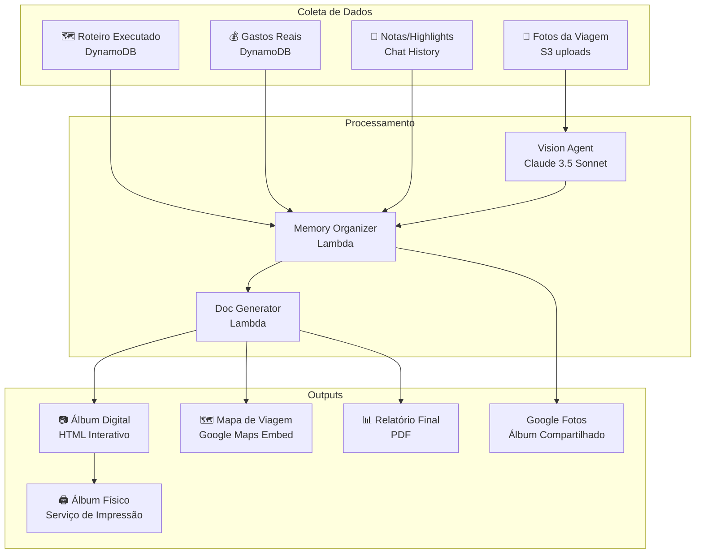

# Fase 6 - Memórias (Pós-Viagem)

## Objetivo
Implementar o sistema de organização de memórias pós-viagem: álbuns de fotos, mapas de trajeto, relatórios de viagem, integração com Google Fotos e serviços de impressão.

## Entradas
- Fase 5 completa (Concierge funcionando)
- Viagem finalizada (status: MEMORIES)
- Fotos e documentos da viagem no S3
- Dados de roteiro executado no DynamoDB

## Saídas
- Álbum de fotos organizado por local/data
- Mapa interativo do trajeto real vs planejado
- Relatório financeiro final
- Integração com Google Fotos (opcional)
- Exportação para impressão de álbum físico

## Duração Estimada: 2 semanas

---

## Visão Geral da Fase de Memórias



---

## Semana 1: Coleta e Organização de Memórias

### Passo 6.1: Modelo de Dados de Memórias

#### Entidades DynamoDB (Tabela n-agent-core)

**Memória de Viagem:**
```python
TRIP_MEMORY = {
    "PK": "TRIP#550e8400",
    "SK": "MEMORY#SUMMARY",
    "trip_id": "550e8400",
    "status": "COMPLETED",  # COLLECTING | PROCESSING | COMPLETED
    "summary": {
        "total_days": 21,
        "cities_visited": ["Londres", "Paris", "Roma", "Florença"],
        "countries": ["UK", "França", "Itália"],
        "total_photos": 847,
        "total_expenses": 14520.50,
        "currency": "EUR",
        "highlights": [
            "Torre Eiffel ao pôr do sol",
            "Tour pelo Coliseu",
            "Dia na Toscana"
        ]
    },
    "timeline_changes": [
        {"original": "Coliseu às 14h", "actual": "Tour guiado às 16h", "reason": "Perdemos horário original"},
        {"original": "Hotel Booking", "actual": "Novo Airbnb", "reason": "Faltava banheiro"}
    ],
    "created_at": "2027-08-23T10:00:00Z",
    "albums": ["album-main", "album-rome", "album-paris"]
}
```

**Foto Individual:**
```python
TRIP_PHOTO = {
    "PK": "TRIP#550e8400",
    "SK": "PHOTO#2027-08-05#img-001",
    "photo_id": "img-001",
    "s3_key": "trips/550e8400/photos/img-001.jpg",
    "thumbnail_key": "trips/550e8400/thumbnails/img-001.jpg",
    "taken_at": "2027-08-05T14:30:00Z",
    "location": {
        "city": "Londres",
        "place": "Tower Bridge",
        "lat": 51.5055,
        "lng": -0.0754
    },
    "metadata": {
        "width": 4032,
        "height": 3024,
        "device": "iPhone 15 Pro",
        "detected_faces": 3,
        "detected_landmarks": ["Tower Bridge"]
    },
    "tags": ["família", "ponte", "landmark"],
    "in_albums": ["album-main", "album-london"],
    "is_highlight": True
}
```

**Álbum:**
```python
TRIP_ALBUM = {
    "PK": "TRIP#550e8400",
    "SK": "ALBUM#album-main",
    "album_id": "album-main",
    "title": "Eurotrip 2027 - Álbum Principal",
    "description": "Melhores momentos da nossa viagem pela Europa",
    "cover_photo_id": "img-001",
    "photo_count": 150,
    "sections": [
        {"title": "Londres", "date_range": "02-05/08", "photo_count": 35},
        {"title": "Paris", "date_range": "06-10/08", "photo_count": 42},
        {"title": "Roma", "date_range": "14-17/08", "photo_count": 38},
        {"title": "Florença", "date_range": "18-21/08", "photo_count": 35}
    ],
    "created_at": "2027-08-23T12:00:00Z",
    "shared_with": ["fabiola@email.com", "vicenzo@email.com"],
    "is_public": False,
    "public_url": None,
    "google_photos_album_id": "AF1Q...",  # Se sincronizado
    "print_ready": True
}
```

---

### Passo 6.2: Ferramentas de Memórias

**agent/src/tools/memory_tools.py**:

```python
from strands import tool
from typing import List, Dict, Optional
from datetime import datetime
import boto3

dynamodb = boto3.resource('dynamodb')
s3 = boto3.client('s3')

@tool
def initialize_trip_memories(trip_id: str) -> dict:
    """
    Inicializa a fase de memórias para uma viagem concluída.
    Coleta dados do roteiro executado e prepara estrutura de álbuns.
    
    Use quando a viagem terminar e o usuário quiser organizar memórias.
    """
    table = dynamodb.Table('n-agent-core')
    
    # Buscar dados da viagem
    trip_data = table.query(
        KeyConditionExpression='PK = :pk',
        ExpressionAttributeValues={':pk': f'TRIP#{trip_id}'}
    )
    
    # Extrair estatísticas
    events = [i for i in trip_data['Items'] if i['SK'].startswith('EVENT#')]
    days = [i for i in trip_data['Items'] if i['SK'].startswith('DAY#')]
    photos = [i for i in trip_data['Items'] if i['SK'].startswith('PHOTO#')]
    
    # Calcular resumo
    cities = list(set(d.get('city') for d in days if d.get('city')))
    total_expenses = sum(float(e.get('price', 0)) for e in events if e.get('price'))
    
    # Criar registro de memória
    memory_record = {
        'PK': f'TRIP#{trip_id}',
        'SK': 'MEMORY#SUMMARY',
        'trip_id': trip_id,
        'status': 'COLLECTING',
        'summary': {
            'total_days': len(days),
            'cities_visited': cities,
            'total_photos': len(photos),
            'total_expenses': total_expenses,
            'currency': 'EUR',
            'highlights': []
        },
        'timeline_changes': [],
        'created_at': datetime.utcnow().isoformat(),
        'albums': []
    }
    
    table.put_item(Item=memory_record)
    
    return {
        'success': True,
        'trip_id': trip_id,
        'summary': memory_record['summary'],
        'message': '📸 Fase de memórias iniciada! Vou organizar suas fotos e criar um álbum da viagem.'
    }


@tool
def process_trip_photos(trip_id: str, use_vision: bool = True) -> dict:
    """
    Processa fotos da viagem usando Vision AI para:
    - Detectar localização (landmarks)
    - Identificar pessoas
    - Extrair metadados EXIF
    - Organizar por data/local
    
    Args:
        trip_id: ID da viagem
        use_vision: Se True, usa Claude Vision para análise avançada
    """
    table = dynamodb.Table('n-agent-core')
    bucket = 'n-agent-documents'
    
    # Listar fotos no S3
    response = s3.list_objects_v2(
        Bucket=bucket,
        Prefix=f'trips/{trip_id}/photos/'
    )
    
    photos_processed = 0
    photos_by_city = {}
    
    for obj in response.get('Contents', []):
        photo_key = obj['Key']
        photo_id = photo_key.split('/')[-1].split('.')[0]
        
        # Extrair metadados EXIF (simulado - usar biblioteca real)
        metadata = extract_exif_metadata(bucket, photo_key)
        
        # Determinar localização
        location = determine_photo_location(
            trip_id, 
            metadata.get('taken_at'),
            metadata.get('gps')
        )
        
        # Criar thumbnail
        thumbnail_key = f'trips/{trip_id}/thumbnails/{photo_id}.jpg'
        create_thumbnail(bucket, photo_key, thumbnail_key)
        
        # Salvar registro
        photo_record = {
            'PK': f'TRIP#{trip_id}',
            'SK': f'PHOTO#{metadata.get("taken_at", "unknown")}#{photo_id}',
            'photo_id': photo_id,
            's3_key': photo_key,
            'thumbnail_key': thumbnail_key,
            'taken_at': metadata.get('taken_at'),
            'location': location,
            'metadata': metadata,
            'tags': [],
            'in_albums': [],
            'is_highlight': False
        }
        
        table.put_item(Item=photo_record)
        
        # Agrupar por cidade
        city = location.get('city', 'Desconhecido')
        if city not in photos_by_city:
            photos_by_city[city] = []
        photos_by_city[city].append(photo_id)
        
        photos_processed += 1
    
    return {
        'success': True,
        'photos_processed': photos_processed,
        'by_city': {city: len(photos) for city, photos in photos_by_city.items()},
        'message': f'✨ {photos_processed} fotos processadas e organizadas por localização!'
    }


@tool
def create_trip_album(
    trip_id: str, 
    album_title: str,
    album_type: str = "main",
    filter_city: Optional[str] = None,
    include_highlights_only: bool = False
) -> dict:
    """
    Cria um álbum de fotos da viagem.
    
    Args:
        trip_id: ID da viagem
        album_title: Título do álbum
        album_type: "main" (principal), "city" (por cidade), "highlights" (melhores)
        filter_city: Se informado, filtra fotos apenas desta cidade
        include_highlights_only: Se True, inclui apenas fotos marcadas como destaque
    """
    import uuid
    
    table = dynamodb.Table('n-agent-core')
    album_id = f'album-{uuid.uuid4().hex[:8]}'
    
    # Buscar fotos
    photos_response = table.query(
        KeyConditionExpression='PK = :pk AND begins_with(SK, :sk)',
        ExpressionAttributeValues={
            ':pk': f'TRIP#{trip_id}',
            ':sk': 'PHOTO#'
        }
    )
    
    photos = photos_response['Items']
    
    # Aplicar filtros
    if filter_city:
        photos = [p for p in photos if p.get('location', {}).get('city') == filter_city]
    
    if include_highlights_only:
        photos = [p for p in photos if p.get('is_highlight')]
    
    # Organizar por data
    photos.sort(key=lambda x: x.get('taken_at', ''))
    
    # Criar seções por cidade
    sections = {}
    for photo in photos:
        city = photo.get('location', {}).get('city', 'Outros')
        if city not in sections:
            sections[city] = {
                'title': city,
                'photos': [],
                'date_range': {'start': None, 'end': None}
            }
        sections[city]['photos'].append(photo['photo_id'])
        
        taken_at = photo.get('taken_at')
        if taken_at:
            if not sections[city]['date_range']['start'] or taken_at < sections[city]['date_range']['start']:
                sections[city]['date_range']['start'] = taken_at
            if not sections[city]['date_range']['end'] or taken_at > sections[city]['date_range']['end']:
                sections[city]['date_range']['end'] = taken_at
    
    # Determinar capa (primeira foto highlight ou primeira foto)
    cover_photo = next((p for p in photos if p.get('is_highlight')), photos[0] if photos else None)
    
    # Criar álbum
    album_record = {
        'PK': f'TRIP#{trip_id}',
        'SK': f'ALBUM#{album_id}',
        'album_id': album_id,
        'title': album_title,
        'album_type': album_type,
        'cover_photo_id': cover_photo['photo_id'] if cover_photo else None,
        'photo_count': len(photos),
        'sections': [
            {
                'title': s['title'],
                'date_range': f"{s['date_range']['start'][:10]} - {s['date_range']['end'][:10]}" if s['date_range']['start'] else '',
                'photo_count': len(s['photos'])
            }
            for s in sections.values()
        ],
        'created_at': datetime.utcnow().isoformat(),
        'shared_with': [],
        'is_public': False,
        'print_ready': False
    }
    
    table.put_item(Item=album_record)
    
    # Atualizar fotos com referência ao álbum
    for photo in photos:
        table.update_item(
            Key={'PK': f'TRIP#{trip_id}', 'SK': photo['SK']},
            UpdateExpression='SET in_albums = list_append(if_not_exists(in_albums, :empty), :album)',
            ExpressionAttributeValues={
                ':album': [album_id],
                ':empty': []
            }
        )
    
    return {
        'success': True,
        'album_id': album_id,
        'title': album_title,
        'photo_count': len(photos),
        'sections_count': len(sections),
        'message': f'📷 Álbum "{album_title}" criado com {len(photos)} fotos em {len(sections)} seções!'
    }


@tool
def mark_photo_as_highlight(trip_id: str, photo_id: str, highlight: bool = True) -> dict:
    """
    Marca ou desmarca uma foto como destaque da viagem.
    Fotos destacadas aparecem em resumos e na capa de álbuns.
    """
    table = dynamodb.Table('n-agent-core')
    
    # Buscar foto
    response = table.query(
        KeyConditionExpression='PK = :pk AND begins_with(SK, :sk)',
        FilterExpression='photo_id = :photo_id',
        ExpressionAttributeValues={
            ':pk': f'TRIP#{trip_id}',
            ':sk': 'PHOTO#',
            ':photo_id': photo_id
        }
    )
    
    if not response['Items']:
        return {'error': 'Foto não encontrada'}
    
    photo = response['Items'][0]
    
    table.update_item(
        Key={'PK': photo['PK'], 'SK': photo['SK']},
        UpdateExpression='SET is_highlight = :val',
        ExpressionAttributeValues={':val': highlight}
    )
    
    action = "marcada como destaque" if highlight else "removida dos destaques"
    return {
        'success': True,
        'photo_id': photo_id,
        'message': f'⭐ Foto {action}!'
    }


@tool
def add_trip_highlight(trip_id: str, highlight_text: str, related_photo_id: Optional[str] = None) -> dict:
    """
    Adiciona um momento marcante à viagem.
    
    Args:
        trip_id: ID da viagem
        highlight_text: Descrição do momento marcante
        related_photo_id: ID de foto relacionada (opcional)
    """
    table = dynamodb.Table('n-agent-core')
    
    # Buscar memória
    response = table.get_item(
        Key={'PK': f'TRIP#{trip_id}', 'SK': 'MEMORY#SUMMARY'}
    )
    
    if 'Item' not in response:
        return {'error': 'Memórias não inicializadas. Use initialize_trip_memories primeiro.'}
    
    memory = response['Item']
    highlights = memory.get('summary', {}).get('highlights', [])
    highlights.append(highlight_text)
    
    table.update_item(
        Key={'PK': f'TRIP#{trip_id}', 'SK': 'MEMORY#SUMMARY'},
        UpdateExpression='SET summary.highlights = :highlights',
        ExpressionAttributeValues={':highlights': highlights}
    )
    
    # Se tiver foto relacionada, marca como highlight
    if related_photo_id:
        mark_photo_as_highlight(trip_id, related_photo_id, True)
    
    return {
        'success': True,
        'message': f'✨ Momento adicionado: "{highlight_text}"'
    }


@tool
def generate_trip_summary_document(trip_id: str) -> dict:
    """
    Gera um documento HTML rico com o resumo completo da viagem.
    Inclui: timeline, mapa, fotos destacadas, gastos, highlights.
    """
    table = dynamodb.Table('n-agent-core')
    
    # Buscar todos os dados
    response = table.query(
        KeyConditionExpression='PK = :pk',
        ExpressionAttributeValues={':pk': f'TRIP#{trip_id}'}
    )
    
    items = response['Items']
    
    # Separar por tipo
    meta = next((i for i in items if i['SK'].startswith('META#')), {})
    memory = next((i for i in items if i['SK'] == 'MEMORY#SUMMARY'), {})
    days = sorted([i for i in items if i['SK'].startswith('DAY#')], key=lambda x: x['SK'])
    events = [i for i in items if i['SK'].startswith('EVENT#')]
    photos = [i for i in items if i['SK'].startswith('PHOTO#') and i.get('is_highlight')]
    
    # Gerar HTML (template simplificado)
    html_content = generate_memory_html(meta, memory, days, events, photos)
    
    # Salvar no S3
    s3_key = f'trips/{trip_id}/docs/resumo-viagem.html'
    s3.put_object(
        Bucket='n-agent-documents',
        Key=s3_key,
        Body=html_content.encode('utf-8'),
        ContentType='text/html'
    )
    
    # Gerar URL
    doc_url = f'https://n-agent-documents.s3.amazonaws.com/{s3_key}'
    
    return {
        'success': True,
        'document_url': doc_url,
        'message': '📄 Resumo da viagem gerado! Clique no link para visualizar.'
    }


@tool
def generate_expense_report(trip_id: str) -> dict:
    """
    Gera relatório financeiro detalhado da viagem.
    Compara orçamento planejado vs gastos reais por categoria.
    """
    table = dynamodb.Table('n-agent-core')
    
    # Buscar eventos (gastos)
    response = table.query(
        KeyConditionExpression='PK = :pk AND begins_with(SK, :sk)',
        ExpressionAttributeValues={
            ':pk': f'TRIP#{trip_id}',
            ':sk': 'EVENT#'
        }
    )
    
    events = response['Items']
    
    # Agrupar por categoria
    expenses_by_category = {}
    expenses_by_city = {}
    total = 0
    
    for event in events:
        category = event.get('type', 'OUTROS')
        city = event.get('city', 'Desconhecido')
        price = float(event.get('price', 0))
        
        if category not in expenses_by_category:
            expenses_by_category[category] = {'planned': 0, 'actual': 0, 'items': []}
        expenses_by_category[category]['actual'] += price
        expenses_by_category[category]['items'].append({
            'title': event.get('title'),
            'price': price,
            'date': event.get('datetime', '')[:10]
        })
        
        if city not in expenses_by_city:
            expenses_by_city[city] = 0
        expenses_by_city[city] += price
        
        total += price
    
    # Gerar HTML com gráficos
    html_content = generate_expense_html(
        trip_id,
        expenses_by_category,
        expenses_by_city,
        total
    )
    
    s3_key = f'trips/{trip_id}/docs/relatorio-financeiro.html'
    s3.put_object(
        Bucket='n-agent-documents',
        Key=s3_key,
        Body=html_content.encode('utf-8'),
        ContentType='text/html'
    )
    
    return {
        'success': True,
        'total_expenses': total,
        'by_category': {k: v['actual'] for k, v in expenses_by_category.items()},
        'by_city': expenses_by_city,
        'document_url': f'https://n-agent-documents.s3.amazonaws.com/{s3_key}',
        'message': f'💰 Relatório financeiro gerado! Total gasto: €{total:.2f}'
    }


@tool
def generate_travel_map(trip_id: str) -> dict:
    """
    Gera mapa interativo com o trajeto da viagem.
    Mostra: cidades visitadas, pontos de interesse, trajeto real vs planejado.
    """
    table = dynamodb.Table('n-agent-core')
    
    # Buscar dias e eventos com localização
    response = table.query(
        KeyConditionExpression='PK = :pk',
        ExpressionAttributeValues={':pk': f'TRIP#{trip_id}'}
    )
    
    items = response['Items']
    days = sorted([i for i in items if i['SK'].startswith('DAY#')], key=lambda x: x['SK'])
    
    # Extrair coordenadas
    waypoints = []
    for day in days:
        city = day.get('city')
        # Geocoding simplificado - em produção usar Google Geocoding API
        coords = geocode_city(city)
        if coords:
            waypoints.append({
                'city': city,
                'date': day['SK'].replace('DAY#', ''),
                'lat': coords['lat'],
                'lng': coords['lng'],
                'summary': day.get('summary', '')
            })
    
    # Gerar HTML com Google Maps embed
    html_content = generate_map_html(trip_id, waypoints)
    
    s3_key = f'trips/{trip_id}/docs/mapa-viagem.html'
    s3.put_object(
        Bucket='n-agent-documents',
        Key=s3_key,
        Body=html_content.encode('utf-8'),
        ContentType='text/html'
    )
    
    return {
        'success': True,
        'waypoints_count': len(waypoints),
        'cities': [w['city'] for w in waypoints],
        'document_url': f'https://n-agent-documents.s3.amazonaws.com/{s3_key}',
        'message': f'🗺️ Mapa da viagem gerado com {len(waypoints)} pontos!'
    }
```

---

### Passo 6.3: Templates HTML para Memórias

**lambdas/doc-generator/src/templates/memory_templates.py**:

```python
def generate_memory_html(meta: dict, memory: dict, days: list, events: list, photos: list) -> str:
    """Gera HTML do resumo de memórias."""
    
    summary = memory.get('summary', {})
    highlights = summary.get('highlights', [])
    
    return f"""
<!DOCTYPE html>
<html lang="pt-BR">
<head>
    <meta charset="UTF-8">
    <meta name="viewport" content="width=device-width, initial-scale=1.0">
    <title>{meta.get('name', 'Memórias da Viagem')}</title>
    <script src="https://cdn.tailwindcss.com"></script>
    <style>
        @media print {{ .no-print {{ display: none; }} }}
        .photo-grid {{ display: grid; grid-template-columns: repeat(auto-fill, minmax(200px, 1fr)); gap: 1rem; }}
        .photo-card {{ aspect-ratio: 1; object-fit: cover; border-radius: 8px; }}
    </style>
</head>
<body class="bg-gradient-to-br from-blue-50 to-purple-50 min-h-screen">
    <!-- Header -->
    <header class="bg-white shadow-lg">
        <div class="max-w-6xl mx-auto px-6 py-8">
            <h1 class="text-4xl font-bold text-gray-900">{meta.get('name', 'Nossa Viagem')}</h1>
            <p class="text-xl text-gray-600 mt-2">
                {summary.get('total_days', 0)} dias • {len(summary.get('cities_visited', []))} cidades • 
                {summary.get('total_photos', 0)} fotos
            </p>
            <div class="flex gap-4 mt-4">
                <span class="px-3 py-1 bg-blue-100 text-blue-800 rounded-full text-sm">
                    🌍 {', '.join(summary.get('cities_visited', []))}
                </span>
                <span class="px-3 py-1 bg-green-100 text-green-800 rounded-full text-sm">
                    💰 €{summary.get('total_expenses', 0):,.2f}
                </span>
            </div>
        </div>
    </header>

    <main class="max-w-6xl mx-auto px-6 py-8 space-y-12">
        
        <!-- Highlights -->
        <section class="bg-white rounded-2xl shadow-md p-6">
            <h2 class="text-2xl font-bold mb-4">✨ Momentos Inesquecíveis</h2>
            <div class="grid md:grid-cols-2 gap-4">
                {''.join(f'<div class="p-4 bg-yellow-50 rounded-lg border-l-4 border-yellow-400"><p>{h}</p></div>' for h in highlights)}
            </div>
        </section>

        <!-- Fotos Destacadas -->
        <section class="bg-white rounded-2xl shadow-md p-6">
            <h2 class="text-2xl font-bold mb-4">📸 Fotos Favoritas</h2>
            <div class="photo-grid">
                {''.join(f'' for p in photos[:12])}
            </div>
        </section>

        <!-- Timeline -->
        <section class="bg-white rounded-2xl shadow-md p-6">
            <h2 class="text-2xl font-bold mb-6">🗓️ Nossa Jornada</h2>
            <div class="space-y-4">
                {''.join(generate_day_card(day, i+1) for i, day in enumerate(days))}
            </div>
        </section>

        <!-- Mudanças no Roteiro -->
        {generate_changes_section(memory.get('timeline_changes', []))}

    </main>

    <footer class="bg-gray-800 text-white py-8 mt-12">
        <div class="max-w-6xl mx-auto px-6 text-center">
            <p>Memórias organizadas com ❤️ pelo n-agent</p>
            <p class="text-gray-400 text-sm mt-2">Gerado em {datetime.utcnow().strftime('%d/%m/%Y')}</p>
        </div>
    </footer>
</body>
</html>
"""

def generate_day_card(day: dict, day_number: int) -> str:
    """Gera card de um dia da viagem."""
    return f"""
    <div class="flex gap-4 items-start">
        <div class="flex-shrink-0 w-16 h-16 bg-blue-600 text-white rounded-full flex items-center justify-center font-bold text-xl">
            D{day_number}
        </div>
        <div class="flex-1 bg-gray-50 rounded-lg p-4">
            <div class="flex justify-between items-start">
                <div>
                    <h3 class="font-bold text-lg">{day.get('city', 'Cidade')}</h3>
                    <p class="text-gray-600">{day['SK'].replace('DAY#', '')}</p>
                </div>
                <span class="text-2xl">{get_weather_emoji(day.get('weather_forecast', {}))}</span>
            </div>
            <p class="mt-2 text-gray-700">{day.get('summary', 'Dia de exploração!')}</p>
        </div>
    </div>
    """

def generate_changes_section(changes: list) -> str:
    """Gera seção de mudanças no roteiro."""
    if not changes:
        return ""
    
    return f"""
    <section class="bg-white rounded-2xl shadow-md p-6">
        <h2 class="text-2xl font-bold mb-4">🔄 Imprevistos & Adaptações</h2>
        <div class="space-y-3">
            {''.join(f'''
            <div class="flex items-center gap-4 p-3 bg-orange-50 rounded-lg">
                <span class="text-2xl">🔀</span>
                <div class="flex-1">
                    <p class="text-gray-500 line-through text-sm">{c.get("original")}</p>
                    <p class="font-medium">{c.get("actual")}</p>
                    <p class="text-sm text-orange-600">{c.get("reason")}</p>
                </div>
            </div>
            ''' for c in changes)}
        </div>
    </section>
    """

def get_weather_emoji(weather: dict) -> str:
    """Retorna emoji baseado no clima."""
    condition = weather.get('condition', '').lower()
    if 'sun' in condition or 'clear' in condition:
        return '☀️'
    elif 'cloud' in condition:
        return '☁️'
    elif 'rain' in condition:
        return '🌧️'
    elif 'snow' in condition:
        return '❄️'
    return '🌤️'
```

---

## Semana 2: Integrações e Exportação

### Passo 6.4: Integração com Google Fotos

**agent/src/tools/google_photos_tools.py**:

```python
from strands import tool
from google.oauth2.credentials import Credentials
from googleapiclient.discovery import build
import boto3

secrets = boto3.client('secretsmanager')

@tool
def sync_album_to_google_photos(
    trip_id: str, 
    album_id: str, 
    user_id: str
) -> dict:
    """
    Sincroniza um álbum do n-agent com o Google Fotos do usuário.
    Cria um álbum compartilhado no Google Fotos com as fotos selecionadas.
    
    Requer: Usuário ter conectado conta Google via OAuth.
    """
    # Buscar credenciais OAuth do usuário
    user_creds = get_user_google_credentials(user_id)
    if not user_creds:
        return {
            'error': 'Conta Google não conectada',
            'action_required': 'connect_google',
            'message': 'Para sincronizar com Google Fotos, conecte sua conta Google no painel.'
        }
    
    # Criar serviço Google Photos
    credentials = Credentials.from_authorized_user_info(user_creds)
    service = build('photoslibrary', 'v1', credentials=credentials)
    
    # Buscar álbum e fotos no DynamoDB
    table = boto3.resource('dynamodb').Table('n-agent-core')
    
    album_response = table.get_item(
        Key={'PK': f'TRIP#{trip_id}', 'SK': f'ALBUM#{album_id}'}
    )
    album = album_response.get('Item', {})
    
    photos_response = table.query(
        KeyConditionExpression='PK = :pk AND begins_with(SK, :sk)',
        FilterExpression='contains(in_albums, :album_id)',
        ExpressionAttributeValues={
            ':pk': f'TRIP#{trip_id}',
            ':sk': 'PHOTO#',
            ':album_id': album_id
        }
    )
    photos = photos_response['Items']
    
    # Criar álbum no Google Photos
    gphoto_album = service.albums().create(
        body={'album': {'title': album.get('title', 'Álbum n-agent')}}
    ).execute()
    
    gphoto_album_id = gphoto_album['id']
    
    # Upload das fotos
    uploaded_count = 0
    for photo in photos:
        try:
            # Download do S3
            s3_key = photo.get('s3_key')
            photo_data = download_from_s3('n-agent-documents', s3_key)
            
            # Upload para Google Photos
            upload_token = upload_to_google_photos(service, photo_data)
            
            # Adicionar ao álbum
            service.mediaItems().batchCreate(
                body={
                    'albumId': gphoto_album_id,
                    'newMediaItems': [{
                        'simpleMediaItem': {'uploadToken': upload_token}
                    }]
                }
            ).execute()
            
            uploaded_count += 1
            
        except Exception as e:
            print(f"Erro ao sincronizar foto {photo.get('photo_id')}: {e}")
    
    # Salvar referência do álbum Google
    table.update_item(
        Key={'PK': f'TRIP#{trip_id}', 'SK': f'ALBUM#{album_id}'},
        UpdateExpression='SET google_photos_album_id = :gid',
        ExpressionAttributeValues={':gid': gphoto_album_id}
    )
    
    # Compartilhar álbum
    share_info = service.albums().share(
        albumId=gphoto_album_id,
        body={'sharedAlbumOptions': {'isCollaborative': True, 'isCommentable': True}}
    ).execute()
    
    share_url = share_info.get('shareInfo', {}).get('shareableUrl')
    
    return {
        'success': True,
        'google_album_id': gphoto_album_id,
        'share_url': share_url,
        'photos_synced': uploaded_count,
        'message': f'📱 Álbum sincronizado com Google Fotos! {uploaded_count} fotos enviadas.'
    }


@tool
def import_photos_from_google(trip_id: str, user_id: str, date_range: dict) -> dict:
    """
    Importa fotos do Google Fotos do usuário para o álbum da viagem.
    Filtra por data da viagem automaticamente.
    
    Args:
        trip_id: ID da viagem
        user_id: ID do usuário
        date_range: {'start': 'YYYY-MM-DD', 'end': 'YYYY-MM-DD'}
    """
    user_creds = get_user_google_credentials(user_id)
    if not user_creds:
        return {'error': 'Conta Google não conectada'}
    
    credentials = Credentials.from_authorized_user_info(user_creds)
    service = build('photoslibrary', 'v1', credentials=credentials)
    
    # Buscar fotos por data
    results = service.mediaItems().search(
        body={
            'filters': {
                'dateFilter': {
                    'ranges': [{
                        'startDate': parse_date(date_range['start']),
                        'endDate': parse_date(date_range['end'])
                    }]
                }
            },
            'pageSize': 100
        }
    ).execute()
    
    photos = results.get('mediaItems', [])
    imported_count = 0
    
    for photo in photos:
        try:
            # Download da foto
            photo_url = f"{photo['baseUrl']}=d"  # =d para download
            photo_data = download_from_url(photo_url)
            
            # Upload para S3
            photo_id = f"gphoto-{photo['id'][:8]}"
            s3_key = f'trips/{trip_id}/photos/{photo_id}.jpg'
            upload_to_s3('n-agent-documents', s3_key, photo_data)
            
            # Criar registro no DynamoDB
            # ... (similar ao process_trip_photos)
            
            imported_count += 1
            
        except Exception as e:
            print(f"Erro ao importar foto: {e}")
    
    return {
        'success': True,
        'photos_found': len(photos),
        'photos_imported': imported_count,
        'message': f'📥 {imported_count} fotos importadas do Google Fotos!'
    }
```

---

### Passo 6.5: Exportação para Impressão

**agent/src/tools/print_tools.py**:

```python
from strands import tool
import boto3

@tool
def prepare_album_for_print(trip_id: str, album_id: str, print_options: dict) -> dict:
    """
    Prepara álbum para impressão física.
    Gera PDF otimizado para impressão com layout de álbum.
    
    Args:
        trip_id: ID da viagem
        album_id: ID do álbum
        print_options: {
            'format': 'A4' | 'square' | '20x30',
            'layout': 'classic' | 'modern' | 'minimal',
            'include_captions': True,
            'include_map': True,
            'cover_style': 'photo' | 'text' | 'collage'
        }
    """
    table = boto3.resource('dynamodb').Table('n-agent-core')
    
    # Buscar álbum e fotos
    album = table.get_item(
        Key={'PK': f'TRIP#{trip_id}', 'SK': f'ALBUM#{album_id}'}
    ).get('Item', {})
    
    photos = table.query(
        KeyConditionExpression='PK = :pk AND begins_with(SK, :sk)',
        FilterExpression='contains(in_albums, :album_id)',
        ExpressionAttributeValues={
            ':pk': f'TRIP#{trip_id}',
            ':sk': 'PHOTO#',
            ':album_id': album_id
        }
    )['Items']
    
    # Verificar requisitos mínimos
    if len(photos) < 10:
        return {
            'error': 'Álbum precisa de pelo menos 10 fotos para impressão',
            'current_count': len(photos)
        }
    
    # Gerar PDF (usando Lambda com Puppeteer ou wkhtmltopdf)
    pdf_html = generate_print_layout_html(album, photos, print_options)
    
    # Invocar Lambda de geração de PDF
    lambda_client = boto3.client('lambda')
    response = lambda_client.invoke(
        FunctionName='n-agent-pdf-generator',
        Payload=json.dumps({
            'html': pdf_html,
            'output_key': f'trips/{trip_id}/print/{album_id}-print.pdf',
            'options': {
                'format': print_options.get('format', 'A4'),
                'printBackground': True,
                'margin': {'top': '1cm', 'bottom': '1cm', 'left': '1cm', 'right': '1cm'}
            }
        })
    )
    
    result = json.loads(response['Payload'].read())
    
    # Marcar álbum como pronto para impressão
    table.update_item(
        Key={'PK': f'TRIP#{trip_id}', 'SK': f'ALBUM#{album_id}'},
        UpdateExpression='SET print_ready = :val, print_pdf_url = :url',
        ExpressionAttributeValues={
            ':val': True,
            ':url': result.get('pdf_url')
        }
    )
    
    return {
        'success': True,
        'pdf_url': result.get('pdf_url'),
        'pages': result.get('pages'),
        'estimated_price': calculate_print_price(result.get('pages'), print_options),
        'message': f'🖨️ Álbum preparado para impressão! {result.get("pages")} páginas.'
    }


@tool
def get_print_partners() -> dict:
    """
    Lista parceiros de impressão disponíveis com preços.
    """
    return {
        'partners': [
            {
                'id': 'fotoregistro',
                'name': 'FotoRegistro',
                'formats': ['A4', '20x30', '30x30'],
                'prices': {
                    'A4': {'base': 89, 'per_page': 3.5},
                    '20x30': {'base': 119, 'per_page': 5.0},
                    '30x30': {'base': 159, 'per_page': 7.0}
                },
                'delivery_days': 7,
                'rating': 4.8
            },
            {
                'id': 'nicephotos',
                'name': 'NicePhotos',
                'formats': ['A4', 'square', '20x30'],
                'prices': {
                    'A4': {'base': 79, 'per_page': 4.0},
                    'square': {'base': 99, 'per_page': 4.5},
                    '20x30': {'base': 129, 'per_page': 5.5}
                },
                'delivery_days': 10,
                'rating': 4.5
            }
        ],
        'message': 'Escolha um parceiro para imprimir seu álbum!'
    }


@tool
def order_album_print(
    trip_id: str, 
    album_id: str, 
    partner_id: str,
    shipping_address: dict
) -> dict:
    """
    Finaliza pedido de impressão do álbum.
    Redireciona para checkout do parceiro.
    
    Args:
        trip_id: ID da viagem
        album_id: ID do álbum
        partner_id: ID do parceiro de impressão
        shipping_address: Endereço de entrega
    """
    table = boto3.resource('dynamodb').Table('n-agent-core')
    
    album = table.get_item(
        Key={'PK': f'TRIP#{trip_id}', 'SK': f'ALBUM#{album_id}'}
    ).get('Item', {})
    
    if not album.get('print_ready'):
        return {'error': 'Álbum não está preparado para impressão. Use prepare_album_for_print primeiro.'}
    
    # Gerar link de checkout do parceiro (affiliate link)
    checkout_url = generate_partner_checkout_url(
        partner_id=partner_id,
        pdf_url=album.get('print_pdf_url'),
        address=shipping_address,
        affiliate_id='n-agent-2024'
    )
    
    return {
        'success': True,
        'checkout_url': checkout_url,
        'partner': partner_id,
        'estimated_delivery': '7-10 dias úteis',
        'message': '🛒 Clique no link para finalizar seu pedido de impressão!'
    }
```

---

## Checklist de Conclusão da Fase 6

### Funcional
- [ ] Inicialização de memórias após viagem concluída
- [ ] Processamento e organização de fotos
- [ ] Criação de álbuns (principal, por cidade, highlights)
- [ ] Marcação de fotos como destaque
- [ ] Geração de resumo da viagem (HTML)
- [ ] Relatório financeiro com gráficos
- [ ] Mapa interativo do trajeto

### Integrações
- [ ] Sincronização com Google Fotos
- [ ] Importação de fotos do Google Fotos
- [ ] Integração com parceiros de impressão
- [ ] Exportação de PDF para impressão

### Frontend
- [ ] Página de Memórias no web-client
- [ ] Galeria de fotos com lightbox
- [ ] Editor de álbuns (drag & drop)
- [ ] Visualizador de mapa interativo
- [ ] Fluxo de pedido de impressão

---

## Próximos Passos

Com a Fase de Memórias completa, o ciclo de vida da viagem está finalizado:

1. ✅ Conhecimento → Coleta de informações
2. ✅ Planejamento → Criação de roteiros
3. ✅ Contratação → Reservas e pagamentos
4. ✅ Concierge → Suporte durante viagem
5. ✅ **Memórias → Organização pós-viagem**

### Melhorias Futuras (Backlog)

- [ ] IA para seleção automática de melhores fotos (Vision)
- [ ] Reconhecimento facial para agrupar fotos por pessoa
- [ ] Vídeo de resumo automático (slideshow com música)
- [ ] Integração com Instagram/Facebook para compartilhamento
- [ ] Álbum colaborativo em tempo real
- [ ] Heatmap de locais visitados baseado em GPS

---

**Duração Estimada**: 2 semanas  
**Dependências**: Fase 5 (Concierge), Google Photos API, S3, Lambda PDF Generator
