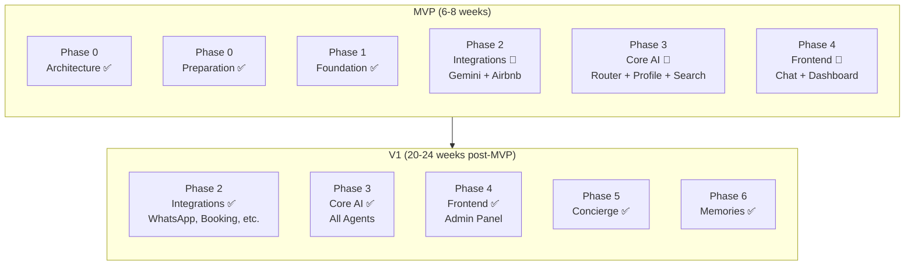
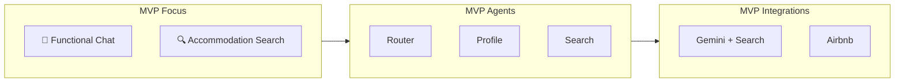
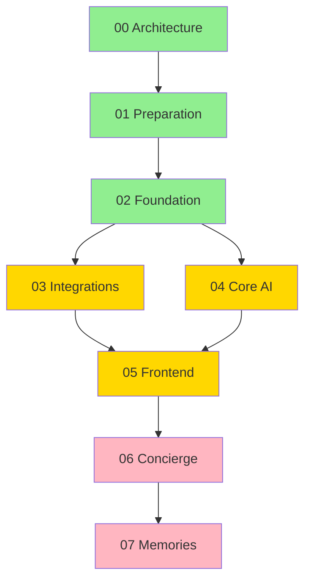

# Implementation Phases - Index

## 🎯 MVP vs V1 Mapping

This directory contains detailed documentation for each implementation phase of n-agent. With the scope division between MVP and V1, the phases have been remapped:

### Legend

| Symbol | Meaning |
|--------|---------|
| ✅ | Fully included in MVP |
| 🔶 | Partially included in MVP |
| ❌ | V1 only |
| ⏳ | In progress |

---

## 📋 Phases by Release



### MVP (6-8 weeks)

| Phase | Document | Status | MVP Scope |
|-------|----------|--------|-----------|
| 0 | [00_arquitetura.md](./00_arquitetura.md) | ✅ Complete | Base architecture, AgentCore |
| 0 | [01_fase0_preparacao.md](./01_fase0_preparacao.md) | ✅ Complete | Environment setup, Bedrock |
| 1 | [02_fase1_fundacao.md](./02_fase1_fundacao.md) | ✅ Complete | Runtime, Memory, DynamoDB, Auth |
| 2 | [03_fase2_integracoes.md](./03_fase2_integracoes.md) | 🔶 Partial | **MVP**: Gemini + Search, Airbnb |
| 3 | [04_fase3_core_ai.md](./04_fase3_core_ai.md) | 🔶 Partial | **MVP**: Router, Profile, Search agents |
| 4 | [05_fase4_frontend.md](./05_fase4_frontend.md) | 🔶 Partial | **MVP**: Chat UI, Basic Dashboard |

### V1 (Post-MVP)

| Phase | Document | V1 Scope |
|-------|----------|----------|
| 2 | [03_fase2_integracoes.md](./03_fase2_integracoes.md) | WhatsApp, Booking, Skyscanner, AviationStack |
| 3 | [04_fase3_core_ai.md](./04_fase3_core_ai.md) | Complete Planner, Document Agent, Vision Agent |
| 4 | [05_fase4_frontend.md](./05_fase4_frontend.md) | Admin Panel, Document Viewer, Multi-trip |
| 5 | [06_fase5_concierge.md](./06_fase5_concierge.md) | Alerts, Flight monitoring, Day summaries |
| 6 | [07_fase6_memorias.md](./07_fase6_memorias.md) | Albums, Trip maps, Reports |

---

## 📁 File Structure

```
fases_implementacao/
├── README.md                    # This file
├── 00_arquitetura.md           # General architecture and technical decisions
├── 01_fase0_preparacao.md      # AWS environment and tools setup
├── 02_fase1_fundacao.md        # AgentCore, DynamoDB, Cognito, API Gateway
├── 03_fase2_integracoes.md     # WhatsApp, Google, travel APIs
├── 04_fase3_core_ai.md         # Trip flows, multi-agent, documents
├── 05_fase4_frontend.md        # Web app, chat, dashboard
├── 06_fase5_concierge.md       # Proactive alerts and notifications
└── 07_fase6_memorias.md        # Post-trip organization
```

---

## 🔗 Scope Documents

To understand what goes in each release:

| Document | Description |
|----------|-------------|
| [../MVP_SCOPE.md](../MVP_SCOPE.md) | Detailed MVP scope |
| [../V1_SCOPE.md](../V1_SCOPE.md) | Detailed V1 scope |
| [../MVP_ROADMAP.md](../MVP_ROADMAP.md) | Sprint-by-sprint MVP timeline |

---

## 📌 Important Notes

### For MVP



1. **Focus on core**: Functional chat + accommodation search
2. **Minimal integrations**: Only Gemini + Airbnb
3. **Minimal agents**: Router + Profile + Search
4. **Minimal frontend**: Auth + Chat + Basic Dashboard
5. **No WhatsApp**: Web only (Meta approval is slow)
6. **No Concierge**: No proactive alerts
7. **No Memories**: Post-trip phase is V1+

### Recommended Reading

- **Starting now?** Read [00_arquitetura.md](./00_arquitetura.md) first
- **Implementing infra?** Follow [01_fase0_preparacao.md](./01_fase0_preparacao.md) → [02_fase1_fundacao.md](./02_fase1_fundacao.md)
- **Implementing agent?** Focus on [04_fase3_core_ai.md](./04_fase3_core_ai.md) Router and Profile sections
- **Implementing frontend?** Focus on [05_fase4_frontend.md](./05_fase4_frontend.md) Auth and Chat sections

---

## 🔄 Phase Dependencies



**Legend**:
- 🟢 Green: Complete (MVP foundation)
- 🟡 Yellow: In progress (MVP delivery)
- 🔴 Pink: Planned (V1)

---

**Last Updated**: January 2026
