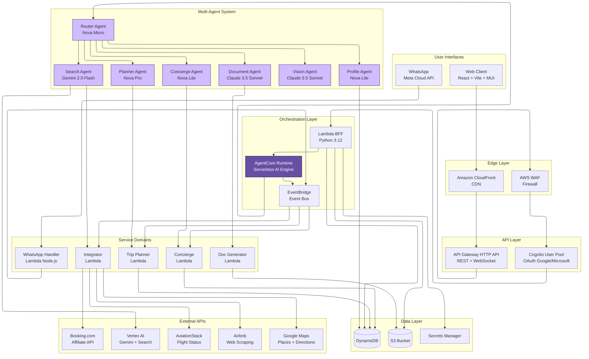
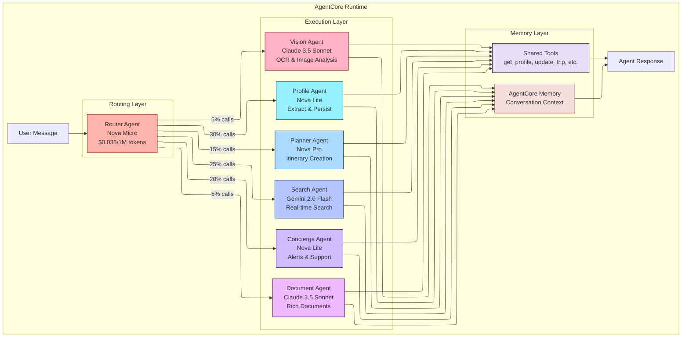
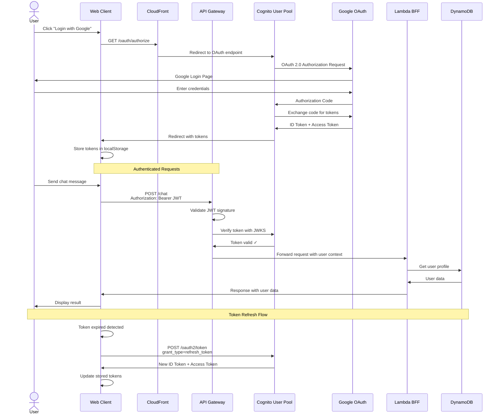

# n-agent Architecture Diagrams

This document contains Mermaid diagrams describing the AWS solution architecture and application execution flow.

## Table of Contents

- [AWS Architecture](#aws-architecture)
- [Multi-Agent System](#multi-agent-system)
- [Application Flow - Normal Execution](#application-flow---normal-execution)
- [Data Model](#data-model)
- [Authentication Flow](#authentication-flow)

---

## AWS Architecture

This diagram shows the complete serverless architecture on AWS, including all components from edge to data layer.



---

## Multi-Agent System

This diagram details the internal structure of the multi-agent system and how agents interact with each other.



---

## Application Flow - Normal Execution

This flowchart describes the complete execution flow of the application, from user input to final response.

```mermaid

---
config:
  layout: elk
---
flowchart TD
    START([User Sends Message])
    
    subgraph "1. Message Reception"
        A[Web Chat or WhatsApp]
        B{Interface Type?}
        C[WhatsApp Handler Lambda]
        D[API Gateway]
        E[Normalize Message Format]
    end
    
    subgraph "2. Authentication & Validation"
        F{User Authenticated?}
        G[Cognito JWT Validation]
        H[Return 401 Unauthorized]
        I[Get User Context from DynamoDB]
    end
    
    subgraph "3. Event Publishing"
        J[Publish to EventBridge]
        K[Event: MESSAGE_RECEIVED]
        L[Lambda BFF Subscribes]
    end
    
    subgraph "4. Agent Orchestration"
        M[Invoke AgentCore Runtime]
        N[Router Agent Analyzes Intent]
        O{Intent Classification}
        
        P1[PROFILE Intent]
        P2[PLANNING Intent]
        P3[SEARCH Intent]
        P4[CONCIERGE Intent]
        P5[DOCUMENT Intent]
        P6[VISION Intent]
        P7[CHAT Intent]
    end
    
    subgraph "5. Specialized Agent Execution"
        Q1[Profile Agent<br/>Extract & Update Profile]
        Q2[Planner Agent<br/>Create/Update Itinerary]
        Q3[Search Agent<br/>Query External APIs]
        Q4[Concierge Agent<br/>Check Alerts & Reminders]
        Q5[Document Agent<br/>Generate PDF/HTML]
        Q6[Vision Agent<br/>Process Image]
        Q7[Router Agent<br/>Direct Response]
    end
    
    subgraph "6. Tool Execution"
        R{Requires External API?}
        S[Integrator Lambda]
        T[Call External Service]
        U[Google Maps / Booking / Gemini]
        V[Cache Result]
    end
    
    subgraph "7. Memory & Persistence"
        W[Get Conversation Context]
        X[Execute Agent Tools]
        Y[Update Trip/Profile Data]
        Z[Save to DynamoDB]
        AA[Update AgentCore Memory]
    end
    
    subgraph "8. Response Generation"
        AB[Agent Generates Response]
        AC{Response Type?}
        AD[Text Message]
        AE[Rich Document Link]
        AF[Task List/Questions]
        AG[Quick Action Buttons]
    end
    
    subgraph "9. Response Delivery"
        AH[Format Response for Interface]
        AI{Original Interface?}
        AJ[Send to Web via WebSocket]
        AK[Send to WhatsApp via Meta API]
        AL[Save Message to Chat History]
    end
    
    END([User Receives Response])
    
    START --> A
    A --> B
    B -->|WhatsApp| C
    B -->|Web| D
    C --> E
    D --> E
    
    E --> F
    F -->|No| H
    H --> END
    F -->|Yes| G
    G --> I
    
    I --> J
    J --> K
    K --> L
    
    L --> M
    M --> N
    N --> O
    
    O -->|PROFILE| P1
    O -->|PLANNING| P2
    O -->|SEARCH| P3
    O -->|CONCIERGE| P4
    O -->|DOCUMENT| P5
    O -->|VISION| P6
    O -->|CHAT| P7
    
    P1 --> Q1
    P2 --> Q2
    P3 --> Q3
    P4 --> Q4
    P5 --> Q5
    P6 --> Q6
    P7 --> Q7
    
    Q1 --> W
    Q2 --> R
    Q3 --> R
    Q4 --> R
    Q5 --> W
    Q6 --> W
    Q7 --> W
    
    R -->|Yes| S
    R -->|No| W
    S --> T
    T --> U
    U --> V
    V --> W
    
    W --> X
    X --> Y
    Y --> Z
    Z --> AA
    
    AA --> AB
    AB --> AC
    
    AC -->|Text| AD
    AC -->|Document| AE
    AC -->|Tasks| AF
    AC -->|Buttons| AG
    
    AD --> AH
    AE --> AH
    AF --> AH
    AG --> AH
    
    AH --> AI
    AI -->|Web| AJ
    AI -->|WhatsApp| AK
    
    AJ --> AL
    AK --> AL
    AL --> END

    style START fill:#6750A4,stroke:#21005D,color:#fff
    style END fill:#6750A4,stroke:#21005D,color:#fff
    style F fill:#FFB4AB,stroke:#93000A
    style O fill:#FFB4AB,stroke:#93000A
    style R fill:#FFB4AB,stroke:#93000A
    style AC fill:#FFB4AB,stroke:#93000A
    style AI fill:#FFB4AB,stroke:#93000A
```



---

## Data Model

This diagram shows the DynamoDB Single Table Design structure and relationships between entities.

```mermaid

---
config:
  layout: elk
---

erDiagram
    NAgentCore {
        string PK "Partition Key"
        string SK "Sort Key"
        map Attributes "Entity Data"
    }
    
    NAgentProfiles {
        string PK "Partition Key"
        string SK "Sort Key"
        map Attributes "Profile Data"
    }
    
    NAgentChatHistory {
        string PK "TRIP#uuid"
        string SK "MSG#timestamp"
        map Attributes "Message Data"
    }
    
    NAgentConfig {
        string PK "PROMPT#type or INTEGRATION#name"
        string SK "VERSION#n or CONFIG"
        map Attributes "Configuration Data"
    }
    
    S3Bucket {
        string Key "File Path"
        binary Content "File Data"
    }

    NAgentCore ||--o{ NAgentProfiles : "references"
    NAgentCore ||--o{ NAgentChatHistory : "conversation logs"
    NAgentCore ||--o{ S3Bucket : "stores documents"
    NAgentConfig ||--o{ NAgentCore : "configures agents"

    NAgentCore_User["USER#email | PROFILE"]
    NAgentCore_Trip["TRIP#uuid | META#USER#email#DATE#start"]
    NAgentCore_Participant["TRIP#uuid | MEMBER#email"]
    NAgentCore_Day["TRIP#uuid | DAY#YYYY-MM-DD"]
    NAgentCore_Event["TRIP#uuid | EVENT#timestamp"]
    
    NAgentProfiles_Person["PERSON#personId | PROFILE#GENERAL"]
    NAgentProfiles_TripPrefs["PERSON#personId | TRIP#tripId#PREFS"]
    NAgentProfiles_Trip["TRIP#tripId | PROFILE#GENERAL"]
    
    NAgentConfig_Prompt["PROMPT#agentType | VERSION#n"]
    NAgentConfig_Integration["INTEGRATION#name | CONFIG"]
```

**Access Patterns:**

1. **Get User Profile**: `PK = USER#email, SK = PROFILE`
2. **Get Trip with Metadata**: `PK = TRIP#uuid, SK begins_with META`
3. **Get All Trip Participants**: `PK = TRIP#uuid, SK begins_with MEMBER`
4. **Get Trip Day Itinerary**: `PK = TRIP#uuid, SK = DAY#2026-05-15`
5. **Get All Trip Events**: `PK = TRIP#uuid, SK begins_with EVENT`
6. **Get Person Profile**: `PK = PERSON#personId, SK = PROFILE#GENERAL`
7. **Get Person Prefs for Trip**: `PK = PERSON#personId, SK = TRIP#tripId#PREFS`
8. **Get Chat History for Trip**: `PK = TRIP#uuid, SK begins_with MSG`
9. **Get Agent Prompt**: `PK = PROMPT#router, SK = VERSION#1`
10. **Get Integration Config**: `PK = INTEGRATION#google-maps, SK = CONFIG`

---

## Authentication Flow

This diagram shows the OAuth authentication flow with Cognito and social providers.



---

## Cost Breakdown by Component

| Component | Usage Model | Monthly Cost (MVP) | Annual Cost |
|-----------|------------|-------------------|-------------|
| **AgentCore Runtime** | Pay-per-use (vCPU + Memory) | $0.60 | $7.20 |
| **API Gateway** | Per request | $3.50 | $42.00 |
| **Lambda Executions** | Per invocation + duration | $8.00 | $96.00 |
| **DynamoDB** | On-Demand (reads/writes) | $5.00 | $60.00 |
| **S3 Storage** | Per GB + requests | $2.00 | $24.00 |
| **CloudFront** | Data transfer | $5.00 | $60.00 |
| **Cognito** | Per MAU (first 50K free) | $0.00 | $0.00 |
| **Bedrock Models** | Per token | $15.00 | $180.00 |
| **Google Maps API** | Per request ($200 credit) | $0.00 | $120.00 |
| **Gemini API** | Per search query | $10.00 | $120.00 |
| **WhatsApp Cloud API** | Per conversation | $5.00 | $60.00 |
| **External APIs** | Various (Booking, Aviation) | $30.00 | $360.00 |
| **Monitoring & Logs** | CloudWatch | $3.00 | $36.00 |
| **Secrets Manager** | Per secret | $0.40 | $4.80 |
| **Total** | | **$87.50** | **$1,170.00** |

**Notes:**
- Costs based on 100-200 active users during MVP phase
- Google Maps $200/month credit covers most usage
- First 1,000 WhatsApp service conversations free
- AgentCore cost validated via actual usage (not estimation)

---

## Deployment Architecture

```mermaid

---
config:
  layout: elk
---
graph LR
    subgraph "Development"
        DEV[Local Development<br/>agent/ folder]
        TEST[Unit Tests<br/>pytest]
    end
    
    subgraph "CI/CD Pipeline"
        GH[GitHub Actions]
        TF[Terraform Plan]
        LINT[Code Linting]
        SEC[Security Scan]
    end
    
    subgraph "Staging Environment"
        STAGE_APIGW[API Gateway]
        STAGE_BFF[Lambda BFF]
        STAGE_RUNTIME[AgentCore Runtime]
        STAGE_DDB[(DynamoDB)]
    end
    
    subgraph "Production Environment"
        PROD_APIGW[API Gateway]
        PROD_BFF[Lambda BFF]
        PROD_RUNTIME[AgentCore Runtime]
        PROD_DDB[(DynamoDB)]
    end
    
    subgraph "Monitoring"
        CW[CloudWatch]
        XRAY[X-Ray Tracing]
        ALARM[CloudWatch Alarms]
    end

    DEV --> TEST
    TEST --> GH
    GH --> LINT
    LINT --> SEC
    SEC --> TF
    TF -->|Approved| STAGE_APIGW
    
    STAGE_APIGW --> STAGE_BFF
    STAGE_BFF --> STAGE_RUNTIME
    STAGE_RUNTIME --> STAGE_DDB
    
    STAGE_DDB -->|QA Approved| PROD_APIGW
    
    PROD_APIGW --> PROD_BFF
    PROD_BFF --> PROD_RUNTIME
    PROD_RUNTIME --> PROD_DDB
    
    PROD_RUNTIME --> CW
    PROD_RUNTIME --> XRAY
    CW --> ALARM

    style PROD_APIGW fill:#6750A4,stroke:#21005D,color:#fff
    style PROD_BFF fill:#6750A4,stroke:#21005D,color:#fff
    style PROD_RUNTIME fill:#6750A4,stroke:#21005D,color:#fff
    style PROD_DDB fill:#6750A4,stroke:#21005D,color:#fff
```



---

**Last Updated:** January 11, 2026  
**Version:** 1.0  
**Maintained By:** n-agent-core Team
