# Fase 3 - Core AI (Fluxos de Viagem)

## Objetivo
Implementar a lógica principal do assistente: fluxos de conhecimento, planejamento e contratação de serviços, com persistência completa no DynamoDB.

## Entradas
- Fase 2 completa (Integrações funcionando)
- AgentCore com ferramentas do Gateway
- WhatsApp integrado

## Saídas
- Fluxo de conhecimento implementado
- Fluxo de planejamento funcionando
- CRUD de viagens no DynamoDB
- Geração de documentos ricos (roteiros, checklists)
- Versionamento de roteiros

## Duração Estimada: 3 semanas

---

## 🚨 Mudanças Arquiteturais Importantes

Esta fase foi atualizada para refletir decisões do arquivo [00_arquitetura.md](./00_arquitetura.md):

1. **Arquitetura Multi-Agente**: Adicionado Passo 3.6 com **Router Agent**:
   - Router (Nova Micro) classifica queries: trivial/informative/complex/vision/critical
   - Distribuição: 60% trivial, 25% informativa, 10% complexa, 3% visão, 2% crítica
   - **Economia**: Queries simples custam 10-100x menos usando Nova Lite ao invés de Claude

2. **Prompt Caching**: Adicionado Passo 3.7 com configuração:
   - System prompt (2000 tokens) + Trip context (500 tokens) marcados para cache
   - TTL: 5 minutos, Mínimo: 1024 tokens
   - **Economia**: 99.6% ($0.002 → $0.000008 por query)
   - Cache read/write: **$0 grátis** para Nova custom models

3. **Templates HTML Ricos**: Atualizado para usar:
   - Tailwind CSS via CDN (inline)
   - Chart.js para gráficos interativos
   - Google Maps embed para mapas
   - Print-friendly CSS para PDF

4. **Tipos de Documentos**: Separado em:
   - **User Uploads** (tickets, vouchers, passaportes) → OCR processing
   - **Agent Generated** (itinerários, checklists) → HTML standalone com interatividade

5. **Custo Total**: $158/mês para 1000 usuários (não $280), com $3.40 de IA (70% cache hit rate)

---

## Semana 1: Fluxo de Conhecimento + Persistência

### Passo 3.1: Modelo de Dados da Viagem

#### Definir Entidades (agent/src/models/trip.py)

```python
from dataclasses import dataclass, field
from typing import List, Optional, Dict
from datetime import date
from enum import Enum

class TripStatus(Enum):
    KNOWLEDGE = "KNOWLEDGE"      # Fase 1: Coletando informações
    PLANNING = "PLANNING"        # Fase 2: Planejando roteiro
    CONTRACTING = "CONTRACTING"  # Fase 3: Contratando serviços
    CONCIERGE = "CONCIERGE"      # Fase 4: Durante a viagem
    MEMORIES = "MEMORIES"        # Fase 5: Pós-viagem

class MemberRole(Enum):
    OWNER = "OWNER"
    ADMIN = "ADMIN"
    EDITOR = "EDITOR"
    VIEWER = "VIEWER"

@dataclass
class TripMember:
    email: str
    name: str
    role: MemberRole
    phone: Optional[str] = None
    passport_expiry: Optional[date] = None
    dietary_restrictions: List[str] = field(default_factory=list)
    accessibility_needs: List[str] = field(default_factory=list)
    fears: List[str] = field(default_factory=list)  # Ex: medo de altura
    
@dataclass
class TripObjective:
    description: str
    priority: int  # 1 = alta, 3 = baixa
    category: str  # "attraction", "experience", "shopping", etc.

@dataclass
class TripBudget:
    total_limit: float
    currency: str = "EUR"
    spent: float = 0.0
    categories: Dict[str, float] = field(default_factory=dict)
    # Ex: {"hospedagem": 5000, "transporte": 2000, "alimentação": 3000}

@dataclass
class Trip:
    id: str
    name: str
    owner_id: str
    status: TripStatus
    
    # Datas
    start_date: Optional[date] = None
    end_date: Optional[date] = None
    flexible_dates: bool = True
    
    # Configurações
    destinations: List[str] = field(default_factory=list)
    members: List[TripMember] = field(default_factory=list)
    objectives: List[TripObjective] = field(default_factory=list)
    budget: Optional[TripBudget] = None
    
    # Preferências
    transport_preferences: List[str] = field(default_factory=list)
    accommodation_preferences: List[str] = field(default_factory=list)
    
    # Metadados
    created_at: str = ""
    updated_at: str = ""
    current_version: int = 1
```

### Passo 3.2: Repositório DynamoDB

**agent/src/repositories/trip_repository.py**:

```python
import boto3
import json
import uuid
from datetime import datetime
from typing import Optional, List, Dict
from ..models.trip import Trip, TripStatus, TripMember, MemberRole

class TripRepository:
    def __init__(self, table_name: str = "n-agent-core"):
        self.dynamodb = boto3.resource('dynamodb')
        self.table = self.dynamodb.Table(table_name)
    
    def create_trip(self, owner_id: str, name: str) -> Trip:
        """Cria uma nova viagem."""
        trip_id = f"trip-{uuid.uuid4().hex[:8]}"
        now = datetime.utcnow().isoformat()
        
        trip = Trip(
            id=trip_id,
            name=name,
            owner_id=owner_id,
            status=TripStatus.KNOWLEDGE,
            created_at=now,
            updated_at=now
        )
        
        # Salvar metadados da viagem
        self.table.put_item(Item={
            'PK': f'TRIP#{trip_id}',
            'SK': f'META#USER#{owner_id}',
            'trip_id': trip_id,
            'name': name,
            'owner_id': owner_id,
            'status': trip.status.value,
            'created_at': now,
            'updated_at': now,
            'current_version': 1,
            'GSI1PK': f'USER#{owner_id}',
            'GSI1SK': f'TRIP#{trip_id}'
        })
        
        # Adicionar owner como membro
        self._add_member(trip_id, TripMember(
            email=owner_id,
            name="Owner",
            role=MemberRole.OWNER
        ))
        
        return trip
    
    def get_trip(self, trip_id: str) -> Optional[Dict]:
        """Recupera todos os dados de uma viagem."""
        response = self.table.query(
            KeyConditionExpression='PK = :pk',
            ExpressionAttributeValues={':pk': f'TRIP#{trip_id}'}
        )
        
        if not response['Items']:
            return None
        
        # Organizar dados por tipo
        trip_data = {
            'meta': None,
            'members': [],
            'days': [],
            'events': [],
            'docs': []
        }
        
        for item in response['Items']:
            sk = item['SK']
            if sk.startswith('META#'):
                trip_data['meta'] = item
            elif sk.startswith('MEMBER#'):
                trip_data['members'].append(item)
            elif sk.startswith('DAY#'):
                trip_data['days'].append(item)
            elif sk.startswith('EVENT#'):
                trip_data['events'].append(item)
            elif sk.startswith('DOC#'):
                trip_data['docs'].append(item)
        
        return trip_data
    
    def get_user_trips(self, user_id: str) -> List[Dict]:
        """Lista todas as viagens de um usuário."""
        response = self.table.query(
            IndexName='GSI1',
            KeyConditionExpression='GSI1PK = :pk',
            ExpressionAttributeValues={':pk': f'USER#{user_id}'}
        )
        return response['Items']
    
    def update_trip_status(self, trip_id: str, owner_id: str, status: TripStatus):
        """Atualiza o status da viagem."""
        self.table.update_item(
            Key={'PK': f'TRIP#{trip_id}', 'SK': f'META#USER#{owner_id}'},
            UpdateExpression='SET #status = :status, updated_at = :now',
            ExpressionAttributeNames={'#status': 'status'},
            ExpressionAttributeValues={
                ':status': status.value,
                ':now': datetime.utcnow().isoformat()
            }
        )
    
    def update_trip_knowledge(self, trip_id: str, owner_id: str, data: Dict):
        """Atualiza dados da fase de conhecimento."""
        update_expr = 'SET updated_at = :now'
        expr_values = {':now': datetime.utcnow().isoformat()}
        
        for key, value in data.items():
            update_expr += f', {key} = :{key}'
            expr_values[f':{key}'] = value
        
        self.table.update_item(
            Key={'PK': f'TRIP#{trip_id}', 'SK': f'META#USER#{owner_id}'},
            UpdateExpression=update_expr,
            ExpressionAttributeValues=expr_values
        )
    
    def _add_member(self, trip_id: str, member: TripMember):
        """Adiciona um membro à viagem."""
        self.table.put_item(Item={
            'PK': f'TRIP#{trip_id}',
            'SK': f'MEMBER#{member.email}',
            'email': member.email,
            'name': member.name,
            'role': member.role.value,
            'phone': member.phone,
            'passport_expiry': str(member.passport_expiry) if member.passport_expiry else None,
            'dietary_restrictions': member.dietary_restrictions,
            'accessibility_needs': member.accessibility_needs,
            'fears': member.fears,
            'GSI1PK': f'USER#{member.email}',
            'GSI1SK': f'TRIP#{trip_id}'
        })
    
    def add_day(self, trip_id: str, date: str, city: str, summary: str = ""):
        """Adiciona um dia ao roteiro."""
        self.table.put_item(Item={
            'PK': f'TRIP#{trip_id}',
            'SK': f'DAY#{date}',
            'date': date,
            'city': city,
            'summary': summary,
            'weather_forecast': {},
            'events': []
        })
    
    def add_event(self, trip_id: str, event: Dict):
        """Adiciona um evento (reserva, atração, etc.)."""
        timestamp = event.get('datetime', datetime.utcnow().isoformat())
        event_id = f"evt-{uuid.uuid4().hex[:6]}"
        
        self.table.put_item(Item={
            'PK': f'TRIP#{trip_id}',
            'SK': f'EVENT#{timestamp}#{event_id}',
            'event_id': event_id,
            **event
        })
        
        return event_id
```

### Passo 3.3: Ferramentas de Gestão de Viagem

**agent/src/tools/trip_tools.py**:

```python
from strands import tool
from ..repositories.trip_repository import TripRepository
from ..models.trip import TripStatus

repo = TripRepository()

@tool
def create_trip(user_id: str, trip_name: str) -> dict:
    """
    Cria uma nova viagem para o usuário.
    Use quando o usuário disser que quer planejar uma viagem nova.
    """
    trip = repo.create_trip(owner_id=user_id, name=trip_name)
    return {
        'trip_id': trip.id,
        'name': trip.name,
        'status': trip.status.value,
        'message': f'Viagem "{trip_name}" criada com sucesso! Vamos começar a fase de conhecimento.'
    }

@tool
def get_trip_context(trip_id: str) -> dict:
    """
    Recupera todo o contexto de uma viagem.
    Use antes de responder perguntas sobre uma viagem específica.
    """
    trip_data = repo.get_trip(trip_id)
    if not trip_data:
        return {'error': 'Viagem não encontrada'}
    
    meta = trip_data['meta']
    members = trip_data['members']
    
    return {
        'trip_id': trip_id,
        'name': meta.get('name'),
        'status': meta.get('status'),
        'destinations': meta.get('destinations', []),
        'start_date': meta.get('start_date'),
        'end_date': meta.get('end_date'),
        'budget': meta.get('budget'),
        'members_count': len(members),
        'members': [
            {'name': m.get('name'), 'role': m.get('role')}
            for m in members
        ],
        'objectives': meta.get('objectives', []),
        'preferences': {
            'transport': meta.get('transport_preferences', []),
            'accommodation': meta.get('accommodation_preferences', [])
        }
    }

@tool
def update_trip_info(trip_id: str, user_id: str, updates: dict) -> dict:
    """
    Atualiza informações da viagem.
    Use para salvar informações coletadas durante a conversa.
    
    Campos possíveis em updates:
    - destinations: lista de cidades/países
    - start_date: data de início (YYYY-MM-DD)
    - end_date: data de fim (YYYY-MM-DD)
    - budget: {"total_limit": 15000, "currency": "EUR"}
    - objectives: [{"description": "...", "priority": 1, "category": "..."}]
    - transport_preferences: ["trem", "transporte público"]
    - accommodation_preferences: ["airbnb", "2+ banheiros"]
    """
    repo.update_trip_knowledge(trip_id, user_id, updates)
    return {
        'success': True,
        'message': 'Informações da viagem atualizadas.'
    }

@tool
def add_trip_member(trip_id: str, member_data: dict) -> dict:
    """
    Adiciona um membro à viagem.
    
    member_data deve conter:
    - email: email do membro
    - name: nome do membro
    - role: ADMIN, EDITOR ou VIEWER
    - phone: (opcional) telefone
    - dietary_restrictions: (opcional) lista de restrições
    - fears: (opcional) lista de medos (altura, lugares fechados)
    """
    from ..models.trip import TripMember, MemberRole
    
    member = TripMember(
        email=member_data['email'],
        name=member_data['name'],
        role=MemberRole[member_data.get('role', 'VIEWER')],
        phone=member_data.get('phone'),
        dietary_restrictions=member_data.get('dietary_restrictions', []),
        fears=member_data.get('fears', [])
    )
    
    repo._add_member(trip_id, member)
    
    return {
        'success': True,
        'message': f'{member.name} adicionado à viagem.'
    }

@tool
def advance_trip_phase(trip_id: str, user_id: str) -> dict:
    """
    Avança a viagem para a próxima fase.
    Use quando o usuário confirmar que quer prosseguir.
    
    Fases: KNOWLEDGE → PLANNING → CONTRACTING → CONCIERGE → MEMORIES
    """
    trip_data = repo.get_trip(trip_id)
    if not trip_data:
        return {'error': 'Viagem não encontrada'}
    
    current_status = TripStatus(trip_data['meta']['status'])
    
    phase_order = [
        TripStatus.KNOWLEDGE,
        TripStatus.PLANNING,
        TripStatus.CONTRACTING,
        TripStatus.CONCIERGE,
        TripStatus.MEMORIES
    ]
    
    current_index = phase_order.index(current_status)
    if current_index >= len(phase_order) - 1:
        return {'error': 'Viagem já está na fase final'}
    
    next_status = phase_order[current_index + 1]
    repo.update_trip_status(trip_id, user_id, next_status)
    
    phase_messages = {
        TripStatus.PLANNING: "🗺️ Vamos para a fase de Planejamento! Vou criar sugestões de roteiro baseadas nas suas preferências.",
        TripStatus.CONTRACTING: "📝 Hora de contratar! Vou organizar os serviços que precisamos reservar.",
        TripStatus.CONCIERGE: "✈️ A viagem começou! Estou aqui para ajudar durante toda a jornada.",
        TripStatus.MEMORIES: "📸 Viagem concluída! Vamos organizar suas memórias."
    }
    
    return {
        'success': True,
        'new_phase': next_status.value,
        'message': phase_messages[next_status]
    }

@tool
def list_user_trips(user_id: str) -> list:
    """Lista todas as viagens do usuário."""
    trips = repo.get_user_trips(user_id)
    return [
        {
            'trip_id': t['trip_id'],
            'name': t['name'],
            'status': t['status'],
            'destinations': t.get('destinations', [])
        }
        for t in trips
    ]
```

---

## Semana 2: Fluxo de Planejamento + Roteiros

### Passo 3.4: Lógica de Planejamento

**agent/src/tools/planning_tools.py**:

```python
from strands import tool
from ..repositories.trip_repository import TripRepository
import json

repo = TripRepository()

@tool
def generate_itinerary_suggestion(trip_id: str) -> dict:
    """
    Gera uma sugestão de roteiro baseada nas informações da viagem.
    Use quando o usuário pedir uma sugestão de roteiro.
    
    Retorna um roteiro estruturado com dias, cidades e atividades sugeridas.
    """
    trip_data = repo.get_trip(trip_id)
    if not trip_data:
        return {'error': 'Viagem não encontrada'}
    
    meta = trip_data['meta']
    
    # Extrair informações
    destinations = meta.get('destinations', [])
    start_date = meta.get('start_date')
    end_date = meta.get('end_date')
    members_count = len(trip_data['members'])
    budget = meta.get('budget', {})
    objectives = meta.get('objectives', [])
    
    # Estrutura base do roteiro
    itinerary = {
        'trip_id': trip_id,
        'version': 1,
        'label': 'Sugestão Inicial',
        'summary': {
            'total_days': 0,
            'destinations': destinations,
            'estimated_cost': 0
        },
        'days': [],
        'recommendations': []
    }
    
    # A IA vai preencher isso usando as ferramentas de busca
    return {
        'template': itinerary,
        'context': {
            'destinations': destinations,
            'dates': {'start': start_date, 'end': end_date},
            'travelers': members_count,
            'budget': budget,
            'objectives': objectives
        },
        'instructions': """
        Use este template para construir o roteiro.
        Para cada destino:
        1. Use search_hotels para encontrar opções de hospedagem
        2. Use search_places para encontrar atrações principais
        3. Use search_web para informações atualizadas sobre preços e horários
        4. Distribua os dias considerando tempo de deslocamento
        """
    }

@tool
def save_itinerary_day(trip_id: str, day_data: dict) -> dict:
    """
    Salva um dia do roteiro.
    
    day_data deve conter:
    - date: data no formato YYYY-MM-DD
    - city: cidade principal do dia
    - summary: resumo do dia
    - events: lista de eventos/atividades
    """
    repo.add_day(
        trip_id=trip_id,
        date=day_data['date'],
        city=day_data['city'],
        summary=day_data.get('summary', '')
    )
    
    # Adicionar eventos do dia
    for event in day_data.get('events', []):
        event['date'] = day_data['date']
        repo.add_event(trip_id, event)
    
    return {
        'success': True,
        'message': f"Dia {day_data['date']} em {day_data['city']} salvo."
    }

@tool
def add_booking_to_trip(trip_id: str, booking: dict) -> dict:
    """
    Adiciona uma reserva/contratação à viagem.
    
    booking deve conter:
    - type: FLIGHT, HOTEL, TOUR, TRANSFER, RESTAURANT, TICKET
    - provider: nome do fornecedor (Booking, Airbnb, etc.)
    - datetime: data/hora do serviço
    - title: título descritivo
    - price: valor
    - currency: moeda
    - status: PENDING, CONFIRMED, PAID
    - confirmation_code: código de confirmação (se houver)
    - details: informações adicionais
    - documents: lista de URLs de documentos anexos
    """
    event_id = repo.add_event(trip_id, {
        'type': booking['type'],
        'provider': booking['provider'],
        'datetime': booking['datetime'],
        'title': booking['title'],
        'price': booking['price'],
        'currency': booking.get('currency', 'EUR'),
        'status': booking.get('status', 'PENDING'),
        'confirmation_code': booking.get('confirmation_code'),
        'details': booking.get('details', {}),
        'documents': booking.get('documents', [])
    })
    
    return {
        'success': True,
        'event_id': event_id,
        'message': f"Reserva adicionada: {booking['title']}"
    }

@tool
def create_itinerary_version(trip_id: str, label: str, changes_description: str) -> dict:
    """
    Cria uma nova versão do roteiro.
    Use quando fizer alterações significativas no roteiro.
    
    Exemplos de labels: "Versão Econômica", "Versão Conforto", "Ajuste Disney"
    """
    trip_data = repo.get_trip(trip_id)
    if not trip_data:
        return {'error': 'Viagem não encontrada'}
    
    current_version = trip_data['meta'].get('current_version', 1)
    new_version = current_version + 1
    
    # Salvar snapshot da versão anterior
    # (implementação simplificada - em produção, salvar em S3)
    
    repo.update_trip_knowledge(
        trip_id,
        trip_data['meta']['owner_id'],
        {
            'current_version': new_version,
            f'version_{new_version}_label': label,
            f'version_{new_version}_changes': changes_description
        }
    )
    
    return {
        'success': True,
        'version': new_version,
        'label': label,
        'message': f'Nova versão "{label}" criada (v{new_version})'
    }
```

---

## Semana 3: Documentos Ricos + System Prompts

### Passo 3.5: Gerador de Documentos

**lambdas/doc-generator/src/handler.py**:

```python
import json
import boto3
import os
from datetime import datetime
from jinja2 import Template

s3 = boto3.client('s3')
dynamodb = boto3.resource('dynamodb')

BUCKET_NAME = os.environ.get('DOCUMENTS_BUCKET', 'n-agent-documents')
TABLE_NAME = os.environ.get('TABLE_NAME', 'n-agent-core')

# Templates HTML com Tailwind CDN e Chart.js
ITINERARY_TEMPLATE = """
<!DOCTYPE html>
<html lang="pt-BR">
<head>
    <meta charset="UTF-8">
    <meta name="viewport" content="width=device-width, initial-scale=1.0">
    <title>{{ trip_name }} - Itinerário Completo</title>
    
    <!-- Tailwind CSS inline -->
    <script src="https://cdn.tailwindcss.com"></script>
    
    <!-- Chart.js para gráficos -->
    <script src="https://cdn.jsdelivr.net/npm/chart.js"></script>
    
    <!-- Google Maps embed (se necessário) -->
    <style>
        @media print {
            .no-print { display: none; }
            .page-break { page-break-before: always; }
        }
        
        /* Tema n-agent */
        :root {
            --primary: #667eea;
            --secondary: #764ba2;
        }
    </style>
</head>
<body class="bg-gray-50 p-6">
    <!-- Header -->
    <header class="bg-white shadow-sm rounded-lg p-4 mb-6">
        <div class="flex items-center justify-between">
            <div>
                <h1 class="text-2xl font-bold text-gray-900">🌍 {{ trip_name }}</h1>
                <p class="text-gray-600">{{ start_date }} → {{ end_date }}</p>
            </div>
            <div class="text-right no-print">
                <button onclick="window.print()" class="bg-blue-600 text-white px-4 py-2 rounded hover:bg-blue-700">
                    📄 Baixar PDF
                </button>
            </div>
        </div>
        
        <!-- Summary Grid -->
        <div class="grid grid-cols-3 gap-4 mt-4">
            <div class="bg-gradient-to-r from-blue-500 to-purple-600 text-white p-4 rounded-lg text-center">
                <div class="text-3xl font-bold">{{ total_days }}</div>
                <div class="text-sm">dias</div>
            </div>
            <div class="bg-gradient-to-r from-blue-500 to-purple-600 text-white p-4 rounded-lg text-center">
                <div class="text-3xl font-bold">{{ members_count }}</div>
                <div class="text-sm">viajantes</div>
            </div>
            <div class="bg-gradient-to-r from-blue-500 to-purple-600 text-white p-4 rounded-lg text-center">
                <div class="text-3xl font-bold">{{ destinations|length }}</div>
                <div class="text-sm">destinos</div>
            </div>
        </div>
    </header>
    
    <!-- Content -->
    <main class="space-y-6">
        <!-- Timeline Visual -->
        <div class="timeline">
            
            <div class="day-card bg-white rounded-lg shadow p-6 mb-4">
                <div class="day-header flex justify-between items-center mb-4">
                <span class="day-number">Dia {{ loop.index }}</span>
                <span class="city-badge">📍 {{ day.city }}</span>
            </div>
            <p style="color: #666; margin-bottom: 15px;">{{ day.date }}</p>
            
            
            <div class="event">
                <span class="event-time">{{ event.time }}</span>
                <div class="event-title">{{ event.title }}</div>
                <div class="event-details">
                    {{ event.details }}
                    
                    <span class="price-tag">{{ event.currency }} {{ event.price }}</span>
                    
                </div>
            </div>
            
        </div>
        
        
        <div class="budget-section">
            <h3>💰 Orçamento</h3>
            <p>{{ budget.spent }} / {{ budget.total_limit }} {{ budget.currency }}</p>
            <div class="budget-bar">
                <div class="budget-fill" style="width: {{ (budget.spent / budget.total_limit * 100)|int }}%"></div>
            </div>
        </div>
    </div>
</body>
</html>
"""

def generate_itinerary_html(trip_data: dict) -> str:
    """Gera HTML do roteiro."""
    template = Template(ITINERARY_TEMPLATE)
    
    meta = trip_data['meta']
    days = sorted(trip_data['days'], key=lambda x: x['date'])
    events_by_date = {}
    
    for event in trip_data['events']:
        date = event.get('date', event.get('datetime', '')[:10])
        if date not in events_by_date:
            events_by_date[date] = []
        events_by_date[date].append(event)
    
    # Enriquecer dias com eventos
    for day in days:
        day['events'] = sorted(
            events_by_date.get(day['date'], []),
            key=lambda x: x.get('datetime', '')
        )
    
    return template.render(
        trip_name=meta.get('name', 'Minha Viagem'),
        start_date=meta.get('start_date', ''),
        end_date=meta.get('end_date', ''),
        total_days=len(days),
        members_count=len(trip_data['members']),
        destinations=meta.get('destinations', []),
        days=days,
        budget=meta.get('budget', {'spent': 0, 'total_limit': 10000, 'currency': 'EUR'})
    )

def handler(event, context):
    """Handler principal do gerador de documentos."""
    
    doc_type = event.get('doc_type', 'itinerary')
    trip_id = event.get('trip_id')
    
    # Buscar dados da viagem
    table = dynamodb.Table(TABLE_NAME)
    response = table.query(
        KeyConditionExpression='PK = :pk',
        ExpressionAttributeValues={':pk': f'TRIP#{trip_id}'}
    )
    
    if not response['Items']:
        return {'statusCode': 404, 'body': 'Trip not found'}
    
    # Organizar dados
    trip_data = {'meta': None, 'members': [], 'days': [], 'events': [], 'docs': []}
    for item in response['Items']:
        sk = item['SK']
        if sk.startswith('META#'):
            trip_data['meta'] = item
        elif sk.startswith('MEMBER#'):
            trip_data['members'].append(item)
        elif sk.startswith('DAY#'):
            trip_data['days'].append(item)
        elif sk.startswith('EVENT#'):
            trip_data['events'].append(item)
    
    # Gerar documento
    if doc_type == 'itinerary':
        html_content = generate_itinerary_html(trip_data)
        content_type = 'text/html'
        extension = 'html'
    else:
        return {'statusCode': 400, 'body': f'Unknown doc_type: {doc_type}'}
    
    # Salvar no S3
    timestamp = datetime.utcnow().strftime('%Y%m%d%H%M%S')
    version = trip_data['meta'].get('current_version', 1)
    s3_key = f"trips/{trip_id}/docs/{doc_type}-v{version}-{timestamp}.{extension}"
    
    s3.put_object(
        Bucket=BUCKET_NAME,
        Key=s3_key,
        Body=html_content.encode('utf-8'),
        ContentType=content_type
    )
    
    # Gerar URL assinada (válida por 7 dias)
    url = s3.generate_presigned_url(
        'get_object',
        Params={'Bucket': BUCKET_NAME, 'Key': s3_key},
        ExpiresIn=7 * 24 * 3600
    )
    
    # Registrar documento no DynamoDB
    table.put_item(Item={
        'PK': f'TRIP#{trip_id}',
        'SK': f'DOC#{doc_type}-v{version}',
        'type': doc_type,
        'version': version,
        's3_key': s3_key,
        'created_at': datetime.utcnow().isoformat(),
        'url': url
    })
    
    return {
        'statusCode': 200,
        'body': json.dumps({
            'url': url,
            'type': doc_type,
            'version': version
        })
    }
```

### Passo 3.6: Arquitetura Multi-Agente com Router

## 🧠 Como Funciona o Roteamento Multi-Agente

### Conceito

O **Router Agent** é um agente especializado que analisa cada mensagem do usuário e decide qual modelo de IA deve processá-la. É como um "triagem" que encaminha o paciente (mensagem) para o médico (modelo) certo.

### Fluxo Completo de uma Mensagem

```mermaid
sequenceDiagram
    participant User as 👤 Usuário
    participant WA as WhatsApp
    participant Router as 🔀 Router Agent<br/>(Nova Micro)
    participant Chat as 💬 Chat Agent<br/>(Nova Lite)
    participant Plan as 🧠 Planning Agent<br/>(Nova Pro)
    participant Vision as 👁️ Vision Agent<br/>(Claude Sonnet)
    
    User->>WA: "Oi! Tudo bem?"
    WA->>Router: Classifica mensagem
    Router->>Router: Análise: TRIVIAL
    Router->>Chat: Encaminha (sem memória)
    Chat-->>User: "Olá! Tudo ótimo, e você?"
    
    Note over Router: Custo: $0.000035 (Router) + $0.00006 (Chat) = $0.000095
    
    User->>WA: "Qual meu hotel em Roma?"
    WA->>Router: Classifica mensagem
    Router->>Router: Análise: INFORMATIVE
    Router->>Chat: Encaminha (com memória)
    Chat->>Chat: Busca em AgentCore Memory
    Chat-->>User: "Seu hotel é o Monti Palace..."
    
    Note over Router: Custo: $0.000035 + $0.00006 = $0.000095
    
    User->>WA: "Planeje 3 dias em Roma"
    WA->>Router: Classifica mensagem
    Router->>Router: Análise: COMPLEX
    Router->>Plan: Encaminha (com tools)
    Plan->>Plan: Usa Google Maps, Booking, etc.
    Plan-->>User: "📋 Roteiro criado!..."
    
    Note over Router: Custo: $0.000035 + $0.0008 = $0.000835
    
    User->>WA: [Imagem de passaporte]
    WA->>Router: Detecta imagem
    Router->>Router: has_image=True
    Router->>Vision: Encaminha
    Vision->>Vision: OCR + Análise
    Vision-->>User: "Passaporte válido até 2030..."
    
    Note over Router: Custo: $0.000035 + $0.003 = $0.003035
```



### Quem Avalia?

**Router Agent (Nova Micro - $0.035/1M tokens)**

É um modelo **ultra-rápido e barato** que executa uma análise simples da mensagem em ~100-200ms. Ele não precisa entender profundamente o contexto, apenas classificar em categorias.

**Por que Nova Micro?**
- ⚡ **Latência**: ~100-200ms (vs 500-1000ms de modelos maiores)
- 💰 **Custo**: 10-100x mais barato que usar Nova Pro diretamente
- 🎯 **Precisão**: 95%+ para classificação simples (suficiente)

### Implementação Detalhada

**agent/src/router/agent_router.py**:

```python
import boto3
import json
import re
from enum import Enum
from typing import Dict, Any, Optional
from datetime import datetime

class QueryComplexity(Enum):
    """Tipos de complexidade de queries."""
    TRIVIAL = "trivial"          # "Oi", "Ok", "Obrigado" → Nova Lite
    INFORMATIVE = "informative"  # "Qual meu hotel?" → Nova Lite + Memory
    COMPLEX = "complex"          # "Planeje 3 dias em Roma" → Nova Pro + Tools
    VISION = "vision"            # "Analise este documento" → Claude Sonnet
    CRITICAL = "critical"        # Contratos, docs legais → Claude Sonnet

class AgentRouter:
    """Router que classifica queries e direciona para o modelo adequado."""
    
    def __init__(self):
        self.bedrock = boto3.client('bedrock-runtime', region_name='us-east-1')
        
        # Configuração de modelos (custos por 1M tokens)
        self.models = {
            'router': {
                'id': 'us.amazon.nova-micro-v1:0',
                'cost_input': 0.035,   # $0.035/1M
                'cost_output': 0.14    # $0.14/1M
            },
            'chat': {
                'id': 'us.amazon.nova-lite-v1:0',
                'cost_input': 0.06,    # $0.06/1M
                'cost_output': 0.24    # $0.24/1M
            },
            'planning': {
                'id': 'us.amazon.nova-pro-v1:0',
                'cost_input': 0.80,    # $0.80/1M
                'cost_output': 3.20    # $3.20/1M
            },
            'vision': {
                'id': 'anthropic.claude-3-sonnet-20240229-v1:0',
                'cost_input': 3.00,    # $3.00/1M
                'cost_output': 0       # Não usado (vision apenas lê)
            }
        }
        
        # Padrões para classificação rápida (antes de chamar Router)
        self.trivial_patterns = [
            r'^(oi|olá|hey|hi|hello)[\s!?]*$',
            r'^(obrigad[oa]|thanks|valeu)[\s!?]*$',
            r'^(ok|certo|tudo bem|sim|não|yes|no)[\s!?]*$',
            r'^👍|👋|😊|❤️$',  # Apenas emojis
        ]
    
    def is_trivial_pattern(self, message: str) -> bool:
        """Verifica se mensagem é trivial sem chamar Router (economia)."""
        message_lower = message.lower().strip()
        
        # Mensagens muito curtas (<= 3 palavras) geralmente são triviais
        if len(message_lower.split()) <= 3:
            for pattern in self.trivial_patterns:
                if re.match(pattern, message_lower, re.IGNORECASE):
                    return True
        return False
    
    def classify_query(self, user_message: str, has_image: bool = False, trip_context: Optional[Dict] = None) -> QueryComplexity:
        """Usa Nova Micro para classificar complexidade da query."""
        
        # 1. Detecção rápida: imagem = visão
        if has_image:
            return QueryComplexity.VISION
        
        # 2. Detecção rápida: padrões triviais (economiza chamada ao Router)
        if self.is_trivial_pattern(user_message):
            return QueryComplexity.TRIVIAL
        
        # 3. Usar Router Agent para classificação inteligente
        prompt = self._build_classification_prompt(user_message, trip_context)
        
        response = self.bedrock.invoke_model(
            modelId=self.models['router']['id'],
            body=json.dumps({
                'messages': [{'role': 'user', 'content': prompt}],
                'max_tokens': 10,
                'temperature': 0.1,  # Baixa temperatura = mais determinístico
                'top_p': 0.9
            })
        )
        
        response_body = json.loads(response['body'].read())
        classification = response_body['content'][0]['text'].strip().upper()
        
        # Parse da classificação
        try:
            return QueryComplexity(classification.lower())
        except ValueError:
            # Fallback se classificação inválida
            print(f"⚠️ Classificação inválida: {classification}, usando INFORMATIVE")
            return QueryComplexity.INFORMATIVE
    
    def _build_classification_prompt(self, user_message: str, trip_context: Optional[Dict]) -> str:
        """Constrói prompt de classificação com exemplos."""
        
        # Adiciona contexto da viagem se disponível
        context_info = ""
        if trip_context:
            context_info = f"""
CONTEXTO DA VIAGEM:
- Status: {trip_context.get('status', 'KNOWLEDGE')}
- Destinos: {', '.join(trip_context.get('destinations', []))}
- Datas: {trip_context.get('start_date')} → {trip_context.get('end_date')}
"""
        
        return f"""
Você é um classificador de mensagens de usuários em um assistente de viagens.

{context_info}

MENSAGEM DO USUÁRIO:
"{user_message}"

Classifique a complexidade respondendo APENAS UMA das palavras abaixo:

TRIVIAL → Saudações, agradecimentos, confirmações simples ("Oi", "Ok", "Obrigado")
INFORMATIVE → Perguntas sobre informações já coletadas ("Qual meu hotel?", "A que horas é o voo?")
COMPLEX → Solicitações de planejamento ou busca de novas informações ("Planeje 3 dias em Roma", "Busque hotéis perto do Coliseu")
CRITICAL → Solicitações envolvendo documentos importantes ou decisões críticas ("Revise meu contrato de seguro", "Valide minha reserva de voo")

EXEMPLOS:
- "Bom dia!" → TRIVIAL
- "Qual o nome do hotel em Paris?" → INFORMATIVE
- "Quero visitar o Louvre amanhã, me ajuda?" → COMPLEX
- "Preciso cancelar minha reserva urgente" → CRITICAL

CLASSIFICAÇÃO (responda apenas UMA palavra):
"""
    
    def get_model_for_complexity(self, complexity: QueryComplexity) -> Dict[str, Any]:
        """Retorna configuração do modelo adequado para a complexidade."""
        mapping = {
            QueryComplexity.TRIVIAL: self.models['chat'],
            QueryComplexity.INFORMATIVE: self.models['chat'],
            QueryComplexity.COMPLEX: self.models['planning'],
            QueryComplexity.VISION: self.models['vision'],
            QueryComplexity.CRITICAL: self.models['vision']
        }
        return mapping[complexity]
    
    def route(self, user_message: str, has_image: bool = False, trip_context: Optional[Dict] = None) -> Dict[str, Any]:
        """Classifica e retorna configuração completa para o agente."""
        
        start_time = datetime.now()
        
        # 1. Classificar query
        complexity = self.classify_query(user_message, has_image, trip_context)
        
        # 2. Selecionar modelo
        model_config = self.get_model_for_complexity(complexity)
        
        # 3. Configurações específicas do agente
        config = {
            'model_id': model_config['id'],
            'complexity': complexity.value,
            'use_tools': complexity in [QueryComplexity.COMPLEX, QueryComplexity.CRITICAL],
            'use_memory': complexity != QueryComplexity.TRIVIAL,
            'enable_cache': True,  # Prompt caching habilitado
            'cost_input_per_1m': model_config['cost_input'],
            'cost_output_per_1m': model_config['cost_output'],
            'routing_time_ms': int((datetime.now() - start_time).total_seconds() * 1000)
        }
        
        # 4. Log de roteamento (para métricas)
        print(f"🔀 Router: '{user_message[:50]}...' → {complexity.value} ({model_config['id']}) em {config['routing_time_ms']}ms")
        
        return config

# Uso no entrypoint principal
router = AgentRouter()

def handle_message(user_message: str, has_image: bool = False, trip_context: Optional[Dict] = None) -> str:
    """Handler principal que usa o router."""
    
    # 1. Rotear mensagem
    routing_config = router.route(user_message, has_image, trip_context)
    
    # 2. Selecionar e executar agente apropriado
    complexity = routing_config['complexity']
    
    if complexity == 'trivial':
        # Chat simples, sem memória
        return chat_agent(
            message=user_message,
            model_id=routing_config['model_id'],
            use_memory=False,
            use_cache=True
        )
    
    elif complexity == 'informative':
        # Chat com memória
        return chat_agent(
            message=user_message,
            model_id=routing_config['model_id'],
            use_memory=True,
            use_cache=True
        )
    
    elif complexity == 'complex':
        # Planning com ferramentas
        return planning_agent(
            message=user_message,
            model_id=routing_config['model_id'],
            use_tools=True,
            use_memory=True,
            use_cache=True,
            trip_context=trip_context
        )
    
    elif complexity in ['vision', 'critical']:
        # Vision/Critical com Claude
        return vision_agent(
            message=user_message,
            model_id=routing_config['model_id'],
            has_image=has_image,
            use_memory=True
        )


# Exemplo de uso dos agentes especializados

def chat_agent(message: str, model_id: str, use_memory: bool, use_cache: bool) -> str:
    """Agente de chat simples (Nova Lite)."""
    bedrock = boto3.client('bedrock-runtime')
    
    system_prompt = "Você é o n-agent, assistente de viagens amigável."
    
    # Buscar contexto da memória se necessário
    context = ""
    if use_memory:
        memory = get_memory_context()  # Implementado em memory_manager.py
        context = f"\n\nCONTEXTO DA CONVERSA:\n{memory}"
    
    response = bedrock.invoke_model(
        modelId=model_id,
        body=json.dumps({
            'messages': [
                {'role': 'system', 'content': system_prompt + context},  # Cached
                {'role': 'user', 'content': message}
            ],
            'max_tokens': 500,
            'temperature': 0.7
        })
    )
    
    return json.loads(response['body'].read())['content'][0]['text']


def planning_agent(message: str, model_id: str, use_tools: bool, use_memory: bool, use_cache: bool, trip_context: Dict) -> str:
    """Agente de planejamento complexo (Nova Pro)."""
    bedrock = boto3.client('bedrock-runtime')
    
    system_prompt = """
Você é o n-agent na fase de PLANEJAMENTO.

FERRAMENTAS DISPONÍVEIS:
- search_hotels(city, checkin, checkout, guests)
- search_flights(origin, destination, date, passengers)
- get_directions(origin, destination)
- create_itinerary(days, activities)
"""
    
    # Buscar contexto completo
    context = ""
    if use_memory:
        memory = get_memory_context()
        context = f"\n\nCONTEXTO:\n{memory}\n\nVIAGEM:\n{json.dumps(trip_context, indent=2)}"
    
    # Invocar com ferramentas (AgentCore Gateway)
    response = bedrock.invoke_agent(
        agentId='your-agent-id',
        sessionId=trip_context.get('session_id'),
        inputText=message,
        enableTrace=True
    )
    
    return response['completion']


def vision_agent(message: str, model_id: str, has_image: bool, use_memory: bool) -> str:
    """Agente de visão (Claude Sonnet)."""
    bedrock = boto3.client('bedrock-runtime')
    
    # Processar imagem se presente
    image_content = []
    if has_image:
        # Buscar imagem do S3 ou base64
        image_data = get_image_from_message()  # Implementado em whatsapp_handler.py
        image_content = [{
            'type': 'image',
            'source': {
                'type': 'base64',
                'media_type': 'image/jpeg',
                'data': image_data
            }
        }]
    
    response = bedrock.invoke_model(
        modelId=model_id,
        body=json.dumps({
            'messages': [{
                'role': 'user',
                'content': image_content + [{'type': 'text', 'text': message}]
            }],
            'max_tokens': 1000,
            'temperature': 0.3  # Baixa temperatura para análise precisa
        })
    )
    
    return json.loads(response['body'].read())['content'][0]['text']
```

### Exemplos Práticos de Roteamento

| Mensagem do Usuário | Classificação | Modelo Usado | Custo Estimado | Latência | Uso de Tools/Memory |
|---------------------|---------------|--------------|----------------|----------|---------------------|
| "Oi!" | TRIVIAL | Nova Lite | $0.000095 | ~200ms | ❌ / ❌ |
| "Obrigado!" | TRIVIAL | Nova Lite | $0.000095 | ~200ms | ❌ / ❌ |
| "Qual meu hotel em Roma?" | INFORMATIVE | Nova Lite | $0.000095 | ~300ms | ❌ / ✅ |
| "A que horas é o voo?" | INFORMATIVE | Nova Lite | $0.000095 | ~300ms | ❌ / ✅ |
| "Planeje 3 dias em Roma" | COMPLEX | Nova Pro | $0.000835 | ~2s | ✅ / ✅ |
| "Busque hotéis perto do Coliseu" | COMPLEX | Nova Pro | $0.000835 | ~3s | ✅ / ✅ |
| [Foto do passaporte] | VISION | Claude Sonnet | $0.003035 | ~4s | ❌ / ✅ |
| "Valide minha reserva de voo" | CRITICAL | Claude Sonnet | $0.003035 | ~3s | ✅ / ✅ |

### Métricas de Economia

**Sem Router (usando apenas Nova Pro para tudo):**
- 8000 mensagens/mês × $0.0008 (média) = **$6.40/mês**

**Com Router:**
- 60% TRIVIAL (4800 msgs) × $0.000095 = $0.456
- 25% INFORMATIVE (2000 msgs) × $0.000095 = $0.190
- 10% COMPLEX (800 msgs) × $0.000835 = $0.668
- 3% VISION (240 msgs) × $0.003035 = $0.728
- 2% CRITICAL (160 msgs) × $0.003035 = $0.486
- **Total: $2.53/mês**

**Economia: 60%** ($6.40 → $2.53)

Com **Prompt Caching (70% hit rate):**
- Total com cache: **$1.52/mês**
- **Economia total: 76%** ($6.40 → $1.52)

### Vantagens do Sistema

1. **Custo-Eficiência**: Paga caro apenas quando necessário
2. **Latência Otimizada**: Queries simples respondem em ~200ms
3. **Escalabilidade**: Router suporta milhões de classificações por centavos
4. **Flexibilidade**: Fácil adicionar novos tipos de complexidade
5. **Métricas**: Log detalhado de roteamento para análise

### Passo 3.7: Configurar Prompt Caching

**agent/src/config/cache_config.py**:

```python
from typing import Dict, Any

def get_cached_system_prompt(trip_context: Dict[str, Any]) -> str:
    """Retorna system prompt marcado para caching.
    
    Economia:
    - Sem cache: 2500 tokens × $0.0008 = $0.002/query
    - Com cache: 10 tokens × $0.0008 = $0.000008/query (99.6% economia)
    - TTL: 5 minutos
    - Mínimo: 1024 tokens (ok, temos ~2500)
    """
    
    # System prompt fixo (será cached)
    base_prompt = """
Você é o n-agent, assistente pessoal de viagens especializado.

🎯 SUAS CAPACIDADES:
- Planejar viagens completas (destinos, hotéis, voos, roteiros)
- Buscar informações em tempo real (clima, voos, hotéis)
- Gerar documentos ricos (itinerários HTML, checklists)
- Gerenciar orçamento e alertas
- Suporte multilíngue

📋 FERRAMENTAS DISPONÍVEIS:
- search_hotels: Busca hotéis via Booking.com
- search_flights: Busca voos via AviationStack
- get_weather: Previsão do tempo
- get_directions: Rotas via Google Maps
- update_trip_info: Atualiza informações da viagem
- create_document: Gera itinerários HTML

💡 REGRAS:
1. SEMPRE confirme entendimento antes de ações irreversíveis
2. Use as ferramentas para dados atualizados
3. Seja proativo: sugira, não apenas responda
4. Respeite orçamento do usuário
5. Considere acessibilidade e restrições
"""
    
    # Contexto da viagem (também cached se > 1024 tokens)
    trip_prompt = f"""
📍 CONTEXTO DA VIAGEM ATUAL:
- Nome: {trip_context.get('name', 'Nova viagem')}
- Status: {trip_context.get('status', 'KNOWLEDGE')}
- Destinos: {', '.join(trip_context.get('destinations', []))}
- Datas: {trip_context.get('start_date')} → {trip_context.get('end_date')}
- Viajantes: {trip_context.get('members_count', 0)} pessoas
- Orçamento: {trip_context.get('budget_currency', 'EUR')} {trip_context.get('budget_limit', 0)}
"""
    
    # Marcar para cache (AWS Bedrock cache automático se > 1024 tokens)
    return base_prompt + trip_prompt

# Configuração do modelo com cache
model_config = {
    'modelId': 'us.amazon.nova-lite-v1:0',
    'inferenceConfig': {
        'maxTokens': 2000,
        'temperature': 0.7,
    },
    # Prompt caching habilitado automaticamente para Nova custom models
    # Cache TTL: 5 minutos
    # Cache read/write: $0 (grátis para Nova)
}
```

### Passo 3.8: System Prompts por Fase

**agent/src/prompts/system_prompts.py**:

```python
KNOWLEDGE_PHASE_PROMPT = """
Você é o n-agent, um assistente pessoal de viagens na fase de CONHECIMENTO.

🎯 SEU OBJETIVO NESTA FASE:
Coletar todas as informações necessárias para planejar a viagem perfeita.

📋 INFORMAÇÕES QUE VOCÊ PRECISA COLETAR:
1. DESTINOS: Quais países/cidades? Ordem de preferência?
2. DATAS: Quando? Flexibilidade?
3. DURAÇÃO: Quantos dias?
4. VIAJANTES: Quantas pessoas? Idades? Restrições?
5. ORÇAMENTO: Quanto pretendem gastar?
6. OBJETIVOS: O que querem fazer? (cultura, praia, aventura, compras)
7. PREFERÊNCIAS: Transporte? Hospedagem? Alimentação?
8. RESTRIÇÕES: Medos, alergias, necessidades especiais?

📌 REGRAS:
- Faça UMA ou DUAS perguntas por vez, não bombardeie o usuário
- Confirme o que entendeu antes de salvar
- Use update_trip_info para salvar cada informação coletada
- Quando tiver informações suficientes, gere um resumo e pergunte se pode avançar
- Use advance_trip_phase quando o usuário confirmar

💡 DICAS:
- Seja conversacional e amigável
- Use emojis com moderação
- Sugira opções quando o usuário estiver indeciso
- Lembre o usuário de informações que ainda faltam
"""

PLANNING_PHASE_PROMPT = """
Você é o n-agent, um assistente pessoal de viagens na fase de PLANEJAMENTO.

🎯 SEU OBJETIVO NESTA FASE:
Criar o roteiro perfeito baseado nas informações coletadas.

📋 O QUE VOCÊ DEVE FAZER:
1. Analisar o contexto da viagem (use get_trip_context)
2. Pesquisar opções de hospedagem (use search_hotels)
3. Pesquisar atrações e restaurantes (use search_places)
4. Buscar informações atualizadas (use search_web)
5. Montar sugestões de roteiro dia a dia
6. Apresentar opções com preços estimados
7. Ajustar conforme feedback do usuário

📌 REGRAS:
- Sempre considere o orçamento definido
- Respeite restrições e preferências dos viajantes
- Inclua tempos de deslocamento realistas
- Ofereça alternativas (econômica vs conforto)
- Use save_itinerary_day para salvar cada dia aprovado
- Use create_itinerary_version ao fazer mudanças significativas

💡 DICAS:
- Agrupe atrações próximas no mesmo dia
- Sugira dias mais leves após viagens longas (jet lag)
- Inclua tempo livre para imprevistos
- Lembre de reservas com antecedência obrigatória
"""

CONTRACTING_PHASE_PROMPT = """
Você é o n-agent, um assistente pessoal de viagens na fase de CONTRATAÇÃO.

🎯 SEU OBJETIVO NESTA FASE:
Ajudar o usuário a reservar todos os serviços do roteiro.

📋 O QUE VOCÊ DEVE FAZER:
1. Listar todos os serviços que precisam ser reservados
2. Indicar prazos e datas ideais para cada reserva
3. Fornecer links diretos para reserva
4. Registrar cada reserva confirmada (use add_booking_to_trip)
5. Criar timeline de pagamentos
6. Gerar checklists de documentos necessários

📌 REGRAS:
- Priorize reservas com prazo (ex: ingressos limitados)
- Lembre o usuário de condições de cancelamento
- Mantenha controle do orçamento atualizado
- Valide documentos quando o usuário enviar (passaportes, etc.)

💡 DICAS:
- Sugira dividir grandes pagamentos em meses diferentes
- Alerte sobre taxas ocultas (tourist tax, resort fee)
- Lembre de seguro viagem e PID
"""

def get_prompt_for_phase(phase: str) -> str:
    """Retorna o system prompt adequado para a fase."""
    prompts = {
        'KNOWLEDGE': KNOWLEDGE_PHASE_PROMPT,
        'PLANNING': PLANNING_PHASE_PROMPT,
        'CONTRACTING': CONTRACTING_PHASE_PROMPT,
    }
    return prompts.get(phase, KNOWLEDGE_PHASE_PROMPT)
```

---

## Checklist de Conclusão da Fase 3

- [ ] Modelo de dados Trip implementado
- [ ] TripRepository funcionando (CRUD)
- [ ] Ferramentas de gestão de viagem criadas
- [ ] Ferramentas de planejamento criadas
- [ ] Gerador de documentos HTML funcionando
- [ ] System prompts por fase configurados
- [ ] Versionamento de roteiros implementado
- [ ] Teste end-to-end: criar viagem → coletar info → gerar roteiro

---

## Testes de Validação

### Teste Completo do Fluxo

```bash
# 1. Criar viagem
agentcore invoke '{
  "prompt": "Quero criar uma viagem chamada Eurotrip 2027",
  "user_id": "victor@email.com"
}'

# 2. Adicionar informações
agentcore invoke '{
  "prompt": "Vamos para Londres, Paris e Roma. Seremos 4 pessoas, em agosto de 2027, por 15 dias. Orçamento de 10 mil euros.",
  "user_id": "victor@email.com",
  "trip_id": "trip-xxxxxxxx"
}'

# 3. Pedir sugestão de roteiro
agentcore invoke '{
  "prompt": "Pode sugerir um roteiro?",
  "user_id": "victor@email.com",
  "trip_id": "trip-xxxxxxxx"
}'
```

---

## Próxima Fase

Com o Core AI funcionando, siga para a **[Fase 4 - Frontend](./05_fase4_frontend.md)** onde vamos:
- Criar o Web App React
- Implementar painel do usuário
- Visualização de documentos ricos
- Interface de chat web
